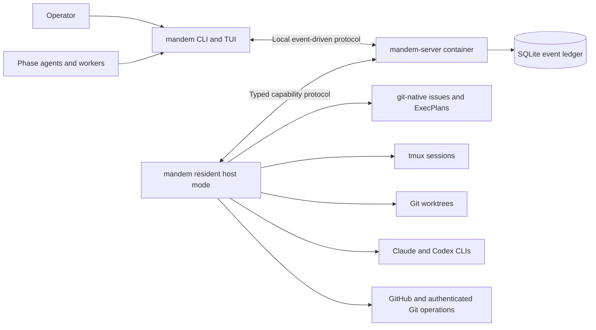
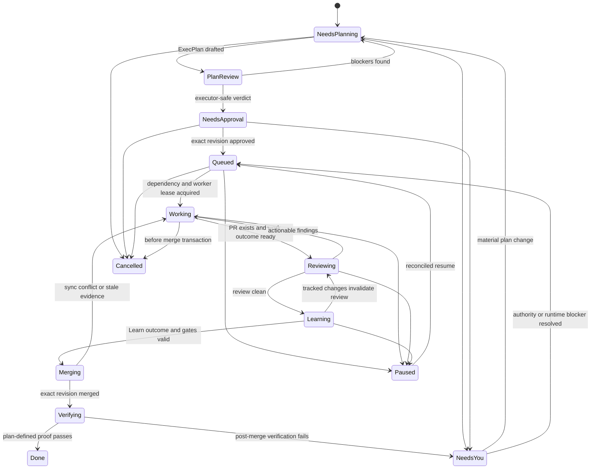
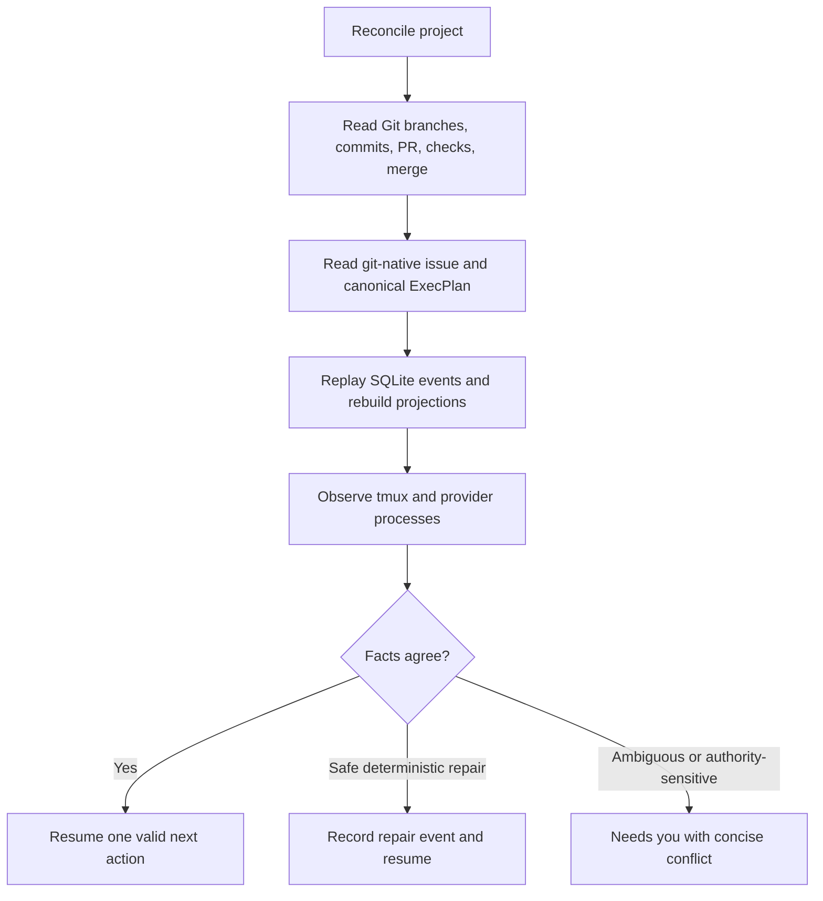

# Mandem - Plan

The repository-root `PLANS.md` defines how to author, review, and execute this program ExecPlan.
Read `PLANS.md` in full before working with this plan. Keep
`Progress`, `Surprises & Discoveries`, `Decision Log`, and `Outcomes & Retrospective` current at
every stopping point.

This is Mandem's current program plan. The copy previously merged in Strategy Builder Pro is
historical provenance. This plan coordinates U1 through U10 but does not authorize implementation.
Only an approved child ExecPlan authorizes its unit. The `program_coordination_authorized` field
permits sequencing; `execution_authorized` remains permanently `false` on this plan.

## Purpose / Big Picture

**Objective:** Create Mandem, a standalone open-source system that orchestrates agents building
TypeScript web applications in Brandon's house architecture. It uses bounded conversations,
self-contained ExecPlans, visible coding-agent workers, deterministic gates, and unattended
execution.

**Product authority:** Brandon is Mandem's primary operator and defines its default doctrine. Other
developers and product owners are secondary users.

**Current boundary:** U1 merged, but post-merge verification opened corrective work item `5717221`.
U1C is the planned corrective child at
`docs/plans/units/u1-corrective-architecture-package-contract.md`. U1A is a newly planned
foundational unit for documentation discoverability and continuous authoring-quality gates. U2-U10
remain unauthorized, and U2 is blocked until U1C and U1A complete. The first consumer target is
Strategy Builder Pro on Brandon's Linux agent host.

---

## Context and Orientation

Mandem is a new standalone repository. At the start of this plan it contains planning artifacts
but no accepted implementation. Strategy Builder Pro is the first consumer repository, Nucleus is
the definitive source for the target clean architecture, and Pier Infra supplies aligned examples
of self-contained operational plans. A “program ExecPlan” is the durable, restartable plan for the
whole Mandem build. A “child ExecPlan” is the self-contained implementation authority for exactly
one program unit. A “clean-room review” is a review by an agent that receives the plan and current
repository but no private planning conversation, exposing assumptions a fresh executor could not
recover.

The repository root contains `AGENTS.md`, `CLAUDE.md`, and `PLANS.md`. A fresh Codex session must
read those files and this plan before choosing work. Child plans live under `docs/plans/units/`,
and `docs/plans/units/README.md` records their dependency and promotion state.

The terms below have precise meanings in this plan:

- **AXI** refers specifically to Kunchengui D's external, MIT-licensed
  [`kunchenguid/axi`](https://github.com/kunchenguid/axi) project—not a framework invented by
  Mandem. It defines an agent-oriented command-line interface designed to reduce tokens and tool
  round-trips. Mandem adopts its ten principles: token-efficient TOON output, minimal default
  fields, truncation with a `--full` escape hatch, precomputed summaries, definitive empty states,
  structured errors and exit codes, opt-in ambient session context, useful live data when invoked
  without arguments, contextual next actions, and consistent concise help.
- **TOON** refers specifically to the independently governed, MIT-licensed Token-Oriented Object
  Notation from the external [`toon-format`](https://github.com/toon-format) project—not a Mandem
  format. Mandem uses this compact text format for structured agent output. It carries the same
  semantics as human output while avoiding verbose JSON keys and punctuation.
- **Control plane** is the single server-owned path that decides and records workflow state
  changes. Other processes request actions but do not change durable workflow state directly.
- **Reconciliation** means comparing durable records with Git, pull requests, worktrees, and live
  processes after interruption, then choosing one safe next action or asking the operator.
- **Lease** is a time-bounded exclusive claim that prevents two workers from performing the same
  mutation concurrently.
- **Typed gate** is a named prerequisite with machine-readable inputs, outcome, evidence, and
  invalidation rules.
- **Typed handoff** is a durable phase result whose required fields make missing context fail
  visibly instead of being inferred from chat.
- **WAL**, or write-ahead logging, is SQLite's mode for recording changes in a log before applying
  them to the main database so interrupted writes can recover safely.

AXI is not a Mandem invention. Its upstream authority is Kunchengui D's public
`kunchenguid/axi` repository, licensed MIT. This plan was checked against `principles.yaml` and the
README at commit `b88620b3e87441bdaa330e9fdd313cde68d7fa77` on 2026-07-24. Mandem adopts the ten
principles and adapts them to its own commands; it does not claim ownership of the AXI name,
benchmarks, skill, or reference implementations. If Mandem intentionally departs from that pinned
standard, the architecture docs must identify the departure as a Mandem decision rather than
silently redefining AXI.

TOON is also not a Mandem or AXI invention. Token-Oriented Object Notation is maintained by the
public `toon-format` project, with its formal specification in `toon-format/spec`, reference
TypeScript implementation in `toon-format/toon`, and documentation at `toonformat.dev`. It is MIT
licensed and attributed to Johann Schopplich and contributors. Mandem targets the official v4.0.0
documentation observed on 2026-07-24 and must pin the exact encoder/decoder package version and
conformance fixtures in U7. AXI recommends TOON, but TOON remains an independently governed format.

### Summary

Mandem gives the operator one interface for directing visible coding agents. It packages Brandon's
engineering principles, roles, quality gates, and learning process so projects follow the same
process without requiring the operator to manage its internal steps.

### Problem Frame

Strategy Builder Pro already contains a substantial agent organization: specialized roles, worktree isolation, durable work tracking, reports, review gates, human decision points, and a coordination service.
That system is coupled to Claude Code, spread across many scripts and instruction files, and embedded in an application repository whose name and product concerns may change.

The engineering system is reusable. Moving it into Mandem lets Brandon's projects share one
evolving doctrine and makes the process inspectable without publishing the applications that use
it.

### Key Decisions

**Standalone product.** Mandem lives in its own repository so orchestration and engineering doctrine have a single responsibility separate from any application.

**Opinionated product with fixed process requirements.** Mandem ships Brandon's versioned operating
model as the built-in default. Project configuration may override permitted engineering details,
but cannot bypass the safety kernel: durable-state rules, observability, evidence requirements, or
the `Plan -> Work -> Review -> Learn` lifecycle. Open-source users remain free to fork the product.

**One canonical CLI.** Agents and operators use one supported command surface. Existing Strategy Builder Pro scripts become internal implementation details or migration shims rather than public APIs.

**AXI-native interface.** Mandem adopts AXI's ten design principles and uses TOON for agent-facing structured output. Token budget and round-trip count are product constraints.

**Subscription-backed workers.** The Mandem client launches authenticated vendor CLIs such as
Claude Code and Codex rather than calling model APIs. Provider subscriptions, native tools, and
native authentication remain usable.

**Bounded conversations and disposable workers.** The Mandem client is the stable interface. Every
phase opens a fresh, focused agent session in tmux and closes with a durable handoff. Background
workers are independently viewable and can be taken over only through an attributable control-plane
action.

**Self-contained plans.** Every work item has exactly one canonical ExecPlan maintained according
to the repository-root `PLANS.md`, whose initial contract was copied from Nucleus. A complete
ExecPlan, rather than an extracted milestone prompt, is the execution context for every fresh
worker.

**Git-native work ledger.** Every substantial workflow starts from a project-local git-native
issue. GitHub Issues mirror the project-local git-native issue when a GitHub remote exists; they do
not define workflow state.

**Client and server.** `mandem` is the single host-side CLI/TUI and tmux/agent launcher. `mandem-server` is the Docker-hosted local control plane. They communicate through local event-driven sockets; there is no polling and no public network service.

**One target architecture in v1.** Mandem v1 targets TypeScript web applications, beginning with Strategy Builder Pro. Its build stack is based on SBP; its definitive architecture comes from Nucleus's modern module, clean-architecture, and use-case guides.

**Learning completes the lifecycle.** Mandem uses `Plan -> Work -> Review -> Learn -> Repeat`. Work is not fully closed until reusable lessons have been captured, routed, or explicitly dismissed.

**Primary user first.** Mandem optimizes first for Brandon's work across projects. Making the system approachable to other developers and non-technical product owners is important but subordinate to preserving the engineering doctrine.

### Actors

- A1. **Operator:** Expresses product intent, makes consequential decisions, inspects outcomes, and controls release authority.
- A2. **Phase agent:** Holds one bounded operator conversation for planning, review, learning, or a required decision, then writes a durable handoff and exits.
- A3. **Worker agent:** Performs a bounded role such as engineering, research, QA, review, planning, or decision documentation in an isolated workspace.
- A4. **Mandem client:** Provides the local CLI/TUI, compiles operating docs, opens tmux sessions, launches authenticated agent CLIs, and connects them to the server.
- A5. **Mandem server:** Owns the workflow state machine, queue, scheduling, typed gates, structured events, reconciliation, and SQLite projections.
- A6. **Mandem upstream:** Receives explicitly approved, sanitized defects and improvement reports about Mandem itself.

### System Shape

```text
Operator
   |
   v
mandem client -------------------- local CLI/TUI plus resident host capability mode
   |
   | local event-driven socket
   v
mandem-server -------------------- Docker, workflow engine, queue, gates, SQLite
   |
   +-- git-native issues --------- canonical work ledger
   +-- ExecPlans ----------------- self-contained execution spine
   +-- operating docs ------------ compiled roles, principles, workflows, project context
   +-- structured events --------- observability, provenance, reconciliation

resident host mode
   +-- tmux sessions ------------- bounded phase agents and visible workers
   +-- Git worktrees
   +-- Claude Code CLI
   +-- Codex CLI
```

### Requirements

**Control plane and lifecycle**

- R1. Mandem must own a complete lifecycle from prioritized work selection through dispatch, supervision, checkpointing, verification, harvesting, integration, learning, and closure.
- R2. Every state-changing operation must pass through one audited control-plane mutation path.
- R3. Durable work state must be reconstructable without a provider transcript or surviving worker session.
- R4. Work must support isolated execution so concurrent workers cannot silently interfere with one another.
- R5. Integration must be serialized through explicit verification and merge authority rather than worker self-attestation.
- R6. Every substantial workflow must begin from a project-local git-native work item with one canonical, nearly self-contained ExecPlan.
- R6a. Visible work-item types must use conventional change vocabulary: `build`, `ci`, `docs`, `feat`, `fix`, `perf`, `refactor`, `style`, `test`, and fallback `chore`.

**Workers and providers**

- R7. Mandem must launch real authenticated coding-agent CLI processes without requiring direct OpenAI or Anthropic API use.
- R8. Claude Code and Codex must be supported in the first release so provider neutrality is demonstrated in operation.
- R9. Provider-specific launch, interruption, resume, status, prompts, permissions, and hooks must stay behind capability adapters.
- R10. A worker session may disappear at any time without losing the durable task or preventing a fresh worker from continuing it.
- R11. Tmux must be the first supported session backend and allow a human to attach, observe, and intervene.
- R12. Tmux is the only v1 session backend; it must not own durable workflow state.

**Agent organization and doctrine**

- R13. Mandem must ship versioned built-in operating docs distilled from Strategy Builder Pro, Nucleus, Pier Infra, and Brandon's recorded engineering decisions.
- R14. Operating docs must cover the protected process, architecture, test-driven development, evidence, decisions, review, delivery, tool improvement, human escalation, and ground-truth verification.
- R15. Agent roles must define purpose, inputs, outputs, permissions, mutation boundaries, required evidence, and completion conditions rather than relying on personality prompts alone.
- R16. Mandem must inject the effective role and doctrine context into workers through each provider's supported instruction surfaces.
- R17. Projects may override permitted role and engineering settings deliberately, but configuration cannot change the protected safety and workflow kernel.
- R18. Mandem must show which default and override policies governed a work unit and preserve that provenance with its outcome.
- R19. Composable source documents must live under committed `.mandem/operating-docs/`, organized as `principles/`, `roles/`, `workflows/`, `project/`, and `learnings/`.
- R19a. Mandem must deterministically compile those sources into committed, generated `AGENTS.md` and `CLAUDE.md` entry files and bounded runtime prompts, with selection and content hashes recorded in session provenance.

**AXI interface and operator experience**

- R20. Mandem must expose one canonical CLI whose default outputs follow AXI's ten agent-ergonomic principles.
- R21. Structured agent-facing output must use TOON, with bounded defaults and an explicit path to fuller detail.
- R22. Commands must provide definitive empty states, structured errors, stable exit codes, idempotent mutations where possible, and concise next-action guidance.
- R23. Public language must be understandable to a product owner without requiring knowledge of agent infrastructure.
- R24. Mandem-specific vocabulary must be introduced only when useful and explained on first use.
- R25. Every surface must lead with the outcome, decision, failure, or operator action instead of process narration.
- R26. Mandem must treat verbosity, academic prose, redundant qualification, and fragmented status
  reporting as interface defects across CLI output, prompts, reports, issues, plans, reviews,
  errors, and documentation.
- R27. The Mandem client must summarize the state of all workers in one compact operator view
  rather than requiring the operator to inspect individual workers or assemble multiple reports.
- R28. Progressive disclosure must keep mechanics available for diagnosis without placing them in the default operator path.

**Observability and provenance**

- R29. Every command and resulting control-plane action must emit a structured event containing its work unit, actor, provider, lifecycle stage, outcome, and relevant artifact references.
- R30. Long-running work must emit progress and heartbeats so inactivity is distinguishable from a stalled or dead worker.
- R31. Operators and agents must be able to inspect current state, recent activity, failures, and provenance through bounded AXI output without scraping terminal panes.
- R32. Live session attachment must provide witnessability while the event ledger remains the authoritative historical record.
- R33. Authentication material must not enter Docker, project state, or the event ledger. Cross-project reports follow their explicit publication policy.

**Learning and reporting**

- R34. `learn` must be a first-class lifecycle stage that captures what worked, what failed, and what could improve subsequent work.
- R35. A learning must be routed to the strongest useful local mechanism: a test, deterministic check, script, runbook, ADR, ordinary learning, reviewed operating-doc proposal, or explicit `no reusable learning` outcome.
- R36. Learn must begin from execution friction: `Surprises & Discoveries`, failed iterations, review corrections, operator takeovers, and unexpected delay.
- R37. Reusable doctrine candidates must be stored locally before publication and support review, promotion, and dismissal.
- R38. `mandem report` must send sanitized Mandem defects, doctrine conflicts, and improvement proposals to the configured canonical Mandem repository.
- R39. Upstream reporting must distinguish evidence from inference, include reproducible provenance, deduplicate likely repeats, and record the publication in the local event ledger.
- R40. Every upstream Mandem report must begin as a local sanitized draft and require explicit operator publication approval.
- R41. Mandem must not require a duplicate generic completion report. The ExecPlan, PR, review artifacts, checks, events, and final work-item summary form the implementation record; investigation work may produce a report as its primary outcome.
- R42. The learn stage must ask whether the new knowledge has been made findable and whether the system would catch or apply it automatically next time.

**Packaging and reuse**

- R43. Mandem must be distributed from a standalone open-source repository with an explicit license and attribution for adapted upstream work.
- R44. Consumer repositories must integrate through a documented adapter and configuration contract rather than copying Mandem internals.
- R45. Strategy Builder Pro must be the first supported adapter and migration proving the product against an existing agent organization.
- R46. Mandem's public repository must demonstrate the engineering process without requiring access to private application source code.

**Bounded phases, autonomy, and integration**

- R47. `Plan`, `Work`, `Review`, and `Learn` must each begin in a fresh agent session. A phase may contain multiple exchanges, but crossing a phase boundary requires a durable handoff.
- R48. The Plan phase must create or update the work item's complete ExecPlan, run fresh clean-room review until executor-safe, and require explicit operator approval of the exact plan revision before Work.
- R49. Clean-room review must check missing prerequisites, hidden judgment, unsafe instructions, ambiguous authority, secret handling, and observable proof. After three failed repair/review rounds, Mandem must escalate a concise decision list.
- R50. Plan approval authorizes unattended `Work -> Review -> repair -> Learn -> merge -> configured verification` until completion or a typed authority boundary.
- R51. Each execution iteration must use a fresh worker, read the complete living ExecPlan, choose the next safe incomplete action, validate it, create a focused conventional commit, and update the ExecPlan.
- R52. Independent work items may run concurrently in isolated worktrees; milestones within one plan are sequential unless the plan explicitly proves independence. Final sync, gate, and merge are serialized per project.
- R53. A PR must exist before implementation review begins. Review must be performed by a fresh agent that did not implement the work; v1 uses one general reviewer and adds specialist review only when risk triggers it.
- R54. Actionable review findings return automatically to Work. After Review and Learn pass, Mandem must rerun affected gates and merge automatically using a merge commit by default.
- R55. Worktrees remain until merge and any plan-defined deployment verification complete. Failed, blocked, interrupted, or unmerged worktrees remain resumable.
- R56. Out-of-scope discoveries become linked follow-up work items. Blocking scope expansion requires plan revision, clean-room review, and renewed operator approval.
- R57. The operator controls explicit queue order; Mandem enforces dependencies and may suggest, but never silently perform, reprioritization.

**Test-driven and architecture-conformant engineering**

- R58. Behavior-bearing source changes must follow fail-closed red-green-refactor: record the expected failing test before production code, then green verification and refactoring with the suite remaining green.
- R59. Documentation, generated files, formatting-only changes, and declarative configuration without a practical harness may use the strongest available validation. Other TDD exceptions require prior declaration in the approved ExecPlan.
- R60. UI-affecting work must add or update automated browser verification and capture project-required evidence; headed browser execution is the local default.
- R61. Mandem v1 must enforce one versioned TypeScript web-app Architecture Standard. The structural precedence is Nucleus `module-creation-guide.md`, then `use-case-architecture-guide.md`, then non-conflicting `clean-architecture-rules.md`.
- R62. The standard module includes `domain`, `application`, `infrastructure`, and `api`/composition layers, module-local tests and fakes, public barrels, thin transport entrypoints, dependency injection, repository ports, and explicit infrastructure adapters.
- R63. Greenfield code must fully conform. Existing SBP debt must be baselined, reported, prevented from increasing, and reduced through linked remediation work until all rules become fail-closed.
- R64. The architecture analyzer must deterministically check structure, import and dependency direction, file placement, naming, public APIs, composition roots, forbidden direct IO, tests, and mechanically detectable size/SRP constraints; it must emit concise human output and AXI/TOON detail.

**Local client/server operation**

- R65. `mandem` is the only host-side product command. It provides CLI/TUI behavior and manages
  tmux, worktrees, authenticated agent CLI launch, worker viewing, and attributable takeover.
- R66. `mandem-server` runs locally in Docker, processes the queue, stores SQLite data, and
  communicates with the client over local event-driven sockets without polling.
- R67. Mandem must expose no public network service in v1. Remote use occurs through SSH or provider facilities such as Claude remote control while bounded sessions remain reconstructable.
- R68. Linux is the supported v1 platform. macOS is a post-v1 compatibility target expected to reuse the same Docker, tmux, Git, and local-client model; Windows is outside native scope.
- R69. Operational events and projections live in project-local, gitignored SQLite state under `.mandem/runtime/`; significant lifecycle checkpoints are written to the git-native issue and ExecPlan.
- R70. A later required phase must add Alloy, Loki, Grafana, and standard Mandem dashboards to the
  product installation. This is not an optional deployment profile.
- R71. The first usable release must prove one complete SBP vertical slice. The process must
  initialize and baseline the repository, then create or select a git-native work item. A bounded
  planning session must produce a compliant ExecPlan that passes clean-room review and receives
  operator approval. Claude or Codex must then execute the work unattended with TDD in an isolated
  worktree. The process must open the PR, complete review and repair, run Learn and the required
  gates, and merge automatically. Finally, with all agent conversations closed, a restart must
  reconstruct the complete outcome from durable state.

### Key Flows

- F1. Product intent to completed work
  - **Trigger:** The operator describes an outcome or selects existing work.
  - **Actors:** A1, A2, A3, A4
  - **Steps:** The planning phase creates the plan. The control plane dispatches isolated workers,
    supervises progress, runs reviews and verification, presents required decisions, integrates the
    result, and runs Learn.
  - **Outcome:** The operator receives a concise verified outcome with traceable provenance.

- F2. Worker interruption and reconstruction
  - **Trigger:** A worker exits, stalls, loses context, or is deliberately replaced.
  - **Actors:** A2, A3, A4
  - **Steps:** Mandem detects the state, reads the durable work and event ledgers, starts a fresh compatible worker, and supplies the bounded context needed to continue.
  - **Outcome:** Work continues without treating a provider session as the source of truth.

- F3. Project learning
  - **Trigger:** Review or task closure surfaces reusable knowledge.
  - **Actors:** A1, A2, A3, A4
  - **Steps:** Mandem captures and classifies the learning, discovers the appropriate existing destination, curates overlaps, and records or dismisses it.
  - **Outcome:** The next relevant task begins from a better project or operator system.

- F4. Mandem improvement report
  - **Trigger:** An agent observes a Mandem defect, missing capability, or doctrine conflict.
  - **Actors:** A1, A2, A3, A5
  - **Steps:** Mandem gathers bounded evidence, removes private content, checks for duplication, applies the configured publication policy, and files or drafts the upstream report.
  - **Outcome:** Work across projects contributes safely to Mandem's improvement.

### Acceptance Examples

- AE1. **Covers R7-R12.** Given Claude Code and Codex are authenticated locally, when the same bounded task is dispatched to either provider, then Mandem launches a visible isolated worker and reports the same provider-neutral lifecycle states.
- AE2. **Covers R3, R10, R30.** Given a worker is killed during active work, when Mandem reconciles the task, then it reports the interruption honestly and a fresh worker can continue from durable artifacts.
- AE3. **Covers R20-R28.** Given a product owner asks for status, when Mandem responds, then the default answer states the outcome, blockers, decisions, and next action without raw logs or unexplained infrastructure terminology.
- AE4. **Covers R29-R33.** Given a task moves from dispatch through closure, when its event history is inspected, then every lifecycle transition is attributable without exposing credentials or relying on pane output.
- AE5. **Covers R34-R42.** Given execution encounters a repeatable source of friction, when `learn` runs, then the strongest useful local prevention mechanism is added or a reasoned `no reusable learning` outcome is recorded.
- AE6. **Covers R38-R41.** Given a worker finds a reproducible Mandem defect, when it runs `mandem report`, then a sanitized deduplicated draft is presented and nothing is published until the operator explicitly approves it.
- AE7. **Covers R17-R19.** Given a project overrides a default doctrine rule, when work is executed, then the worker receives the effective override and the final provenance shows that it governed the task.
- AE8. **Covers R47-R51.** Given an approved plan runs for several days and all agent chats are closed, when a fresh client or provider session reconnects, then it reconstructs the current phase and next action from the git-native issue, complete ExecPlan, commits, and events.
- AE9. **Covers R48-R54.** Given a plan is drafted, when clean-room review passes and the operator approves its exact revision, then Mandem executes unattended through PR review, repair, Learn, final gates, and automatic merge unless a typed gate requires the operator.
- AE10. **Covers R58-R60.** Given a behavior change, when its PR reaches Review, then the event and
  commit history provide evidence that an expected failing test preceded production code and that
  the relevant green and browser gates passed.
- AE11. **Covers R61-R64.** Given Mandem is initialized in SBP, when the architecture analyzer runs, then it produces a deterministic baseline against the Nucleus-derived standard, fails new violations, and creates actionable remediation candidates without blocking on grandfathered debt.
- AE12. **Covers R71.** Given the first SBP work item completes and all Mandem and vendor sessions are stopped, when Mandem starts again, then the TUI shows the completed lifecycle, approved plan revision, iterations, PR, reviews, Learn outcome, merge, and evidence without reading an old chat transcript.
- AE13. **Covers R23-R28.** Given a product owner submits or selects an outcome and reaches a typed
  decision gate, when Mandem asks for input, then the default explanation states the decision,
  practical impact, recommended action, and alternatives without infrastructure terminology; after
  approval or rejection, Mandem returns a concise verified outcome and next action.

### Success Criteria

- A product owner can describe an app outcome, understand Mandem's decisions and progress, and receive a verified increment without learning the orchestration machinery.
- Brandon can install Mandem independently into SBP and later into another compatible TypeScript web-app repository; each project owns its own queue, ledger, runtime, and pinned version.
- Claude Code and Codex can execute equivalent lifecycle roles through subscription-backed CLI sessions.
- A fresh session can reconstruct active work and explain what happened from durable state alone.
- Each completed work cycle either improves the relevant system or records honestly that no reusable learning was found.
- Default agent-facing output is measurably smaller and requires fewer round trips than the underlying raw control-plane operations it replaces.

### Scope Boundaries

**Deferred for later**

- Additional coding-agent providers and session backends
- Hosted or remote execution
- A web or graphical fleet interface
- Large dynamically composed swarms
- Public doctrine-pack marketplaces or community policy distribution
- Repository kinds or target architectures beyond the initial TypeScript web-app standard
- Native Windows support

**Outside this product's identity**

- Direct model API orchestration as the primary worker path
- A generic production-agent governance platform
- A generic cross-language or cross-stack coding-agent orchestrator in v1
- A cross-project queue or central fleet
- A no-code app generator that hides engineering quality choices
- An opaque background service whose workers cannot be inspected
- A collection of individually supported repository scripts

### Dependencies and Assumptions

- The initial operator environment provides Git, an authenticated GitHub CLI, tmux, and at least one supported coding-agent CLI.
- Strategy Builder Pro supplies the initial stack, migration target, checks, and current orchestration. Nucleus's `docs/development/module-creation-guide.md`, `docs/development/clean-architecture-rules.md`, `docs/development/use-case-architecture-guide.md`, module generator, and generator tests supply the definitive architecture, with the precedence recorded in R61.
- AXI, TOON, First Mate, Lavish, Compound Engineering, and AWS CLI Agent Orchestrator are external
  design references. U1 records their pinned source, license, attribution, and the Mandem artifact
  that adapts each adopted idea.
- Mandem's name, executable, package coordinates, and repository coordinates require availability checks before public release.

### Sources and Research

- [AXI](https://github.com/kunchenguid/axi) — agent-ergonomic CLI principles, TOON output, progressive disclosure, and benchmark-driven interface design.
- [TOON specification](https://github.com/toon-format/spec) and [documentation](https://toonformat.dev/) — independently governed Token-Oriented Object Notation syntax, conformance fixtures, and MIT licensing.
- [First Mate](https://github.com/kunchenguid/firstmate) — one liaison, visible crews, restart-proof supervision, worktree isolation, and provider-specific supervision protocols.
- [First Mate `stow`](https://github.com/kunchenguid/firstmate/blob/main/skills/stow/SKILL.md) — local-first durable knowledge routing, explicit external publication, and safe-to-reset closure.
- [Lavish AXI](https://github.com/kunchenguid/lavish-axi) — precise artifact-centered human review and durable feedback.
- [CLI Agent Orchestrator](https://github.com/awslabs/cli-agent-orchestrator) — native CLI workers, provider profiles, visible tmux sessions, orchestration primitives, and event plugins.
- [Compound Engineering](https://every.to/guides/compound-engineering) — `Plan -> Work -> Review -> Compound -> Repeat` and the requirement that each work unit improve the system that produces future work.
- [GNHF](https://github.com/kunchenguid/gnhf) — unattended bounded iterations, incremental commits, failure handling, durable notes, resume, and subscription-backed agent adapters.
- [git-native-issue](https://github.com/remenoscodes/git-native-issue) — project-local issue event chains stored under Git refs and projected to hosting providers; consume as a pinned external dependency subject to license review.
- [Obra Superpowers TDD](https://github.com/obra/superpowers/blob/main/skills/test-driven-development/SKILL.md) — strict red-green-refactor behavior and expected-failure proof.
- [Compound Engineering `ce-compound`](https://github.com/EveryInc/compound-engineering-plugin/blob/main/skills/ce-compound/SKILL.md) — execution-friction capture, grounding, overlap checks, prevention, and discoverability, adapted into a lighter mandatory Learn phase.
- `CLAUDE.md` and `docs/architecture/ADR.md` — Strategy Builder Pro's current operating doctrine and decision history.
- The sibling Nucleus repository — definitive architecture and ExecPlan source, especially `PLANS.md` and the three sources named in R61.
- The sibling Pier Infra repository — first-class source for self-contained ExecPlans, clean-room plan review, intent legibility, typed approval boundaries, safe secret handling, and deterministic operational verification.

---

## Plan of Work

Complete the program by promoting and executing U1 through U10 in dependency order. For each unit,
first deepen its scaffold into a self-contained child ExecPlan that follows `PLANS.md`; then run a
fresh clean-room review, repair the plan, obtain operator approval of the exact revision, and only
then set that child plan’s `execution_authorized` field to `true`. Dispatch workers from the full
child plan, not from this program summary or an extracted milestone. After the unit’s pull request
is reviewed, verified, learned from, and merged, update both plans before promoting the next unit.

The master plan may be resumed at any time to determine which child should be planned or executed
next. Its role is to sequence dependencies, preserve the product contract, and ensure downstream
plans are revalidated when an upstream interface changes.

**Target repository:** a new standalone `mandem` repository. Paths in the implementation units are relative to that repository unless explicitly prefixed `Strategy Builder Pro consumer`.

The technical design clarifies R65-R70 without changing their behavior. The persistent host mode
is an internal mode of the single `mandem` client, not a third product. R71 remains the release
acceptance criterion.

### Program Decomposition Contract

This document is the program-level ExecPlan. U1-U10 define the dependency graph and integration contracts; they are not directly dispatchable engineer tasks.

`PLANS.md` permits one checked-in ExecPlan to incorporate another checked-in ExecPlan by reference.
This program uses that rule deliberately: it is self-contained for program sequencing and names
every child path through `docs/plans/units/README.md`; each child is separately self-contained for
implementation. A fresh program orchestrator needs only this file and the current working tree to
discover and complete the whole program.

Each U-ID owns one child ExecPlan under `docs/plans/units/`. Every child begins as a scaffold so the entire program can be reasoned about together. A child becomes executable only after it:

1. is expanded into a nearly self-contained ExecPlan using the repository's `PLANS.md` contract;
2. resolves its planning-time decisions against the master plan and the real outputs of completed dependencies;
3. names its consumed and produced artifacts, module boundaries, tests, failure behavior, and downstream handoff;
4. passes clean-room review and any repair rounds;
5. receives exact operator approval for that reviewed revision.

A child plan has these promotion states:
`scaffolded -> planned -> clean-room approved -> operator approved -> executable -> complete`. A
downstream child may be refined early, but dependency completion invalidates any assumption
contradicted by the produced artifacts and requires review refresh before promotion.

The program orchestrator reads this master and the child registry. An implementation worker
receives only the complete approved child ExecPlan, which must embed every program constraint and
dependency interface it needs. Keeping the program plan with the orchestrator and providing
workers only the approved child ExecPlan prevents competing execution authorities. A bounded unit
packet may aid navigation but can never replace the child ExecPlan.

The program must apply Mandem's architecture standard to Mandem itself. Its source modules,
composition roots, tests, and entrypoints must obey the same Nucleus-derived architecture standard
that Mandem enforces in installed projects. No tooling, bootstrap code, or internal control-plane
code may bypass the architecture checker.

### Key Technical Decisions

- KTD1. **Single Bun package with clean modules.** Build Mandem as one Bun/TypeScript package with two public executables, `mandem` and `mandem-server`. Keep domain boundaries under `src/modules/` using the Nucleus `domain`, `application`, `infrastructure`, and `api` shape. Avoid a workspace/monorepo until independently versioned packages become necessary.
- KTD2. **One installation and server per project.** `mandem init` commits a stable project ID and pinned versions. `mandem up` starts one project-scoped server container, SQLite volume, local event-driven transport, and persistent host mode. Invocations from worktrees resolve to the owning project rather than creating duplicate servers.
- KTD3. **Docker server, resident client mode.** The Docker-hosted server is the durable workflow
  process and stores SQLite data. The same `mandem` binary runs an internal resident host mode
  managed by a Linux user service and connected through the local socket. The resident mode
  executes typed host capabilities such as tmux, Git worktrees, and vendor CLIs but never decides
  workflow transitions.
- KTD4. **Versioned command/event protocol.** CLI, TUI, skills, phase agents, workers, and the resident host mode use one schema-versioned protocol and command-result envelope. No client surface writes SQLite or changes workflow state directly. U3 selects the concrete local transport from a blocking spike; it must support push events without polling or a public service.
- KTD5. **Append-only operational ledger with portable checkpoints.** SQLite stores an append-only
  event stream and rebuildable projections, using WAL mode and backup-first migrations. For
  commits, PRs, checks, and merges, Git and hosting data take precedence. For portable intent and
  approved checkpoints, the git-native issue and ExecPlan take precedence. Tmux is observational
  only. Contradictions create a typed reconciliation incident instead of causing silent repair.
- KTD6. **Typed state machine.** Encode every allowed lifecycle transition, prerequisite, lease,
  invalidation rule, checkpoint, and recovery action centrally instead of coordinating them through
  separate scripts. Reuse SBP's pipeline-graph approach—the design should make invalid ordering
  unreachable—while covering the full Mandem lifecycle and typed interruption states.
- KTD7. **Approval binds to immutable intent.** Plan approval records the work item, canonical plan path, the hash of all approval-sensitive content, clean-room verdict, approver, and authority scope. Living-record regions are machine-delimited, schema-validated, and append-only; only progress, discoveries, evidence, and outcomes may enter them without reapproval. Changes elsewhere, or approval-sensitive instructions moved into an exempt region, invalidate approval.
- KTD8. **Primitive CLI before TUI and skills.** Implement stable AXI commands and TOON result envelopes before presentation layers. OpenTUI's Bun-first React renderer provides the v1 TUI, but every TUI action must map to the same primitive command and yield the same state transition and event history.
- KTD9. **Provider adapters are capability contracts.** Claude and Codex adapters declare interactive phase support, autonomous execution, instruction injection, permission mode, structured completion, interruption, remote access, and failure classification. Fallback runs only after capability validation and reconciliation proves the prior process no longer owns a mutation lease.
- KTD10. **Git-native issues are authoritative through an adapter.** Pin `git-native-issue` as an external executable dependency pending its GPL boundary review. Mandem owns a port and AXI wrapper, not a fork or copied implementation. GitHub mirroring is a projection and cannot silently overwrite workflow state.
- KTD11. **Exact-SHA serialized landing.** Parallel worktrees are allowed, but one server-owned integration lease protects fetch, rebase, repair, review/gate refresh, exact-head verification, merge, and merge checkpoint. Automatic merge uses a merge commit by default.
- KTD12. **TDD and architecture rules are mechanisms.** Provider prompts explain red-green-refactor and the Nucleus-derived architecture; deterministic checks prove them from commands, commits, imports, structure, naming, and code placement. LLM review supplements those mechanisms but cannot replace them.
- KTD13. **Observability grows from the canonical event schema.** The TUI first consumes the event/projection API. Alloy, Loki, Grafana, and standard dashboards land only after the schema survives the SBP vertical slice, then become part of the single required installation path.
- KTD14. **Program plan plus reviewed child ExecPlans.** U1-U10 are program boundaries. Implementation dispatch is forbidden until the owning child ExecPlan is self-contained, clean-room approved, operator approved, and validated against the actual outputs of its dependencies.

### High-Level Technical Design

#### Component ownership



The server is the sole workflow authority. The resident host mode performs server-issued host actions. The interactive CLI/TUI can disappear without interrupting work.

#### Lifecycle and loops



Every transition is an idempotent server command guarded by current state, artifact hashes, leases, authority, and a synchronous portable checkpoint when required.

#### Reconciliation precedence



#### Delivery sequence

```mermaid
flowchart LR
    A[Protocol and domain kernel] --> B[SQLite server and reconciliation]
    B --> C[Resident host mode and Docker lifecycle]
    C --> D[Work ledger, ExecPlans, queue, gates and primitive CLI]
    D --> E[Operating docs, skills and provider adapters]
    E --> F[Autonomous work, review, Learn and merge]
    F --> G[AXI CLI and OpenTUI]
    G --> H[Architecture analyzer and SBP migration]
    H --> I[Restart-proof SBP vertical slice]
    I --> J[Alloy, Loki and Grafana]
```



### Output Structure

```text
mandem/
  .agents/skills/mandem/
  assets/operating-docs/
  assets/architecture-standard/
  docs/architecture/
  docs/plans/
  src/
    cli/
    server/
    tui/
    modules/
      architecture-standard/
      execution/
      operating-docs/
      providers/
      runtime/
      sessions/
      work-items/
      workspaces/
  tests/e2e/
  Dockerfile
  compose.yaml
  package.json
  PLANS.md
```

Each module follows the canonical Nucleus layer shape where the layer is applicable. Entry directories contain composition and presentation only; business rules remain in modules.

### State and Checkpoint Contract

Before acknowledging a transition, the server synchronously checkpoints any affected facts:
project identity and pins; work-item creation; queue order and dependencies; canonical plan path and
approval-sensitive hashes; clean-room verdicts; operator approvals; dispatch attempts; iteration
commit SHAs; PR identity and head SHA; typed gate decisions; takeover, release, pause, and
cancellation; Learn outcome; merge SHA; verification; and closure. Heartbeats, streaming logs, pane
focus, token estimates, and other high-volume telemetry remain SQLite-only.

Each phase ends with a typed handoff containing its input artifact revisions, verdict or outcome, decisions, blockers, artifact mutations, evidence, provenance, and next allowed transition. If a phase session dies without a valid handoff, the server records interruption and opens a fresh session from the last accepted checkpoint.

### Authority and Failure Defaults

- Operator-facing phase sessions use normal interactive vendor permissions.
- Autonomous workers start in the owned worktree with the approved plan. Mandem-issued filesystem
  and Git mutations are scoped to that worktree, and pre-merge reconciliation verifies that the
  primary checkout did not change. Vendor CLIs may run with the operator's configured full-access
  mode; v1 does not claim operating-system containment or network-exfiltration prevention.
- Reviewers are read-only until actionable findings create a new repair lease for a fresh worker.
- Takeover atomically revokes the worker lease and grants exclusive operator control. Automation resumes only after explicit release, operator summary, reconciliation, and a fresh worker.
- Cancellation stops new dispatch, revokes leases, terminates the process tree, records dirty state, and retains the worktree. Merge is non-cancellable after the exact-SHA merge transaction begins.
- Provider failures are classified as launch, authentication, quota, capability, transient transport, worker, or permanent. Retries and fallback are bounded; exhaustion becomes `Needs you`.
- Post-merge verification failure never claims completion or auto-reverts. Mandem preserves evidence, marks `Needs you`, and drafts a linked `fix` work item.

### Assumptions

- The standalone repository is created before U1 begins, uses Bun exclusively, and can publish an executable package plus Docker image.
- Linux is the complete v1 support target and uses a user service as the reference mechanism for persistent host mode. macOS is a post-v1 compatibility target expected to reuse the same application contract with platform-specific service installation.
- The SBP consumer migration may preserve its existing orchestration until the Mandem vertical slice proves parity. Shims are temporary and one-way toward Mandem; there is never dual authority for the same work item.
- U1 must settle and record the `git-native-issue` license/distribution boundary and pinned version before protocol or ledger work depends on it; the expected default is a separately installed executable.
- OpenTUI is pinned to the version proven by a Bun/Linux smoke test during U7; the library choice is settled, while the exact compatible patch version is execution-time evidence.

---

## Implementation Units

### U1. Bootstrap the standalone repository and architecture contract

- **Goal:** Establish the publishable Bun project, clean module skeleton, product documentation, licensing, pins, and deterministic developer gates that every later unit uses.
- **Requirements:** R7-R9, R13-R19a, R43-R46, R58-R64, R68
- **Dependencies:** None
- **Files:** `package.json`, `.bun-version`, `bun.lock`, `tsconfig.json`, `eslint.config.ts`, `vitest.config.ts`, `PLANS.md`, `README.md`, `LICENSE`, `docs/architecture/mandem-system.md`, `docs/architecture/architecture-standard-v1.md`, `docs/sources/doctrine-source-manifest.yaml`, `docs/operations/provider-capability-baseline.md`, `assets/architecture-standard/**`, `src/modules/*/{domain,application,infrastructure,api}/**`, `scripts/check-architecture.ts`, `scripts/check-architecture.test.ts`, `tests/contract/provider-capability-baseline.test.ts`
- **Approach:** Before the first implementation commit, install or verify the external `git-native-issue` executable pinned at v1.3.3 and create the U1 work item, recording this child-plan path and the temporary recovery procedure if installation fails. Create one package with `mandem` and `mandem-server` bin entries, but defer Docker runtime and container health behavior to U3. Normalize the architecture rules from Nucleus commit `7265e19cb24cf9e86c3facbd91326227dfa05dd1` into a complete versioned Mandem standard so later workers do not require access to the sibling repository. Create an immutable doctrine-source manifest covering Nucleus, SBP, Pier Infra, AXI, TOON, and local decision inputs. Use the pinned Nucleus generator outputs and tests only as evidence for analyzer rules and conformant fixtures; Mandem v1 does not ship a module generator. Record all adapted upstream sources and licenses. Before U2 promotion, record installed Claude/Codex versions and non-mutating evidence for the capabilities that shape the provider-neutral protocol. Complete the `git-native-issue` licensing/distribution decision before U2.
- **Execution note:** Build the repository gates test-first. The first red proof should show a deliberately malformed fixture escaping enforcement; green proves the standard catches it without flagging its conformant twin.
- **Patterns to follow:** Nucleus `docs/development/module-creation-guide.md`, `docs/development/clean-architecture-rules.md`, `docs/development/use-case-architecture-guide.md`, `scripts/create-module.ts`, and `scripts/create-module.test.ts`; SBP `scripts/agents/check-commit-contract.ts` for fail-closed executable governance.
- **Test scenarios:**
  - A conformant module fixture with domain/application/infrastructure/api layers, barrels, composition root, fakes, and tests passes.
  - Fixtures with a missing infrastructure layer, deep cross-module import, infrastructure import from application, direct IO in a component, invalid module name, missing file overview, or root-barrel infrastructure export fail with stable rule IDs.
  - Nucleus-derived conformant fixtures remain stable and pass without requiring a Mandem-owned generator.
  - Package build produces both executable artifacts without requiring vendor credentials or a running server.
  - The U1 git-native issue identifies the canonical child plan and remains readable after the implementation worker exits.
  - The provider baseline proves or blocks every Claude/Codex capability required by U2 instead of
    deferring protocol discovery to U5.
- **Verification:** A clean checkout installs with Bun, passes the repository check, produces both executables, and contains the complete canonical standard without relying on Nucleus access or Docker.

### U1C. Correct the architecture checker and package contract

- **Goal:** Close the six post-merge U1 silent-pass paths with test-first architecture and package
  archive/install proof.
- **Requirements:** R43-R46, R58-R64, R68; KTD12 and KTD14.
- **Dependencies:** Merged U1 and corrective Git-native issue `5717221`.
- **Files:** `docs/plans/units/u1-corrective-architecture-package-contract.md`, `package.json`,
  `tests/contract/package-entrypoints.test.ts`, `scripts/check-architecture.test.ts`,
  `src/modules/architecture-standard/domain/{rules,repository-policy,types,index}.ts`,
  `src/modules/architecture-standard/infrastructure/repositories/file-system-tree.ts`, and
  `docs/architecture/architecture-standard-v1.md`.
- **Approach:** Add red fixtures first for package omission, alias root export, vendor and direct
  I/O, authored TypeScript scope, and exact rule set equality. Use an explicit package lifecycle
  and archive allowlist; prove the clean tarball can install into an empty Bun consumer. Keep rule
  policy in the architecture-standard domain and preserve stable existing IDs.
- **Verification:** The exact rule matrix passes, a `git archive HEAD` package contains and installs
  both declared executables, and `bun run check`, build, and binary probes pass before and after
  merge.

### U1A. Enforce documentation discoverability and continuous authoring quality

- **Goal:** Make every maintained document reachable from README indexes, enforce authored
  TypeScript fileoverviews, and provide provider hooks plus vendor-neutral Git/canonical backstops.
- **Requirements:** R58-R64
- **Dependencies:** U1C completion and post-merge verification
- **Files:** `docs/plans/units/u1a-documentation-authoring-quality-gates.md`,
  `src/modules/architecture-standard/**`, `scripts/check-documentation.ts`,
  `scripts/check-authored-files.ts`, `scripts/hooks/**`, `.githooks/**`, `.claude/settings.json`,
  `.codex/hooks.json`, documentation README indexes, and their tests.
- **Approach:** Adapt Pier Docs' recursive README-chain behavior and Nucleus's immediate authoring
  feedback into one Bun/TypeScript policy kernel. Provider hooks invoke shared checks for fast
  feedback; staged Git hooks and `bun run check` remain authoritative. Implement only from the
  reviewed U1A child plan.
- **Execution note:** Begin with malformed documentation, authored-source, Git-hook, and provider
  event fixtures that fail for the intended reason.
- **Verification:** The real repository and conformant fixtures pass; unindexed docs, missing
  fileoverviews, invalid staged commits, and malformed provider events fail with concise evidence.

### U2. Define the versioned protocol, lifecycle kernel, and SQLite event model

- **Goal:** Define explicit representations for every mutation, transition, authority decision,
  event, error, lease, and result envelope before adding presentation or provider code.
- **Requirements:** R1-R6a, R20-R22, R29-R33, R47-R57, R65-R70; AE2, AE4, AE8
- **Dependencies:** U1C and U1A
- **Files:** `src/modules/runtime/domain/**`, `src/modules/runtime/application/**`, `src/modules/runtime/infrastructure/sqlite/**`, `src/modules/runtime/api/**`, `src/modules/execution/domain/**`, `src/modules/execution/application/**`, `src/modules/execution/tests/**`, `docs/architecture/control-protocol.md`
- **Approach:** Define the versioned command envelope, result envelope, error taxonomy, event envelope, state machine, lease model, approval hashes, gate freshness, cancellation/takeover semantics, and portable checkpoint list. Store append-only events and rebuildable projections in SQLite with WAL, schema migrations, unique idempotency keys, and transactionally updated sequence numbers. Model every finding or routed item with a terminal disposition so completion proves nothing was merely announced and abandoned.
- **Execution note:** Start with state-machine and replay tests before storage adapters. Then prove the SQLite adapter against the same port contract using temporary databases.
- **Patterns to follow:** `src/lib/pipeline-graph/pipeline-state.server.ts`, `src/lib/pipeline-graph/pipeline-graph.server.ts`, `scripts/agents/coord-service/*-store.ts`, `scripts/agents/observability-feed.ts`, and `docs/product/spec/2026-07-08-eng-plane-pipeline-design.md`.
- **Test scenarios:**
  - Every valid lifecycle transition succeeds once and duplicate delivery returns the original result without duplicating events.
  - Invalid ordering, missing artifacts, expired leases, stale approval hashes, stale gate revisions, and non-owner mutations fail with stable typed errors.
  - Schema-valid appends inside machine-delimited living-record regions preserve approval; edits elsewhere, invalid living entries, or approval-sensitive instructions placed in an exempt region invalidate it.
  - Event replay rebuilds identical projections after deleting projection tables.
  - Concurrent commands against one work item yield one lease holder and one monotonically ordered event sequence.
  - Every routed finding has exactly one terminal disposition before Done is reachable.
- **Verification:** A deterministic domain suite and real-SQLite adapter suite prove the lifecycle without tmux, Docker, GitHub, or vendor CLIs.

### U3. Build the local server, Docker lifecycle, resident host mode, and reconciliation

- **Goal:** Keep Mandem processing running after the interactive client exits, and recover safely
  after interruption of the container, resident host mode, tmux, or machine.
- **Requirements:** R3, R7-R12, R29-R33, R65-R70; F2, AE2, AE4, AE8
- **Dependencies:** U2
- **Files:** `src/server/**`, `src/cli/commands/init.ts`, `src/cli/commands/up.ts`, `src/cli/commands/down.ts`, `src/cli/commands/reconcile.ts`, `src/modules/runtime/infrastructure/socket/**`, `src/modules/runtime/infrastructure/docker/**`, `src/modules/runtime/infrastructure/service-manager/**`, `src/modules/sessions/**`, `compose.yaml`, `Dockerfile`, `tests/e2e/restart-reconciliation.test.ts`
- **Approach:** Run `mandem-server` in one project-scoped container. Begin with a blocking transport spike that proves local request/response, server-pushed events, reconnection, backpressure, and host-to-container operation without polling or a public listener; select Unix sockets, WebSockets, protobuf-based transport, or another local mechanism from that evidence. `mandem up` also installs/starts the same `mandem` binary in resident-host mode through a Linux user service. Use a protocol handshake carrying project, client, server, protocol, and standard versions. On reconnect, apply ground-truth precedence and either resume one safe next action, record a deterministic repair, or enter `Needs you`.
- **Execution note:** Prove the transport and restart model with fake host capabilities before integrating tmux or agents. Keep authenticated vendor and GitHub credentials in native host-side stores and never copy authentication material into the container, project state, or event ledger.
- **Patterns to follow:** `scripts/agents/coord-service.ts`, `coord-client.ts`, `ensure-coord.ts`, session registry stores, and pane write-fail/read-degrade policy; Bun official Unix-socket server/fetch and WebSocket lifecycle documentation; Docker Compose health and restart semantics.
- **Test scenarios:**
  - The image builds without vendor credentials and its health command proves `mandem-server` is running.
  - Compose starts the server and persists project-local runtime state without exposing a public listener.
  - `mandem up` is idempotent and enforces one server, socket, database, and resident host owner per project ID.
  - A worktree invocation resolves to its primary project's server.
  - Client/server protocol or pinned-version mismatch refuses work with one precise recovery action.
  - The selected local transport proves push delivery, reconnect, backpressure, and host-to-container operation without polling or public exposure.
  - Killing the interactive CLI leaves queued processing and the resident host connection alive.
  - Killing the server, host mode, or socket connection at each lifecycle state reconnects without duplicate commands.
  - Ambiguous conflicts among Git, issue/plan, SQLite, and live processes enter `Needs you`; deterministic projection drift repairs and records evidence.
  - Backup-first SQLite migration failure leaves the prior database usable.
- **Verification:** A Linux integration test repeatedly kills each process boundary and always reconstructs one correct next action without a duplicate lease or transition.

### U4. Implement work items, ExecPlans, queueing, gates, and GitHub projection

- **Goal:** Give every workflow one authoritative git-native issue, one canonical self-contained ExecPlan, explicit dependencies, clean-room review, immutable approval, and a visible queue.
- **Requirements:** R1-R6a, R34-R42, R47-R50, R56-R57; F1, AE8-AE9
- **Dependencies:** U2, U3
- **Files:** `src/modules/work-items/**`, `src/modules/execution/application/plan-*.ts`, `src/modules/execution/application/queue-*.ts`, `src/modules/execution/application/gate-*.ts`, `src/modules/work-items/infrastructure/git-native-issue/**`, `src/modules/work-items/infrastructure/github/**`, `src/modules/work-items/application/report-*.ts`, `src/cli/commands/{work,plan,gate,run,worker,events,report,reconcile}/**`, `src/modules/runtime/api/result-renderers/**`, `assets/operating-docs/workflows/plan/**`, `tests/e2e/plan-approval.test.ts`, `tests/contract/primitive-cli.test.ts`, `tests/contract/dispatch-authority.test.ts`
- **Approach:** Keep workflow decisions in the server while typed resident-host capabilities execute filesystem, Git, `git issue`, and authenticated GitHub operations and return attributable results. Store work-item identity, conventional type, plan path, dependencies, queue position, projection links, and portable checkpoints in the issue event chain. Implement configurable plan directory and naming, PLANS.md validation, clean-room review rounds, typed gates rendered inside the self-contained plan, and hash-bound approval. Deliver the minimal AXI command families and versioned TOON envelopes here so skills and later presentation layers consume a stable canonical surface. Implement local Mandem report drafts, deduplication, explicit publication approval, upstream issue creation/update, and local publication events. The v1 report schema allows concise reproduction steps, Mandem versions, non-secret configuration names, artifact references, and clearly labeled evidence/inference; it rejects credential values and environment dumps before local draft creation and publication. It does not attempt general source-code or prose redaction. Mirror concise state to GitHub when configured while treating conflicts as events for reconciliation.
- **Execution note:** Start with fixture repositories and fake tracker executors; add one real local Git integration suite without requiring network access.
- **Patterns to follow:** Nucleus `PLANS.md`; Pier Infra clean-room review artifacts and approval issue model; SBP `clean-room.ts`, `check-clean-room-stamp.ts`, `check-plan-quality.ts`, issue dedupe, and question lifecycle.
- **Test scenarios:**
  - Creating from an idea, selecting an existing git-native issue, and importing a mapped GitHub issue all converge on one canonical work item before planning.
  - Plan paths outside the default directory work through configuration and remain canonical after restart.
  - A clean-room failure triggers repair and a fresh reviewer; three failed rounds yield one concise `Needs you` decision list.
  - Approval records exact intent/verdict hashes; material edits invalidate it while living evidence edits do not.
  - Duplicate queue, approve, gate, or mirror commands are idempotent.
  - Failed/cancelled dependencies visibly block dependants; explicit ordering remains operator-controlled.
  - Conflicting GitHub edits never overwrite canonical state silently.
  - Primitive CLI commands and TOON envelopes drive the same server transitions without direct database, Git, or tracker mutation.
  - Dispatch rejects a worker packet that presents the program master as a second implementation
    authority; the approved child is the only execution contract.
  - A Mandem report remains local until approval, then creates or updates the configured upstream issue and records provenance.
  - Credential-like canaries and environment dumps are rejected from report drafts, while an
    ordinary non-secret reproduction remains actionable.
- **Verification:** From a fresh fixture repo, the work item reaches Queued only through compliant plan, clean-room verdict, and exact operator approval, and its portable state survives deleting SQLite.

### U5. Compile operating docs and launch bounded Claude/Codex sessions

- **Goal:** Deterministically give each fresh phase agent or worker only the applicable operating context, complete ExecPlan, permissions, and handoff contract across both providers.
- **Requirements:** R7-R19a, R23-R28, R47-R51; AE1-AE3, AE7-AE8
- **Dependencies:** U3, U4
- **Files:** `src/modules/operating-docs/**`, `src/modules/providers/domain/**`, `src/modules/providers/infrastructure/claude/**`, `src/modules/providers/infrastructure/codex/**`, `src/modules/sessions/**`, `assets/operating-docs/**`, `.agents/skills/mandem/SKILL.md`, `tests/contract/provider-conformance.test.ts`, `tests/contract/prompt-provenance.test.ts`
- **Approach:** Define composable operating-doc metadata for audience, role, phase, triggers, priority, and token budget. Compile committed `AGENTS.md`/`CLAUDE.md` adapters and runtime prompts with source hashes. Implement capability-declared Claude and Codex adapters for interactive phases, autonomous workers, read-only reviewers, interruption, structured completion, remote-control flags where supported, and classified failures. Launch workers with the owned worktree as their working directory and only the environment explicitly selected by the provider adapter. Host capability result schemas return typed outcomes and artifact references rather than inherited environment values or unbounded raw command output. Each phase closes only after the server accepts its typed handoff.
- **Execution note:** Drive both adapters through one conformance suite. Build one complete fake-provider adapter first, then Claude, then Codex without changing domain expectations.
- **Patterns to follow:** First Mate's two-tier internal/public skill layout and provider supervision protocols; GNHF's native CLI adapter separation; SBP `launch-agent.ts`, `dispatch-preamble.ts`, agent prompts, and command hooks.
- **Test scenarios:**
  - The same planning fixture launched through Claude and Codex receives the same complete ExecPlan, effective operating docs, authority, workspace identity, and handoff schema.
  - Prompt compilation is deterministic, bounded, records source hashes, and rejects manual drift in generated entry files.
  - Missing provider capability fails before dispatch or selects a recorded compatible fallback.
  - Authentication, quota, transient, permanent, malformed-result, and interrupted-session failures classify correctly with bounded retry/fallback.
  - A phase process killed before handoff restarts fresh from the last checkpoint; an accepted handoff prevents the old session from mutating further.
  - Reviewer mode cannot write; repair mode requires a new lease and worker.
  - Mandem-issued filesystem/Git capabilities reject targets outside the owned worktree, the
    provider starts in that worktree, and reconciliation detects any primary-checkout mutation.
  - Canary credentials are absent from container state, generated prompts, SQLite events and
    projections, typed handoffs, capability results, and project files.
- **Verification:** Claude and Codex pass the same provider contract and a fresh session can continue without provider transcript access.

### U6. Execute unattended worktree iterations through PR, Review, Learn, and merge

- **Goal:** Enable unattended, isolated, test-driven delivery from an approved queue, including
  independent review, learning, exact-SHA merge, and safe cleanup.
- **Requirements:** R4-R5, R47-R60; F1-F3, AE8-AE10
- **Dependencies:** U2-U5
- **Files:** `src/modules/workspaces/**`, `src/modules/execution/application/run-*.ts`, `src/modules/execution/application/review-*.ts`, `src/modules/execution/application/learn-*.ts`, `src/modules/execution/application/merge-*.ts`, `src/modules/execution/infrastructure/git/**`, `src/modules/execution/infrastructure/tmux/**`, `assets/operating-docs/workflows/{work,review,learn}/**`, `tests/e2e/unattended-lifecycle.test.ts`, `tests/e2e/takeover-cancel.test.ts`, `tests/e2e/merge-race.test.ts`
- **Approach:** Give each work item one branch, worktree, and mutation lease. A fresh worker reads the whole plan, chooses the next safe incomplete action, records red/green evidence, commits a bounded conventional change, updates living plan sections, and continues. Create a draft PR after the first pushed implementation commit. Independent Review loops to repair; Learn starts from friction and produces a prevention mechanism or typed no-learning outcome. Land through one exact-SHA integration lease, verify, then remove the worktree only after durable closure.
- **Execution note:** Characterize SBP's current worktree and gate behavior before adapting it. Prove each failure/restart boundary with fake provider processes before a live-provider vertical slice.
- **Patterns to follow:** `create-worktree.ts`, `bootstrap-worktree.ts`, `dispatch-task.ts`, `pane-lifecycle.ts`, `gate-and-merge.ts`, `sync-worktree.ts`, `gate-task.ts`, `finish-task.ts`, `check-commit-contract.ts`, and the PAI-1770 ExecPlan's approval/resume discipline.
- **Test scenarios:**
  - Two independent approved items execute concurrently in distinct worktrees while dependent milestones remain sequential.
  - Every behavior-bearing change shows an expected red test before implementation and green verification afterward; exempt changes require the approved typed reason.
  - A draft PR exists before Review and tracks iteration commits.
  - Review findings create fresh repair iterations and invalidate affected verdicts; Learn changes trigger the relevant review/gates again.
  - Takeover revokes the worker, records dirty/commit state, blocks automation, and resumes only after release, summary, reconciliation, and fresh worker.
  - Cancellation at edit, push, review, and pre-merge states retains the worktree without dispatching further; cancellation after merge begins is rejected.
  - Concurrent merge attempts serialize; target-branch movement or stale head invalidates evidence, resyncs, and reruns gates before merge.
  - Post-merge verification failure creates a draft linked fix item and never marks Done.
- **Verification:** A fixture queue completes unattended from approved plans through automatic merge with balanced dispositions, preserved evidence, and no writes to the primary checkout.

### U7. Deliver the AXI CLI, TOON output, OpenTUI control surface, and worker witnessability

- **Goal:** Add product-owner-facing CLI rendering and a fully navigable local terminal interface
  to the stable control-plane CLI.
- **Requirements:** R20-R33, R55-R57, R65-R69; AE3-AE4
- **Dependencies:** U2-U6
- **Files:** `src/cli/**`, `src/tui/**`, `src/modules/runtime/api/result-renderers/**`, `src/modules/sessions/api/**`, `tests/contract/cli-tui-parity.test.ts`, `tests/e2e/tui-workflow.test.ts`
- **Approach:** Extend U4's primitive command surface with architecture and Learn commands plus concise human rendering, contextual disclosure, stable errors and exits, definite empty states, and `--full` diagnostics. Run the OpenTUI application inside a Mandem-managed tmux session and build views over the same commands. Its home view prioritizes `Needs you` decisions/failures, active outcome-oriented progress, the ordered queue, then recent completions; every row leads with a plain-language reason and next action. Phase actions deliberately create or focus an adjacent pane or dedicated window, retain a resumable originating item view, show remote-control availability when supported, accept the durable handoff, close the bounded phase surface, and return focus to the outcome and next action. If the phase is interrupted or its handoff is rejected, focus returns to the originating item, whose status explains the interruption and offers one keyboard action to open the permitted replacement session after reconciliation. Reconciled phases show the recovered checkpoint before replacement. `worker view` focuses the tmux target; `worker take-over` uses the typed lease transition.
- **Execution note:** Snapshot result envelopes and CLI output before building the TUI. Run an OpenTUI Bun/Linux input, resize, alternate-screen, and cleanup spike before committing the full view hierarchy.
- **Patterns to follow:** AXI's ten principles and TOON usage; GNHF's bounded CLI/TUI status and exit summary; SBP `resume-state.ts`, `observability-feed.ts`, `pane-client.ts`, and definitive empty-state conventions.
- **Test scenarios:**
  - CLI, TUI, Claude skill, and Codex skill perform equivalent create, queue, approve, pause, resume, cancel, view, takeover, release, and reconcile actions with identical event sequences.
  - Human output leads with outcome/action and stays bounded; TOON round-trips the same result; `--full` adds detail without changing semantics.
  - Empty queue, no workers, no events, invalid state, unavailable server, and incompatible client have explicit outputs and stable exits.
  - Event follow is push-driven, resumes from sequence after reconnect, and applies backpressure without polling.
  - TUI restart and terminal resize do not mutate workflow state; view/focus is read-only.
  - Every action is keyboard-operable with visible focus, color-independent state labels, readable narrow-terminal layouts, and an equivalent CLI text path.
  - Focus changes and newly actionable push events appear in a bounded textual activity view
    reachable by keyboard; the equivalent CLI command exposes the same sequence and next action.
  - Interrupted, rejected-handoff, and reconciled phase sessions return focus to the originating
    item and offer exactly one valid replacement-session action.
- **Verification:** A non-technical operator can create/select work, approve a reviewed plan, monitor the queue, view a worker, and understand a blocker without inspecting logs or learning orchestration vocabulary.

### U8. Baseline SBP architecture and install Mandem with migration shims

- **Goal:** Install Mandem into SBP transactionally, compile its operating files, baseline
  architectural debt, and replace selected existing operator entrypoints with Mandem shims without
  creating conflicting implementation instructions.
- **Requirements:** R13-R19a, R43-R46, R58-R64, R71; AE7, AE10-AE11
- **Dependencies:** U1-U7
- **Files:** `src/modules/architecture-standard/**`, `src/cli/commands/init.ts`, `src/cli/commands/architecture.ts`, `assets/architecture-standard/**`, `tests/e2e/init-existing-repo.test.ts`; **Strategy Builder Pro consumer:** `.mandem/config.*`, `.mandem/operating-docs/**`, `AGENTS.md`, `CLAUDE.md`, `package.json`, `scripts/agents/{resume-state,dispatch-task,gate-and-merge}.ts`, `docs/architecture/mandem-baseline.*`
- **Approach:** Make init reversible: preflight repository/tool/provider/Docker state, back up replaced instructions, generate into staging, validate config and compiled prompts, then activate atomically. Analyze SBP against the Nucleus-derived standard using stable violation fingerprints and commit the standard version plus baseline. Fail new or worsened violations while allowing unchanged debt. Group remediation candidates for operator approval rather than flooding the queue. Replace only chosen package aliases/scripts with thin Mandem shims; a work item belongs to exactly one control plane.
- **Execution note:** Begin with read-only baseline generation and fixture snapshots. Do not redirect any live SBP workflow until parity tests prove the corresponding Mandem command.
- **Patterns to follow:** The supplied SBP architecture consistency report; Nucleus boundary script and module generator tests; SBP command/coherence checks and project migration lessons.
- **Test scenarios:**
  - Init on a clean SBP fixture creates the pinned project config, operating docs, generated entry files, runtime ignore rules, backup, and one project identity.
  - Init failure at each staging/validation/activation point restores the original files.
  - Baseline fingerprints are stable across unchanged runs; resolved debt disappears; moved/renamed symbols reconcile where identity is knowable; new violations fail.
  - Existing debt does not block unrelated work, while worsened metrics or new fingerprints do.
  - A migrated alias invokes one Mandem command and cannot also invoke the legacy mutation path.
  - Architecture report is concise by default and explains the highest-leverage drift and remediation grouping with `--full` detail.
- **Verification:** SBP runs with committed Mandem configuration, generated instructions, a reproducible architecture baseline, and at least one safely migrated command without changing existing application behavior.

### U9. Prove the restart-proof SBP vertical slice and produce the v1 release candidate

- **Goal:** Satisfy R71 end to end with both providers, destructive process interruption, unattended completion, and a reproducible release/install path.
- **Requirements:** All v1 requirements, especially R71; AE1-AE12
- **Dependencies:** U1-U8
- **Files:** `tests/e2e/sbp-vertical-slice.test.ts`, `tests/e2e/provider-matrix.test.ts`, `tests/e2e/chaos-restart.test.ts`, `docs/operations/install.md`, `docs/operations/recovery.md`, `docs/operations/sbp-migration.md`, `.github/workflows/check.yml`, `.github/workflows/release.yml`
- **Approach:** Run one real SBP work item through init, git-native issue selection, bounded planning, clean-room review, operator approval, unattended worktree iterations, PR review/repair, Learn, exact-SHA gates, automatic merge, and plan-defined verification. Execute once with Claude primary and once with Codex primary or equivalent contract fixtures where a live subscription test cannot run in CI. At every phase, kill the TUI, resident host, server container, provider process, and tmux server, then reconcile. Produce a pinned release candidate only after the same acceptance suite passes from a clean install; final v1 publication follows U10.
- **Execution note:** Keep live-provider tests outside ordinary deterministic CI but make their evidence required for release. CI uses deterministic fake providers and local Git remotes to reproduce the full protocol.
- **Patterns to follow:** First Mate restart-proof supervision; GNHF iteration/resume/failure rules; SBP's full lifecycle and merge gate; Pier Infra's deterministic operational evidence.
- **Test scenarios:**
  - Covers AE12. With every chat and process stopped after completion, a fresh Mandem start reconstructs the approved plan, iterations, PR, reviews, Learn outcome, merge, verification, and closure.
  - Disconnect immediately after approval; the queue completes without an attached TUI or chat.
  - Kill each process boundary during every active state; restart yields one next action and no duplicate worker, approval, commit, PR, review, or merge.
  - Exhaust the primary provider mid-run; after reconciliation, a capability-compatible fallback continues from durable state with recorded provenance.
  - Replay duplicate socket commands and delayed events; final event/disposition counts remain balanced.
  - Install from the release artifact into a fresh SBP clone and reach the same health and baseline result.
- **Verification:** The release-candidate checklist links durable evidence for the complete SBP slice, both provider contracts, restart matrix, architecture baseline, and clean installation.

### U10. Add the required Grafana, Alloy, and Loki observability phase

- **Goal:** Add standard operational dashboards based on the stable Mandem event contract, then
  publish v1 without creating an alternate workflow-state store or installation path.
- **Requirements:** R29-R33, R70
- **Dependencies:** U9
- **Files:** `compose.yaml`, `observability/alloy/config.alloy`, `observability/loki/config.yaml`, `observability/grafana/provisioning/**`, `observability/grafana/dashboards/**`, `tests/e2e/observability-stack.test.ts`, `docs/operations/observability.md`
- **Approach:** Extend the same Compose installation with Alloy, Loki, and Grafana. Keep service
  traffic internal to Compose or loopback, expose only the operator-facing Grafana interface, and
  disable anonymous non-local access. Export structured server and host logs and event-derived
  metrics while SQLite remains the durable event ledger. Provision dashboards for queue health,
  phase duration, worker activity, provider failure and fallback, retries, gates, merge latency,
  architecture debt, and unresolved `Needs you` states. Publish the pinned executable and server
  image only after this unit and the complete Definition of Done pass.
- **Execution note:** Start with fixture lifecycle data and prove local-only service bindings before wiring ingestion.
- **Patterns to follow:** Mandem's finalized event schema from U2/U9 and Grafana provisioning conventions; SBP command-observability classification as the initial signal taxonomy.
- **Test scenarios:**
  - A known lifecycle produces expected labeled log entries and dashboard panels without private prompt/source content.
  - Restarting the observability containers does not affect queue execution or SQLite state.
  - Loki unavailability degrades observability visibly but never blocks workflow mutations.
  - Retention and disk limits prevent unbounded growth while preserving SQLite's durable operational history policy.
  - Effective Compose bindings expose no observability listener beyond the intended local operator surface.
- **Verification:** The standard installation starts the complete stack, dashboards populate from a
  fixture lifecycle, and removing Grafana or Loki data cannot change workflow state.

---

## Concrete Steps

Work from the Mandem repository root. At the beginning of every fresh program session, run:

    pwd
    git status --short
    sed -n '1,$p' AGENTS.md
    sed -n '1,$p' CLAUDE.md
    sed -n '1,$p' PLANS.md
    sed -n '1,$p' docs/plans/2026-07-21-001-feat-mandem-plan.md
    sed -n '1,$p' docs/plans/units/README.md

The working directory must be the Mandem checkout. Read the complete canonical master before
inspecting `Progress` in this file and the child
registry to find the earliest dependency-ready incomplete unit. If its child plan is still a
scaffold or has `execution_authorized: false`, continue planning or review only. Never start
implementation.

Before promoting a child plan, read the complete child file and confirm that it names `PLANS.md`,
contains every required living section, defines its terms, gives repository-relative files and
exact commands, states observable acceptance, and ends with a revision note. Run its clean-room
review, apply accepted repairs, record the review in both Decision Logs, and ask the operator to
approve that exact revision. Authorization is a separate recorded change after approval.

Because `BrandonJF/mandem` begins as an empty remote with no default-branch commit, the reviewed
planning baseline is the one permitted direct root commit to `main`. It contains no implementation
and keeps every execution flag false. This creates the base branch and durable authority required
for all later worktree branches and pull requests. From U1 onward, workers never push directly to
`main`.

After both clean-room reviews pass, stage only the planning baseline:

    git add -- .codex/config.toml AGENTS.md CLAUDE.md PLANS.md docs/plans
    git diff --cached --name-only
    git diff --cached --check
    git commit -m "docs: establish Mandem planning authority"
    git push -u origin main
    git rev-list --max-parents=0 HEAD

The staged-name output must contain only the explicitly named configuration, instruction, and
planning paths. Any `src/`, `tests/`, package, build, Docker, runtime, generated, or quarantined
prototype path aborts the commit. The root SHA is the immutable planning-baseline identifier and is
recorded in the U1 git-native issue before implementation. Operator approval applies to the exact
master and U1 content in that baseline. Activating `execution_authorized` after approval is an
approval-state transition; it may update only that metadata field and the append-only living
records, never plan instructions.

When a child is authorized, give the executor the complete child plan. The program orchestrator
retains this master for sequencing and ensures the child already contains every applicable program
constraint. The executor proceeds through every milestone without routine “next step” questions,
updates the child’s living sections at each stopping point, commits frequently in an isolated
worktree, and opens a pull request. Review, repair, Learn, merge, and any plan-defined post-merge
verification must complete before the unit is marked complete here.

After each unit merges, run the verification commands named by that child plan at the merged
commit. Record concise evidence and the merge SHA in both plans. Re-read all downstream scaffolds
and revise any assumption or interface invalidated by the completed unit before promoting the next
child.

---

## System-Wide Impact

- **Operators:** Use one interface that can reconstruct the current state from durable records.
  Approval remains required only for plans and typed authority boundaries.
- **Agents:** Receive complete, role-specific context through the same contract for every provider.
  Prompt behavior cannot bypass the server state machine.
- **SBP repository:** Retains its current orchestration during migration. The architecture checker
  prevents new or worsened violations, and selected commands use Mandem shims before the first real
  vertical slice.
- **Git and GitHub:** Git-native issues and ExecPlans store portable workflow facts. Git and pull
  request data define code state. GitHub displays selected queue data but does not define queue
  state.
- **Operations:** The Docker-hosted server stores durable workflow state. The resident host mode
  executes host-only capabilities. The later required observability services consume structured
  events.

### Risks and Mitigations

- **Container/host split becomes a hidden third system.** Keep one `mandem` executable and one versioned capability protocol; resident mode has no workflow judgment and is managed by `mandem up`.
- **SQLite and Git facts diverge after interruption.** Make precedence explicit, checkpoint safety-critical facts synchronously, replay projections, and stop in `Needs you` on ambiguous contradictions.
- **Vendor parity is claimed from launch flags alone.** Use one capability matrix and conformance suite, including interruption, permissions, completion signals, fallback, and context provenance.
- **The TUI becomes another control plane.** Build it only over primitive commands and assert CLI/TUI/skill event parity.
- **Living ExecPlans accidentally retain stale approval.** Machine-delimit and schema-check append-only living regions, hash all other content, and reject approval-sensitive instructions inside exempt regions.
- **Architecture checks could block unrelated SBP work.** Baseline stable fingerprints and fail only
  new or worsened violations while tracking debt reduction.
- **Legacy and Mandem systems both mutate the same task.** Migrate one command/work-item ownership boundary at a time and fail if dual ownership is detected.
- **Automatic merge could use stale evidence.** Hold a server integration lease across target
  refresh, resync, validation, exact-head check, merge, and checkpoint.
- **Observability services could accept non-local connections.** Keep services on internal Compose
  networking or loopback, expose only the required operator interface, and verify effective
  bindings.

### Deferred Implementation Notes

- Exact SQLite schema/index names, local transport and message encoding, OpenTUI component hierarchy, and Linux user-service unit content should be settled while implementing their owning unit and captured in that unit's tests and architecture docs.
- The `git-native-issue` executable version and distribution method depend on the pre-implementation GPL boundary review; replacing it would be a product-scope change because the user selected it explicitly.
- Live Claude/Codex flags must be verified against the installed subscription-backed CLIs during U5. Capability semantics belong in adapters; no domain behavior may depend on undocumented flags.
- macOS service installation is a post-v1 compatibility follow-on and should reuse the Linux-proven resident-mode application contract.

---

## Validation and Acceptance

Program acceptance is observable only when every child ExecPlan has independently passed its
approval, implementation, review, Learn, merge, and verification contract. A green build alone is
not program completion. From a clean Strategy Builder Pro checkout, an operator must be able to
install Mandem and complete the restart-proof vertical slice described by R71, then reconstruct
the outcome after every agent conversation and process has closed.

### Verification Contract

| Gate | Applies to | Required outcome |
| --- | --- | --- |
| `bun run typecheck` | Every unit | No TypeScript errors or undocumented casts |
| `bun run lint` | Every unit | No lint or architecture-boundary violations |
| `bun run test:run` | Every unit | Unit and contract suites pass with red-green evidence for behavior changes |
| `bun run check` | Every unit after U1 | Composite deterministic gate passes, including commit ordering, generated operating-doc drift, architecture rules, and protocol schemas |
| Server/SQLite integration suite | U2-U4 | Real temporary SQLite, selected local transport, replay, migration, and reconciliation behavior pass |
| Provider conformance suite | U5-U9 | Claude, Codex, and fake adapters satisfy the same capability and handoff contract |
| Lifecycle E2E | U6-U9 | Local Git remotes, worktrees, PR fixtures, review/repair/Learn, merge serialization, and cleanup pass |
| OpenTUI terminal tests | U7-U9 | Input, resize, restart, output parity, and terminal cleanup pass on Linux |
| SBP architecture baseline | U8-U9 | Stable baseline generated; no new/worsened violations; actionable report produced |
| Restart/chaos matrix | U3, U6, U9 | Every process boundary recovers to one correct next action without duplicate effects |
| Live-provider acceptance | U9 release | One Claude-primary and one Codex-primary bounded lifecycle produce durable evidence |
| Observability E2E | U10 | Required stack starts locally, authentication material stays out of telemetry, dashboards populate, workflow remains independent |

Verification evidence must bind to the tested commit SHA, plan approval hash, gate-definition version, and relevant target-branch SHA. A later mutation invalidates only the affected evidence and makes the required refresh visible.

---

## Idempotence and Recovery

Reading plans, running checks, and reconciling state are safe to repeat. Planning and review may be
repeated, but authorization always applies to one exact child-plan revision; changing
approval-sensitive content invalidates it. An interrupted worker resumes from the child plan,
worktree, commits, issue, pull request, and Mandem event state rather than from a transcript.

Never delete an incomplete worktree, overwrite an unreviewed plan, or infer completion from a
missing process. Preserve partial work and record the stopping point. If an upstream unit changes
an interface consumed downstream, return affected child plans to a non-executable state, revise
them, and repeat clean-room review and approval. If durable sources disagree and precedence cannot
resolve the contradiction, stop in a visible operator-decision state rather than choosing silently.

---

## Artifacts and Notes

The durable program artifacts are this file, `docs/plans/units/README.md`, the ten child ExecPlans,
their clean-room reviews, git-native work items, commits, pull requests, review and Learn outputs,
verification evidence, and Mandem’s event ledger once implemented. Chat summaries and tmux panes
may help an operator inspect work, but they are not authoritative state.

The initial unreviewed U1 prototype was quarantined outside the repository in a temporary host
archive named `mandem-u1-unreviewed-prototype-2026-07-24.tar.gz`. It is evidence of the process
failure that led to the child-plan promotion contract, not approved implementation input.

---

## Interfaces and Dependencies

The program-level dependency order is U1, U2, U3, U4, U5, U6, U7, U8, U9, then U10. A child may
declare narrower parallel work only after proving that its inputs and merge boundaries are
independent. `docs/plans/units/README.md` is the human-readable registry; each child plan must name
the exact upstream artifacts it consumes and downstream artifacts it produces.

Mandem exposes two executable surfaces from one Bun/TypeScript package: `mandem` is the host-side
CLI/TUI and resident host capability process, while `mandem-server` is the Docker-hosted durable
control plane. Provider CLIs, tmux, Git worktrees, GitHub projection, git-native issues, SQLite,
TOON output, OpenTUI, and the later Grafana stack stay behind the boundaries described in the
relevant child plans. No child may silently redefine a program requirement or another unit’s
published interface.

---

## Definition of Done

- The standalone Mandem repository builds and publishes the `mandem` client and `mandem-server` image from a clean Bun install.
- SBP can be initialized transactionally with committed pins, operating docs, generated agent entry files, and a reproducible Nucleus-derived architecture baseline.
- A git-native work item cannot enter Work without one canonical compliant ExecPlan, executor-safe clean-room verdict, and exact operator approval.
- Claude and Codex satisfy the same bounded-session and autonomous-worker contract using existing subscriptions rather than direct vendor APIs.
- An approved SBP queue executes in isolated worktrees through TDD, draft PR, independent review/repair, Learn, serialized exact-SHA gates, automatic merge, and plan-defined verification.
- TUI, CLI, and agent skills operate through the same primitives and produce identical attributable state transitions.
- The interactive TUI and every vendor chat can be closed; container, resident host, provider, and tmux interruptions reconcile without duplicate side effects or hidden transcript dependence.
- Worktrees are preserved for incomplete work and removed only after merged, verified, durably closed outcomes.
- Architecture debt cannot increase, standing operating-doc changes require review, and Learn either installs a future prevention mechanism or records why no reusable learning exists.
- Upstream Mandem reports remain local sanitized drafts until explicit publication approval.
- The required observability phase adds Alloy, Loki, Grafana, and provisioned dashboards without making them a workflow dependency or source of truth.

---

## Progress

- [x] (2026-07-22) Product interview completed and requirements confirmed.
- [x] (2026-07-22) SBP, Nucleus, Pier Infra, AXI, First Mate, GNHF, git-native-issue, Compound Engineering, Obra TDD, Bun, Docker, and OpenTUI inputs researched.
- [x] (2026-07-22) Implementation approach and first-release vertical slice confirmed.
- [x] (2026-07-24) Created the public standalone `BrandonJF/mandem` repository.
- [x] (2026-07-24) Installed `PLANS.md`, Codex/Claude discovery guidance, the program plan, and U1-U10 child-plan registry.
- [x] (2026-07-24) Quarantined the premature unreviewed U1 prototype and added the child-plan promotion contract.
- [x] (2026-07-24) Repaired the first program clean-room findings, including unit ownership,
  sole child-worker authority, empty-repository bootstrap, recovery coverage, and pinned external
  AXI/TOON provenance.
- [x] (2026-07-24) Final independent verification of the program ExecPlan and registry returned no
  unresolved P0-P2 findings.
- [x] (2026-07-24) Rewrote and clean-room approved the U1 child ExecPlan.
- [x] (2026-07-24) Established planning root `a600d340c5306dad64f7405de6bb6b30b0a8f1b7`
  and U1 git-native issue `da645bd`.
- [x] (2026-07-24) Recorded exact operator approval for authority head
  `b3aa645fa0b4995d01ddb23639d54706e6ea467f`, merged it unchanged as
  `2e9ad31d4a83c366ee36a3e3247ad4fcb559c573`, and created the isolated U1 worktree.
- [x] (2026-07-24) Authorized U1 only after both approvals were durably recorded.
- [x] (2026-07-24) Completed U1 through TDD implementation, repeated independent review and
  repair, Learn, PR #4 merge, and post-merge verification at
  `88b9533ab840c9d357a1d09d2341709e2cbdd986`.
- [x] (2026-07-24) Revalidated U2's scaffold against U1's merged package, architecture checker,
  public module surfaces, repository gates, provider capability baseline, and durable evidence.
  U2 remains unauthorized pending its own complete plan, clean-room review, and exact approval.
- [x] (2026-07-25) Post-merge verification opened U1 corrective work item `5717221`, created U1A
  work item `745eda8`, and invalidated U2 dependency readiness.
- [x] (2026-07-25) Created non-executable U1C corrective child plan for Git-native issue `5717221`.
- [x] (2026-07-27) Recorded exact operator approval and authorized U1C for implementation after
  planning PR #12 merges.
- [ ] Complete U1C and U1A, then promote and complete U2 through U10 in dependency order.

## Surprises & Discoveries

- Observation: A Docker server alone cannot satisfy unattended host execution because it cannot safely own host tmux and authenticated vendor processes. The same `mandem` binary therefore needs a persistent resident mode; this preserves the two-product client/server model while closing the lifecycle gap.
  Evidence: SBP's current coord-service centralizes workflow authority, while tmux/worktree/vendor actions remain host capabilities; killing an interactive client would otherwise remove the only host executor.
- Observation: SBP's current pipeline graph is a useful ordering seed but covers only dispatch through merge and cannot be lifted as Mandem's full lifecycle.
  Evidence: `src/lib/pipeline-graph/pipeline-state.server.ts` models `dispatched`, `started`, `complete`, `synced`, `gated`, `harvested`, and `merged`, omitting Plan, approval, Review, Learn, pause/cancel, and verification.
- Observation: Bun natively supports server and client HTTP over Unix domain sockets plus server WebSockets, making an event-driven local protocol possible without a public or loopback TCP port.
  Evidence: Bun's official HTTP server and fetch documentation expose `unix` socket options; its WebSocket server exposes open/message/close/drain lifecycle handlers.
- Observation: The merged SBP artifact had strong product and implementation-unit content but was not a `PLANS.md`-compliant program ExecPlan.
  Evidence: It lacked the required `PLANS.md` opening reference, `Context and Orientation`, `Concrete Steps`, `Idempotence and Recovery`, `Artifacts and Notes`, `Interfaces and Dependencies`, and bottom revision note.
- Observation: Running Mandem's program from the SBP checkout creates ambiguous authority and prevents fresh Mandem worktrees from discovering their governing plan.
  Evidence: The standalone repository initially had no committed `PLANS.md` or agent entry guidance even though the SBP copy of the plan had already merged.
- Observation: The first clean-room pass found overlapping U1/U3 Docker ownership and no
  bootstrap path for R6's work ledger.
  Evidence: Both units named `Dockerfile` and `compose.yaml`, while the git-native work-item
  capability itself does not arrive until U4.
- Observation: A self-contained child plan should not compete with the master for worker authority.
  Evidence: The first clean-room pass flagged the instruction to give workers both plans even
  though each child is required to embed all applicable program constraints.

## Decision Log

- Decision: Use one project-scoped Docker server plus an internal resident mode of the same host-side `mandem` binary.
  Rationale: This keeps durable processing alive while preserving host access to tmux, worktrees, Git credentials, and subscription-authenticated agent CLIs.
  Date/Author: 2026-07-22 / Brandon and Codex
- Decision: Use OpenTUI with React for the v1 TUI.
  Rationale: It is Bun-first, TypeScript-native, MIT-licensed, actively used by OpenCode, and matches the desired web-style component development without making the TUI authoritative.
  Date/Author: 2026-07-22 / Codex planning default
- Decision: Enrich this unified plan while retaining PLANS.md living-document sections.
  Rationale: The Compound plan contract provides implementation traceability, while Brandon explicitly requires the self-contained living-plan discipline proven in Nucleus and Pier Infra.
  Date/Author: 2026-07-22 / Codex
- Decision: Keep v1 optimized for Brandon's Linux host and repositories rather than generalizing security and platform support prematurely.
  Rationale: Enforce the boundaries that protect the primary checkout, unrelated projects, and authentication material; defer local-socket authentication and macOS parity, and avoid broad exfiltration/redaction machinery that does not improve the initial personal workflow.
  Date/Author: 2026-07-22 / Brandon and Codex document review
- Decision: Validate the local event transport before selecting its concrete mechanism.
  Rationale: Push delivery, reconnection, backpressure, host/container operation, no polling, and no public service are product constraints; Unix sockets, WebSockets, protobuf, or another implementation may satisfy them.
  Date/Author: 2026-07-22 / Brandon and Codex document review
- Decision: Make the Mandem copy of this document the canonical living program ExecPlan and retain the SBP copy only as historical provenance.
  Rationale: A fresh Codex session must be able to enter the Mandem repository, discover the full program, and continue without depending on SBP chat or files.
  Date/Author: 2026-07-24 / Brandon and Codex
- Decision: Separate program coordination authority from child implementation authority.
  Rationale: The program plan must be resumable and capable of coordinating the whole build, while
  its generic `execution_authorized` flag remains false so it cannot be mistaken for a worker
  prompt. `program_coordination_authorized` permits sequencing; each implementation worker still
  needs one reviewed, self-contained child with `execution_authorized: true`.
  Date/Author: 2026-07-24 / Brandon and Codex
- Decision: Make the approved child ExecPlan the sole implementation-worker authority.
  Rationale: The master owns program sequencing; duplicating it in each worker context creates
  conflict and unnecessary tokens after the child has incorporated its relevant constraints.
  Date/Author: 2026-07-24 / Codex after clean-room scope review
- Decision: Move Docker image, Compose, and health behavior wholly to U3.
  Rationale: U3 owns the server and Docker lifecycle; U1 only needs package artifacts and the
  architecture contract.
  Date/Author: 2026-07-24 / Codex after clean-room scope review
- Decision: Pin Nucleus architecture provenance to commit `7265e19cb24cf9e86c3facbd91326227dfa05dd1`.
  Rationale: U1 must normalize a reproducible source into Mandem so later execution never depends
  on an ambient sibling checkout.
  Date/Author: 2026-07-24 / Codex after clean-room feasibility review
- Decision: Land the reviewed planning baseline as Mandem's sole direct root commit to `main`.
  Rationale: The empty remote has no base branch for a pull request; a meaningless seed commit
  would violate planning-authority-first. All implementation starts afterward through worktrees
  and pull requests.
  Date/Author: 2026-07-24 / Codex bootstrap discovery

## Outcomes & Retrospective

Current planning outcome: Mandem has a dependency-ordered program ExecPlan in its own repository,
plus child-plan boundaries for U1, U1C, U1A, and U2-U10. The program is restartable from durable
artifacts and no longer depends on the SBP orchestrator conversation. U1 merged at
`88b9533ab840c9d357a1d09d2341709e2cbdd986`, but planned corrective child U1C for item `5717221`
and U1A item `745eda8` must complete before U2 dependency revalidation can run again.

## Deferred / Open Questions

### From 2026-07-22 review

- **Local control socket lacks an access-control contract** — KTD4 / U3 (P0, security-lens, confidence 100)

  Any local process or container that can reach the project socket could otherwise submit approvals, takeovers, cancellations, worker launches, or merge commands as a trusted Mandem client. A version handshake prevents incompatibility but does not authenticate the caller or authorize individual mutations. This is deferred as post-v1 local security hardening.

Revision note (2026-07-24): Converted the Mandem copy from a unified product/technical artifact
into the canonical `PLANS.md`-governed program ExecPlan, then repaired its clean-room findings.
Added the missing orientation, plan-of-work, concrete-step, validation, recovery, artifact,
interface, living-document, empty-repository bootstrap, child-authority, and phase-recovery
contracts. Recorded Mandem as the sole living home and identified AXI and TOON as pinned,
licensed external sources rather than Mandem inventions. Program coordination and child execution
authority are separate: the master remains non-executable, U1 is now authorized, and U2-U10 remain
blocked behind their own plan gates. The product contract, stable requirements, and U1-U10
technical design were preserved.

Post-merge living update (2026-07-24): Recorded the exact approved authority head, merge SHA, and
fresh U1 worktree readiness. No product requirement or implementation instruction changed.

U1 completion update (2026-07-24): Recorded PR #4 merge
`88b9533ab840c9d357a1d09d2341709e2cbdd986`, successful post-merge verification, durable Learn,
closed git-native issue `da645bd`, and U2 dependency revalidation. U2 remains a non-executable
scaffold.

U1 post-merge correction update (2026-07-25): Recorded corrective work item `5717221`, added U1A
documentation/authoring-quality work item `745eda8`, and blocked U2 until both foundational units
complete. The change keeps the master non-executable and moves implementation detail into the U1A
child ExecPlan.

U1C planning update (2026-07-25): Added the non-executable corrective child ExecPlan at
`docs/plans/units/u1-corrective-architecture-package-contract.md` for all six validated
architecture and package silent-pass findings. U1C is planned only. U1A, U2, and later units remain
blocked until U1C merges and post-merge verification passes.

U1C authorization update (2026-07-27): Recorded exact operator approval of planning PR #12 head
`75817d04b68cc29323ab1eaa6d9fdcec00d47fa0` and plan SHA-256
`1f87f07a4976ba8266cc707a5e9a7930501545137bd8336e8993303590a81231`. Authorized U1C only;
implementation begins after the metadata-only authorization change merges.
