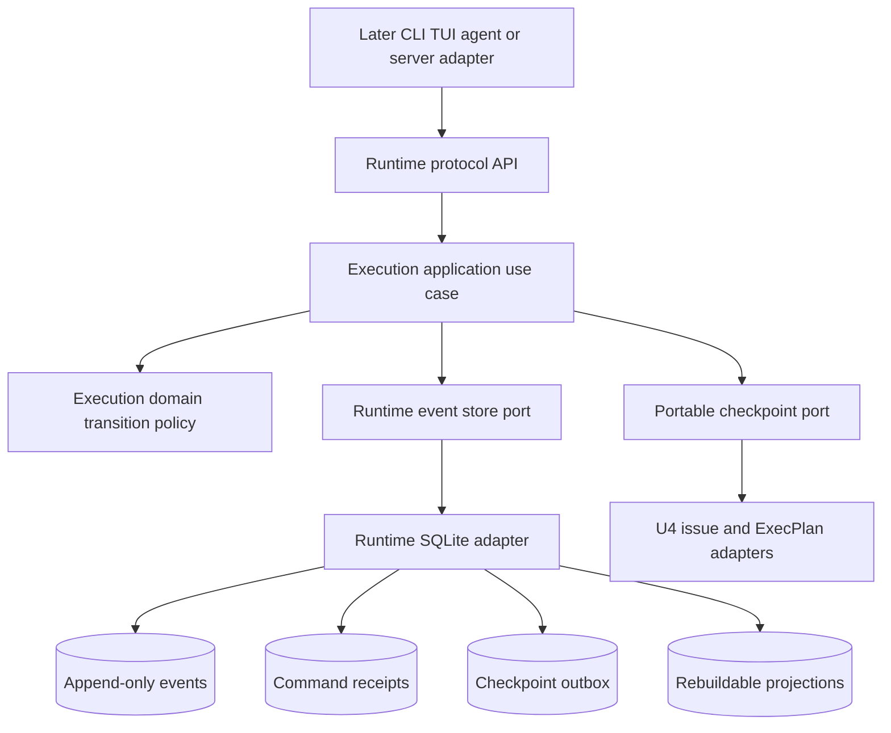
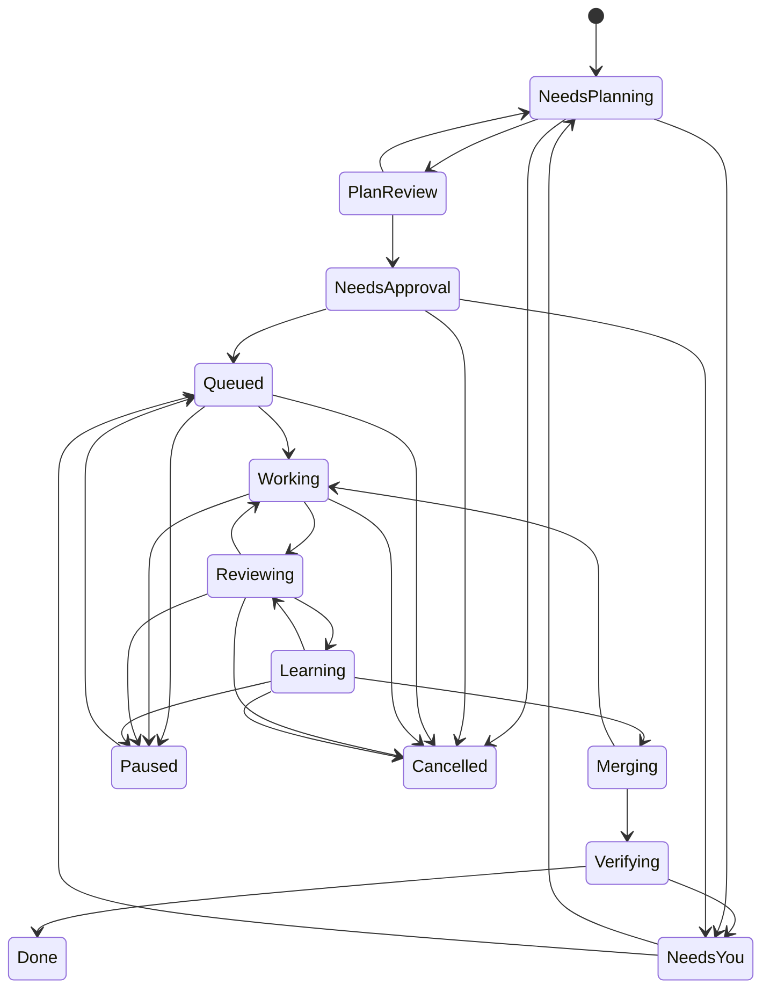
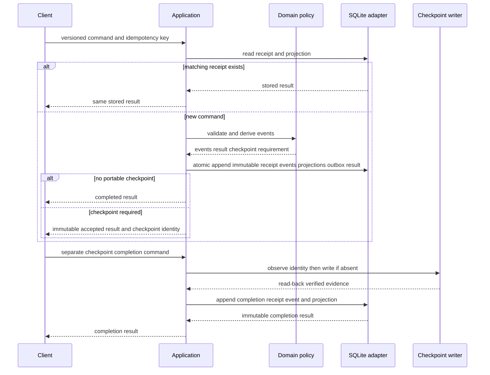
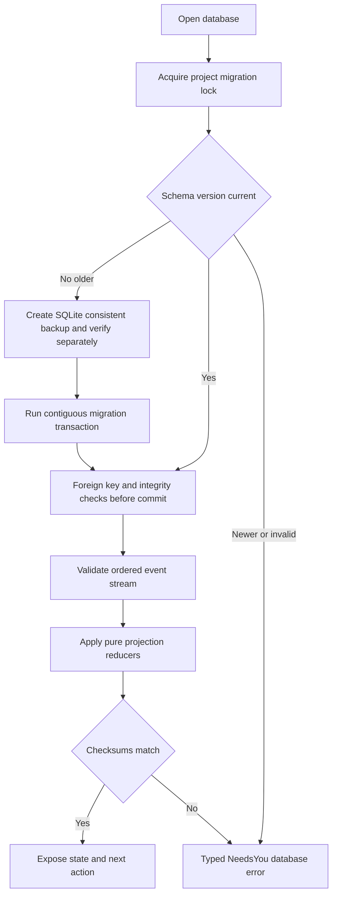

# Protocol, Lifecycle Kernel, and SQLite Event Model - Plan

This ExecPlan is a living document governed by `PLANS.md`. Keep `Progress`, `Surprises & Discoveries`, `Decision Log`, and `Outcomes & Retrospective` current during implementation.

This plan is complete enough for clean-room review, but it does not authorize implementation. Implementation may begin only after a reviewer approves the exact plan revision, the operator responds with standalone `APPROVED` for the stated `execute-plan` target, that approval is recorded and pushed in issue `cb67d131-975c-4d97-9a6f-4934be991ac6`, and `execution_authorized` is changed to `true`.

## Goal Capsule

- **Objective:** Give Mandem one versioned, deterministic contract for commands, lifecycle transitions, results, errors, events, leases, approvals, gate freshness, portable checkpoints, and replayable SQLite state.
- **Observable outcome:** Domain tests prove every allowed and rejected transition without infrastructure. Real temporary SQLite tests then prove atomic first delivery, exact retry results, monotonic per-issue ordering, migration recovery, projection deletion and rebuild, and restart-safe pending checkpoints.
- **Execution profile:** Implement test-first in one isolated worktree. Complete the milestones in order because the SQLite adapter depends on the protocol and lifecycle contracts.
- **Authority:** The operator approves immutable plan intent. Agents and clients may validate and display approval records, but they cannot create an operator approval or denial.
- **Stop conditions:** Stop for a product-scope change, a required change to the existing `Mandem-Approval: v1` format, an architecture exception, or evidence that Bun 1.3.14 cannot provide the required SQLite transaction behavior.
- **Tail ownership:** The worker commits, pushes, opens a pull request, and supplies verification evidence. The worker does not merge.

---

## Product Contract

### Summary

Mandem clients, agents, and later server processes need one shared way to request changes and interpret outcomes. U2 supplies that contract and the pure lifecycle policy before U3 adds a running server or transport. It also supplies the first durable operational ledger so a fresh process can reconstruct an issue without a provider transcript or surviving terminal session.

### Problem Frame

The current repository has a bounded `runtime` module and deterministic architecture tooling, but it has no workflow protocol, lifecycle state, execution module, or data store. If later issues invent those contracts independently, CLI, TUI, resident host, provider workers, and reconciliation could disagree about authority, retries, current state, and recovery.

SQLite cannot commit atomically with Git, a git-native issue ref, or an ExecPlan file. U2 must therefore distinguish a locally committed event from a required portable checkpoint. A command that requires both stores is not reported as fully successful until the portable checkpoint is proven. If that write fails or the process stops, the ledger retains enough pending state to reconcile safely before any successor transition.

### Actors

- A1. **Operator:** Supplies exact approval or denial and controls queue order, takeover, release, pause, cancellation, and other consequential decisions.
- A2. **Client:** A later CLI, TUI, skill, or phase agent that sends versioned commands and reads versioned results, errors, events, and context.
- A3. **Worker:** Performs one bounded execution or review iteration under an active session and lease.
- A4. **Control plane:** Validates commands, applies lifecycle policy, commits events and projections, and coordinates required portable checkpoints.
- A5. **Checkpoint writer:** A later adapter that writes significant facts to the git-native issue or ExecPlan and returns verifiable evidence.

### Requirements

**Protocol and attribution**

- R1. Every command, result, error, event, and portable checkpoint must carry a schema version and enough identity to attribute it to one project, full issue UUID, actor, correlation, and causation chain.
- R2. Every state-changing command must use a project-wide idempotency UUID bound to its command kind and canonical payload digest. Repeating the same key and payload must return the stored result; repeating the key with different content must return a stable conflict and cause no mutation.
- R3. Results and errors must use stable codes and include retryability, affected issue and correlation IDs, artifact references, and permitted next actions as data so later clients present the same recovery guidance.
- R4. Protocol parsers must reject unknown schema versions, unknown fields, malformed identifiers, noncanonical serialized content, and commands that omit required context.
- R4a. An application port must derive a trusted command principal from the local transport context before lifecycle policy runs. Envelope actor fields are requested attribution, not authentication; absent, unverifiable, or mismatched principals fail with a typed authorization error, and authentication material never enters durable protocol values.

**Lifecycle and authority**

- R5. The execution domain must encode the epic lifecycle as an exhaustive transition table with guards for current state, active lease and session, required artifacts, approval freshness, gate freshness, unresolved routed items, and portable checkpoint state.
- R6. Invalid ordering, missing evidence, expired or non-owner leases, late messages from replaced sessions, stale approval targets, stale gate inputs, and authority violations must fail closed with typed errors and no event append.
- R7. `Mandem-Approval: v1` from the public `architecture-standard` module is the only operator approval record. U2 must validate it and bind `execute-plan` to the exact plan commit and SHA-256 digest without defining a second approval format.
- R8. Approval-sensitive plan bytes include the whole plan at the approved commit. Future living-record exemptions require a separately reviewed parser and schema; U2 must not infer exemptions from Markdown headings or the working tree.
- R9. Gate decisions must name their versioned definition, input artifact digests, implementation or target revision, outcome, and evidence. A changed input invalidates only decisions that depend on it.
- R10. A lease must have one owner, session, resource, acquisition time, expiry, and fencing token. A stale owner must never mutate after expiry, takeover, cancellation, or accepted handoff.
- R11. An accepted phase handoff must bind the active lease and session, input artifact revisions, outcome, decisions, blockers, mutations, evidence, and next allowed transition. Acceptance atomically revokes the prior mutation lease.
- R12. Routed findings must use stable identities and exactly one current terminal disposition before `Done`. Superseding or reopening a disposition must append a linked event rather than erase history.
- R12a. Plan review must begin only after the initial plan revision is committed, its branch is pushed, and a planning pull request projects that branch for operator visibility. Each review manifest must store the complete sanitized prompt, reviewer role, reviewed plan path, commit, and digest, governing `PLANS.md` path, commit, and digest, and one repo-relative output path. The fresh reviewer must use the complete bound `PLANS.md` as the primary contract, use specialist lenses only as supplements, remain read-only except for the named file, and write the complete review there directly. Mandem hashes and commits the exact bytes unchanged. Terminal output and text copied by the orchestrator are invalid. If the orchestrator later synthesizes the review, it writes another file that links the immutable source path and digest and explains how it changed the text. A change to a bound input or output makes the verdict stale. Git remains sufficient to reconstruct the review if the hosting provider is unavailable; the pull request presents the same history but does not own it.
- R12b. A process finding is a routed finding created from an operator correction, agent error, review finding, interruption, or unexpected delay that may reveal an orchestration gap. It must record a stable identity, typed origin, affected phase, bounded evidence and artifact references, and exactly one current disposition: `execution-deviation`, `issue-contract-gap`, `product-contract-gap`, `operating-contract-gap`, or `no-reusable-change`. No phase-completion transition may succeed while a process finding is unresolved. A disposition that changes approved intent must route to `NeedsPlanning` and invalidate dependent review, approval, and gate evidence.
- R12c. The review manifest must prove that the reviewer session did not author or revise the governed artifact and did not receive the originating conversation. It names every author and reviser session, the reviewer session, provider and model when available, any risk rule that requires another provider or model, and the challenge lens. The originating session cannot submit the verdict. Mandem blocks review when this evidence is missing or no required reviewer is available; it never substitutes self-review.

**Durability and reconstruction**

- R13. SQLite must store an append-only event stream, command receipts with stored results, per-issue sequence allocation, pending portable checkpoints, and rebuildable projections in one project-local database contract.
- R14. First delivery must atomically store the immutable command receipt, payload digest, monotonically ordered events, projection changes, and result. A lost response followed by retry must return those exact result bytes without another effect. Checkpoint completion is a separate idempotent command and never rewrites the original receipt.
- R15. Projection tables must be disposable. Replaying valid events in sequence into staging projections must match a non-disposable checksum anchor in the append ledger before atomically replacing live projections and exposing exactly one next permitted action.
- R16. Events and checkpoints must store bounded structured facts, hashes, and artifact references. Every persisted string and collection must have a documented size and format limit. Durable schemas must reject credentials, personal data, provider transcripts, raw prompts, filesystem content, and unbounded logs or free text.
- R17. A transition that requires a portable checkpoint must commit one pending checkpoint record uniquely bound to its originating event before external I/O and block successor transitions. The checkpoint writer must observe the deterministic checkpoint identity before retrying a write, and only read-back evidence matching the immutable payload digest may complete it. Interruption must leave one recoverable pending action.
- R18. Malformed events, sequence gaps, digest mismatches, projection checksum mismatches, migration failures, and ambiguous contradictions among durable sources must stop reconstruction with a typed `NeedsYou` outcome rather than skip or guess.
- R19. The SQLite adapter must use Bun 1.3.14's built-in `bun:sqlite`, strict parameter binding, safe integer handling, foreign-key enforcement, WAL mode, a bounded busy timeout, explicit transactions, and real temporary-file tests.
- R20. Schema upgrades must be ordered, versioned, and serialized under one project-local cross-process migration lock acquired before version inspection or backup. The applied-migration history and `user_version` must agree. A SQLite-consistent, separately verified backup must precede change, and required validation must pass before commit. Any failed or post-commit-invalid upgrade must restore a verified prior database and never expose a partially accepted schema.

**Architecture and downstream contracts**

- R21. `runtime` owns shared protocol, serialization, checkpoint, and event-store contracts. `execution` owns lifecycle policy, leases, approvals and gate freshness, handoffs, routed-item disposition, and lifecycle use cases.
- R22. Domain code remains pure. Application use cases depend on ports. `bun:sqlite`, clocks, UUID creation, hashing backed by host libraries, filesystem paths, and checkpoint I/O remain behind infrastructure adapters or composition roots.
- R23. Each module must conform to `docs/architecture/architecture-standard-v1.md`, expose cross-module behavior only through its root barrel, keep infrastructure out of root barrels, and include module-local tests and fakes.
- R24. U2 must document the protocol, lifecycle, source precedence, transaction boundary, replay contract, and downstream extension points in `docs/architecture/control-protocol.md` and index it from `docs/architecture/README.md`.

### Key Flows

- F1. **First command delivery and lost response**
  - **Trigger:** A client submits a new command and loses the response after commit.
  - **Steps:** The control plane validates the envelope, commits its receipt, events, projection changes, and result atomically, then returns the stored result when the client retries the same key and payload.
  - **Outcome:** One command causes one effect even when delivery is ambiguous.
- F2. **Portable checkpoint completion**
  - **Trigger:** A valid transition requires a git-native issue or ExecPlan checkpoint.
  - **Steps:** SQLite records the event and uniquely bound pending checkpoint, blocks successors, and returns an immutable accepted result. A separate completion command first observes the deterministic checkpoint identity, writes only if absent, verifies the external bytes by digest, and records immutable evidence.
  - **Outcome:** A local commit is never misreported as a completed portable transition.
- F3. **Fresh phase after handoff or interruption**
  - **Trigger:** A worker submits a handoff, disappears, expires, or is replaced.
  - **Steps:** A valid handoff revokes the prior lease. Without one, reconciliation uses the last accepted checkpoint and gives a fresh session a new fencing token and bounded context.
  - **Outcome:** Late messages from an old session cannot mutate current work.
- F4. **Projection rebuild after restart**
  - **Trigger:** Projection tables are absent or declared stale.
  - **Steps:** The application validates schema and event integrity, replays every event in order, recomputes projections, and compares canonical checksums.
  - **Outcome:** The rebuilt state and next permitted action match the pre-restart state.
- F5. **Authority or source contradiction**
  - **Trigger:** Approval, gate, Git, issue, plan, event, or observed process facts disagree and precedence cannot decide safely.
  - **Steps:** The control plane records the contradiction without applying the requested transition and projects `NeedsYou` with bounded evidence and permitted operator actions.
  - **Outcome:** Mandem does not silently repair an authority-sensitive conflict.
- F6. **Process discrepancy becomes a durable repair decision**
  - **Trigger:** An operator correction, agent error, review finding, interruption, or unexpected delay may reveal an orchestration gap.
  - **Steps:** The control plane creates or deduplicates one process finding, records bounded evidence and the affected phase, requires one of the five R12b dispositions, links resulting contract or enforcement artifacts, and invalidates dependent review, approval, or gates when governed intent changes.
  - **Outcome:** The phase cannot complete with an unresolved finding, and replay reconstructs both the discrepancy and its current disposition without conversation history.

### Acceptance Examples

- AE1. Given a valid `NeedsApproval -> Queued` command with a current `execute-plan` approval, when the command is delivered twice with the same key and bytes, then both calls return the same result and the ledger contains one transition event.
- AE2. Given a caller reuses that key with a different plan digest, when the control plane validates it, then it returns `IDEMPOTENCY_KEY_REUSED` and changes nothing.
- AE3. Given a worker is killed after SQLite commits a pending checkpoint, whether before or after the issue ref is updated, when a fresh process reconstructs the issue, then it observes the deterministic external identity first, exposes at most one pending action, and permits no successor transition until matching read-back evidence is recorded.
- AE4. Given an active worker lease is replaced by takeover or accepted handoff, when the prior session submits a late command, then fencing-token validation rejects it without an event.
- AE5. Given approval, gate definition, or target revision changes, when a guarded transition is requested, then only the affected evidence becomes stale and the error names the exact refresh action.
- AE6. Given projection tables are deleted, when all valid events replay into staging tables, then their canonical checksum matches the immutable append-ledger anchor before they atomically replace live projections, and the next permitted action equals the pre-deletion snapshot.
- AE7. Given a schema migration fails after backup creation, when the database is reopened, then the prior schema remains usable, the schema version is unchanged, and the backup passes integrity checks.
- AE8. Given every agent conversation and process is closed, when a fresh client reads context, then it receives the same issue, plan revision, workspace, authority, gate, checkpoint, lifecycle, and next-action facts without transcript data.
- AE9. Given one routed finding has no current terminal disposition, when closure is requested, then `Done` is rejected. After one valid disposition is appended, closure may proceed if every other guard passes.
- AE10. Given the operator corrects an attempted plan review that lacks its required PR, when the correction is recorded twice, then one process finding exists with the same stable identity. `accept-plan-review` remains blocked until the finding is dispositioned; a `product-contract-gap` disposition links the epic, affected issue plans, and enforcement scope, returns changed approved intent to `NeedsPlanning`, and replays identically after restart.
- AE11. Given a committed review manifest binds one `PLANS.md` digest, when the governing file changes before Mandem accepts the verdict, then Mandem returns a stable stale-artifact error and appends no accepted-review event. A new manifest that binds the current complete file lets a fresh reviewer prove every applicable requirement before supplemental lenses run.
- AE12. Given a reviewer returns findings in terminal output but does not write the manifest's output file, when Mandem evaluates the verdict, then it rejects it without an event. Given the reviewer writes only the named file, Mandem keeps those exact bytes and digest; a later synthesis uses a different path and names its source digest and explains how it changed the text.
- AE13. Given the plan author submits a review verdict, the reviewer received the authoring conversation, or risk policy requires an available alternative provider or model that Mandem did not use, when Mandem evaluates the verdict, then it rejects it. A fresh session that did not author the artifact may submit its own output after receiving a challenge-oriented prompt and recording all required session and provider facts.

### Scope Boundaries

**Included now**

- Pure, versioned protocol values and canonical serialization.
- Lifecycle transition and guard policy, lease fencing, handoff acceptance, approval and gate freshness, routed-item disposition, and portable checkpoint selection.
- Application ports and use cases for command handling, checkpoint completion, replay, and projection rebuild.
- A real `bun:sqlite` event-store adapter, schema migrations, backups, WAL configuration, integrity validation, and temporary-database tests.
- Architecture documentation for downstream implementers.

**Deferred to follow-up issues**

- U3 owns the running server, local socket transport, Docker lifecycle, resident host mode, process reconciliation, and startup wiring.
- U4 owns git-native issue and ExecPlan adapters, queue behavior, typed gates as product features, primitive CLI commands, and GitHub projections.
- U5 owns provider-session launch and provider capability adapters.
- U6 owns real worktree execution, PR review and repair, Learn, merge coordination, and external Git/hosting reconciliation.
- U7 owns TOON and human rendering, complete AXI CLI behavior, OpenTUI, and live worker views.

**Outside U2**

- Public network APIs, polling transports, provider transcripts as durable state, model API orchestration, natural-language workflow tools, and any UI.
- Performing an actual merge, GitHub mutation, operator approval, or git-native issue write.
- Treating a Markdown working-tree edit as approved content or inventing living-plan exemptions before their format is reviewed.

### Dependency Snapshot

U2 consumes these merged outputs:

- U1 at `88b9533ab840c9d357a1d09d2341709e2cbdd986`: the single Bun package, thin entrypoints, initial `runtime` module, public barrels, and canonical `bun run check` direction.
- U1C merged by `27d4abe1a2815bfef1bec56c71bc6d90880ef035`: the checked 22-rule architecture catalog, package proof, deterministic filesystem analysis, and corrected public module contract.
- U1A merged by `e75f66591e5494cc94a8d8dd4d43c7be86d72227`: documentation and authored-source manifests, `@fileoverview` enforcement, repository hooks, revision checks, and the `Mandem-Approval: v1` public contract.
- WI1 merged by `2efc4d7cf1f8e968ca38c46938014185d825ca8b`: full issue UUIDs, native issue graph metadata, deterministic plan/apply separation, immutable projection transactions, exact retry verification, and the rule that provider state is a projection.

The current repository at `3fa78093ba5d17cc5da4cb9173bc85073b9d074f` passes those outputs to U2. The previous scaffold text that described U1C, U1A, or WI1 as incomplete is superseded.

---

## Planning Contract

### Context and Orientation

`src/modules/runtime/` currently provides only executable identity and Bun-version policy. U2 extends it with transport-independent protocol and persistence contracts. U2 also creates `src/modules/execution/` because lifecycle policy is a business capability rather than process-runtime plumbing.

The architecture standard requires every module to contain `domain`, `application`, `infrastructure`, `api`, `tests/fakes`, `README.md`, a root `index.ts`, `domain/types.ts`, and `api/composition.ts`. A module root barrel may export stable domain, application, and API behavior but never infrastructure. Cross-module imports use `@/modules/<module>`.

An **event** is an immutable fact that already happened. A **projection** is disposable current-state data derived from ordered events. A **command receipt** binds one idempotency key to the canonical command digest and stored result. A **fencing token** is a monotonically increasing lease generation that lets the control plane reject a previous owner's late command. A **portable checkpoint** is a significant lifecycle fact written outside SQLite to the git-native issue or ExecPlan so a fresh environment can recover intent and authority. A **checkpoint outbox** is the durable SQLite record that says an external checkpoint still needs to be written or verified.

### Key Technical Decisions

- KTD1. **Use one protocol envelope with discriminated command payloads.** Define a small catalog of named primitive commands instead of a generic `advance` command. Initial primitives cover lease acquisition/release/revocation, lifecycle transition submission, approval and gate references, handoff acceptance, checkpoint completion, heartbeat facts, routed-item disposition, pause, resume, cancellation, takeover, and reconciliation outcomes. This keeps authorization and validation specific while later interfaces reuse the same contract.
- KTD2. **Use canonical JSON semantics and explicit schema versions.** Reuse `canonicalJson` and approval types from `@/modules/architecture-standard`. Each stored or exchanged envelope has a versioned marker, exact field validation, LF-normalized canonical serialization, and digest tests. Unknown versions or fields fail closed.
- KTD3. **Use project-wide idempotency UUIDs for the ledger lifetime.** Bind the key to command kind plus canonical payload digest. Store the result indefinitely with the event ledger. A matching retry returns the stored result; a mismatched retry returns `IDEMPOTENCY_KEY_REUSED`.
- KTD3a. **Authenticate outside the durable envelope and authorize before policy.** A trusted application port maps U3's future local transport identity to a command principal with actor role and authority scopes. Command handling compares that principal with the envelope's requested attribution before receipt lookup or policy. Tests use a fake principal provider; U3 supplies the real local adapter.
- KTD4. **Use one module dependency direction: execution depends on runtime.** `runtime` owns envelopes, events, immutable command receipts, serialization, event-store and checkpoint ports, checkpoint outbox contracts, SQLite migrations, and the adapter. `execution` owns lifecycle states and guards, leases, handoffs, approval and gate freshness, routed items, and every command, checkpoint-completion, and replay orchestration use case. `execution` imports runtime only through `@/modules/runtime`; runtime never imports execution. Composition injects execution's pure reducers into runtime-owned persistence contracts where needed.
- KTD5. **Reuse the existing approval record without extending it in U2.** `execute-plan` guards entry into queued work. Other existing actions remain valid protocol references for later issues, but U2 does not implement their workflows or add actions. Plan freshness compares the approved commit and digest with canonical plan bytes read through an application port.
- KTD6. **Represent living-plan exemptions as unsupported until a reviewed format exists.** The epic describes machine-delimited living regions, but no merged parser or schema exists. U2 hashes the full approved plan bytes. A later issue may add exemptions only through a plan revision, tests, clean-room review, and new approval.
- KTD7. **Use an explicit transition catalog and pure reducer.** Each transition declaration names source, destination, command, authority, lease rule, artifact prerequisites, gate and approval prerequisites, unresolved-item rule, portable checkpoint type, and failure code. Tests derive coverage from this finite catalog and pair each rejection with an allowed control.
- KTD8. **Use leases with fencing tokens, not timestamps alone.** Expiry makes a lease eligible for replacement, but every mutation must also present the active lease ID, session ID, and fencing token. Takeover, cancellation, and accepted handoff revoke the old lease atomically with the lifecycle event.
- KTD9. **Use a transactional checkpoint outbox across the SQLite/portable boundary.** The lifecycle event and one uniquely bound pending checkpoint commit together, and the original receipt remains an immutable accepted result. Successors remain blocked while checkpoint work is pending. A separate idempotent completion command observes the deterministic external identity before write, verifies read-back bytes and digest, then appends immutable evidence. Reconciliation enters `NeedsYou` on conflicting evidence instead of promising cross-store exactly-once I/O.
- KTD10. **Use Bun's built-in SQLite driver.** Open `bun:sqlite` with strict binding and safe integers. Enable foreign keys, WAL, and a bounded busy timeout on every connection. Use explicit immediate write transactions so one writer allocates the next per-issue sequence and commits receipt, events, projections, and result together.
- KTD11. **Version migrations in code under a cross-process lock.** A migration catalog has contiguous integer versions and immutable checksums. Hold one project-local migration lock before reading versions, creating a SQLite-consistent backup, or admitting another writer. Verify the backup through a separate connection, compare the complete applied-migration history with `user_version`, run only transactional migrations, and validate foreign keys and integrity before commit. If later open validation fails, restore the verified backup before exposing the database. U3 may choose startup timing, but it must reuse this U2 service.
- KTD12. **Treat events and replay anchors as durable and projections as replaceable.** The append ledger includes event identity and digest plus the reducer and projection schema versions and expected post-append aggregate checksum. Rebuild validates every sequence and digest, reduces into isolated staging projections, compares the durable anchor, and atomically swaps only a valid complete rebuild.
- KTD13. **Define source precedence per fact class.** The architecture document must list each portable intent, approval, checkpoint, operational event, commit, pull request, check, merge, lease, and process-observation fact with its authoritative recorder, acceptable evidence, freshness key, conflict rule, and `NeedsYou` action. SQLite may record observations and references but may not repair Git-, issue-, plan-, or approval-owned facts. Safe source disagreement may append a bounded reconciliation event only after ledger integrity passes; storage or event-integrity failure is read-only and preserves the database for recovery.
- KTD14. **Store bounded context, never conversational content.** Events reference artifact paths, commits, digests, provider/session IDs, and evidence summaries. Credentials, raw prompts, transcripts, terminal logs, and arbitrary stdout are rejected from durable envelope schemas.
- KTD15. **Open the planning pull request before review and keep the review record in Git.** The planning branch contains the ExecPlan plus committed review manifests and reviewer-authored outputs under `docs/plans/reviews/`. Each manifest records the complete reviewer prompt and role, exact reviewed plan commit and digest, exact governing `PLANS.md` commit and digest, and sole permitted output path. The reviewer writes the full result to that path; Mandem validates the write set, hashes the file, and commits it without re-authoring. Review policy compares both bound inputs and the exact output digest for freshness. Optional synthesis uses another path and records the source digest and transformation. GitHub renders the branch, discussion, and checks for the operator, but Mandem reconstructs review state from Git and the git-native issue. A provider outage may delay projection updates; it cannot erase or redefine the review.
- KTD16. **Represent Mandem process feedback through routed items.** Add `process-finding` as a routed-item kind with the five closed dispositions from R12b. Creation and disposition append events; correction never rewrites the original evidence. Phase-completion guards require every current process finding to have one terminal disposition. U2 defines the protocol and policy only; U4 captures findings and links contract changes, while U6 drives repair and Learn behavior.
- KTD17. **Verify that a fresh non-author session wrote the review.** Review manifests and verdicts name every author and reviser session, the reviewer session, provider and model when available, risk policy, and challenge lens. Lifecycle policy rejects an author as reviewer, inherited author context, or failure to use another available provider or model when policy requires it. If only one provider is installed and policy permits it, a fresh non-author session may review after the manifest records that limitation.

### High-Level Technical Design

#### Fact ownership and conflict handling

| Fact class | Authoritative recorder | Accepted evidence | Freshness key | Conflict response |
| --- | --- | --- | --- | --- |
| Product intent, canonical plan, and portable lifecycle checkpoint | Git-native issue and committed ExecPlan | Exact ref, commit, path, and content digest | Issue-ref head and plan commit/digest | Preserve both observations and enter `NeedsYou`; never rewrite from SQLite. |
| Plan-review prompt, findings, dispositions, and verdict | Committed review artifacts and git-native issue checkpoints | Artifact path, artifact commit, reviewed plan commit and digest, reviewer identity, and pull-request reference when available | Current plan digest plus latest completed review round | Reject missing or stale review; reconstruct from Git when the hosting projection is unavailable. |
| Operator approval or denial | Canonical `Mandem-Approval: v1` commit on the issue ref | Parsed record plus ancestry proof | Action and immutable target | Reject guarded transition as absent, denied, stale, malformed, or incomparable. |
| Commit, pull request, check, and merge | Git and hosting provider | Exact repository, ref, head, status, and provider identity | Target branch and exact head SHA plus gate definition | Observe first; deterministic stale evidence returns to its safe lifecycle state, ambiguity enters `NeedsYou`. |
| Operational command, event, receipt, lease, outbox, and projection | Validated SQLite append ledger | Canonical event stream and immutable replay anchors | Database schema, event schema, sequence, and digest | Safe source disagreement may append a bounded reconciliation event; storage-integrity failure makes the ledger read-only. |
| Live process, tmux pane, or provider session | No durable authority; observation only | Bounded process and session identifiers | Observation timestamp and lease fencing token | Never infer completion. Reconcile against durable facts or enter `NeedsYou`. |

SQLite may retain hashes and references to facts owned elsewhere, but those observations do not become permission to mutate the owning source.

#### Module and data flow

The execution application use case validates the versioned command, reads current projection state through a runtime port, invokes pure lifecycle policy, and asks the event store to commit the complete local transaction. Infrastructure never decides whether a transition is allowed.

#### Lifecycle state machine

The transition catalog also permits a guarded move to `NeedsYou` from any nonterminal state when reconciliation finds an ambiguous or authority-sensitive contradiction. `Merging` is non-cancellable after its exact-head external transaction begins; interruption there records reconciliation work and resolves only to `Working`, `Verifying`, or `NeedsYou` after Git and hosting evidence is read. `Done` and `Cancelled` are terminal. Paused work preserves its workspace and lease history but has no active mutation lease.

#### Atomic command and checkpoint sequence

If the checkpoint writer fails or the process stops, the original stored accepted result never changes. The transition's local facts remain durable, successor commands fail with `CHECKPOINT_PENDING`, and reconciliation observes the exact external checkpoint identity before retrying. Clients read checkpoint projection state for eventual completion; the separate completion command has its own immutable receipt.

#### Replay and migration sequence

### Lifecycle Guard Contract

Every transition declaration must answer these questions in data so a test can enumerate the complete catalog:

1. Which source states and command kind permit the transition?
2. Which actor role and authority scope may request it?
3. Must the caller hold an active lease and matching fencing token, or must no mutation lease exist?
4. Which plan commit, approval, handoff, PR, review, Learn, gate, merge, or verification artifacts must be present and fresh?
5. Which pending checkpoint, unresolved routed item, stale evidence, or contradiction blocks it?
6. Which event or events, projection changes, lease changes, result code, and portable checkpoint follow success?
7. Which stable error and permitted next action follow each failed guard?

The catalog must cover all displayed edges plus global `NeedsYou` reconciliation edges. Tests must compare the catalog with a fixture inventory so adding a transition or guard without rejection and allowed-boundary tests fails deterministically.

#### Transition catalog

Every row below is part of protocol v1. `portable` means the transition commits a checkpoint outbox item and returns an immutable accepted result until a separate completion command records read-back evidence. `local` means the SQLite transaction may return completed immediately. All commands require a trusted principal whose role matches the row. Any nonterminal state may enter `NeedsYou` through `record-reconciliation-conflict` only after ledger integrity passes and evidence shows an ambiguous or authority-sensitive contradiction.

| From | Command | Role | Lease rule | Required fresh inputs | To | Events and result | Checkpoint |
| --- | --- | --- | --- | --- | --- | --- | --- |
| `NeedsPlanning` | `submit-plan-review` | phase agent | Matching planning session; no worker lease | Canonical plan path, commit, digest, self-check evidence, pushed planning branch, planning PR identity and exact head, and committed review manifest binding the full prompt, reviewer role, plan target, governing `PLANS.md` commit and digest, and sole output path | `PlanReview` | Plan submitted; accepted | portable plan revision and review-round manifest |
| `PlanReview` | `reject-plan-review` | phase agent | Matching review session | Typed blockers and reviewed plan target | `NeedsPlanning` | Review rejected; completed | portable review verdict |
| `PlanReview` | `accept-plan-review` | phase agent | Matching fresh review session that did not author or revise the plan and did not receive its authoring conversation | Full `PLANS.md` conformance and executor-safe verdict from the exact file the reviewer wrote and its digest; write set contains only that output; session and provider rules pass; plan and governing-contract targets remain unchanged; every process finding has one terminal disposition | `NeedsApproval` | Review accepted; completed | portable review verdict |
| `NeedsApproval` | `record-plan-decision` with denial | operator | No worker lease | Canonical denied `execute-plan` record | `NeedsYou` | Approval denied; accepted | portable approval decision |
| `NeedsApproval` | `queue-approved-plan` | operator or control plane | No worker lease | Canonical approved `execute-plan` record matching plan and review | `Queued` | Plan approved and queued; accepted | portable approval and queue checkpoint |
| `Queued` | `acquire-work-lease` | control plane | No active work lease; dependency guards pass | Queue order, dependency completion, workspace identity | `Working` | Lease acquired and work dispatched; accepted | portable dispatch checkpoint |
| `Working` or `Merging` | `record-lease-heartbeat` | current worker or integration owner | Active matching lease, session, and fencing token; heartbeat does not extend expiry | `heartbeat-lease` scope; `observed_at` is no earlier than the prior heartbeat or acquisition and no later than lease expiry | unchanged | `lease-heartbeat-recorded`; completed | local |
| `Working` or `Merging` | `takeover-work-lease` | operator or control plane | Existing lease is expired, or operator explicitly overrides it; increment fencing token and revoke prior lease atomically | `takeover-lease` scope, prior lease identity, new owner and session, bounded expiry, takeover reason | unchanged | `work-lease-taken-over`; accepted | portable takeover checkpoint |
| `Working` | `release-work-lease` | current lease owner, operator, or control plane | Active matching lease and fencing token; operator may release another owner with `release-lease` scope | Release reason, operator summary, reconciliation evidence, current lease identity, and safe workspace reference | `Queued` | `work-lease-released`; lease revoked, recovery recorded, and fresh dispatch enabled; accepted | portable release and reconciliation checkpoint |
| `Working` | `submit-work-handoff` | worker | Active work lease, session, fencing token; lease revoked on accept | Iteration commit, validation evidence, workspace and PR references | `Reviewing` | Work handoff accepted; accepted | portable work handoff |
| `Reviewing` | `record-review-findings` | control plane | Active review session ends; atomically create the named fresh repair-worker lease, session, expiry, and next fencing token | Reviewer handoff, PR and exact reviewed head, actionable findings, successor worker identity | `Working` | Review repair requested and repair lease acquired; accepted | portable review verdict and dispatch checkpoint |
| `Reviewing` | `accept-review` | reviewer | Active review session | PR and exact reviewed head, clean verdict; every process finding raised through Review has one terminal disposition | `Learning` | Review accepted; accepted | portable review verdict |
| `Learning` | `invalidate-review` | phase agent | Active Learn session | Learn mutation changes reviewed head or governed artifact | `Reviewing` | Review invalidated; accepted | portable invalidation checkpoint |
| `Learning` | `accept-learn` | control plane | Active Learn session ends; atomically create the control-plane integration lease, expiry, and next fencing token | Learn handoff, terminal disposition for every routed item including every process finding, linked repairs or dismissal reasons, fresh affected gates, integration owner identity | `Merging` | Learn accepted and integration lease acquired; accepted | portable Learn handoff and integration checkpoint |
| `Merging` | `return-for-repair` | control plane | Active integration lease and fencing token; atomically revoke it and create the named repair worker's work lease with the next work-resource fencing token | Git/provider evidence proves unmerged stale head or repairable sync conflict; named repair worker, session, and bounded expiry | `Working` | Merge repair requested, integration lease revoked, and work lease acquired; accepted | portable reconciliation and dispatch checkpoint |
| `Merging` | `record-exact-merge` | control plane | Active integration lease; command is non-cancellable after external attempt begins | Approved exact head, fresh review/Learn/gates, provider read-back proves merge | `Verifying` | Exact merge recorded; accepted | portable merge checkpoint |
| `Verifying` | `record-verification-success` | control plane | No worker lease | Merge SHA and plan-defined verification evidence | `Done` | Verification passed and issue completed; accepted | portable closure checkpoint |
| `Verifying` | `record-verification-failure` | control plane | No worker lease | Merge SHA and failing evidence | `NeedsYou` | Verification failed; accepted | portable incident checkpoint |
| `NeedsYou` | `resume-planning` | operator | No mutation lease | Resolution changes plan or approval-sensitive intent | `NeedsPlanning` | Operator resolution recorded; accepted | portable decision checkpoint |
| `NeedsYou` | `resume-queued` | operator | No mutation lease | Resolution changes only runtime or authority blocker; existing approval remains fresh | `Queued` | Operator resolution recorded; accepted | portable decision checkpoint |
| `Queued`, `Working`, `Reviewing`, or `Learning` | `pause-work` | operator | Revoke any active mutation lease and increment fencing token | Bounded pause reason and workspace reference | `Paused` | Work paused and lease revoked; accepted | portable pause checkpoint |
| `Paused` | `resume-work` | operator | No active mutation lease | Reconciliation proves workspace and approval/gates remain usable | `Queued` | Work resumed for fresh dispatch; accepted | portable resume checkpoint |
| `NeedsPlanning`, `NeedsApproval`, `Queued`, `Working`, `Reviewing`, or `Learning` | `cancel-work` | operator | Revoke active lease and preserve workspace | Cancellation allowed only before exact merge attempt | `Cancelled` | Work cancelled and lease revoked; accepted | portable cancellation checkpoint |
| Any nonterminal state except integrity-failed storage | `record-reconciliation-conflict` | control plane | Revoke unsafe mutation lease | Ledger is valid; bounded source evidence is ambiguous or authority-sensitive | `NeedsYou` | Conflict recorded; accepted | portable incident checkpoint |
| Any nonterminal state | `record-process-finding` | operator, phase agent, worker, reviewer, or control plane | State-preserving; an active lease neither grants nor blocks authority | `record-process-finding` scope; typed origin matches actor or observed event; affected phase exists; bounded evidence tuple computes a valid finding ID | unchanged | `process-finding-recorded`; completed, or duplicate completed with original event ID | local |
| Any nonterminal state | `dispose-process-finding` | operator or control plane; current phase agent only for `execution-deviation` or `no-reusable-change` | State-preserving; no lease requirement | Existing unresolved finding; one of five dispositions; issue-, product-, or operating-contract gaps link the required repair artifact | unchanged unless changed approved intent, then `NeedsPlanning` | `process-finding-disposition-recorded`; completed | portable when intent changes, otherwise local |
| Any nonterminal state | `supersede-process-finding-disposition` | operator or control plane | State-preserving; no lease requirement | Existing current disposition, exact prior event ID, different valid disposition, reason code, and required repair artifacts | unchanged unless changed approved intent, then `NeedsPlanning` | `process-finding-disposition-superseded`; completed | portable when intent changes, otherwise local |

Every row rejects an untrusted principal, wrong role, invalid source state, active or missing lease contrary to the rule, stale fencing token, absent or stale named input, unresolved required disposition, or pending checkpoint. Errors name the failed guard and one of these next actions: refresh plan approval, refresh gate, complete checkpoint, release or reacquire lease, reconcile sources, return to planning, or ask the operator. A `Merging` interruption never accepts cancel; reconciliation must observe Git and provider state and select `Working`, `Verifying`, or `NeedsYou` through the corresponding row.

For process-finding creation, origin and role must match this table: an operator may submit `operator-correction`; a phase agent, worker, reviewer, or control plane may submit `agent-error` for its own session; only a reviewer may submit `review-finding`; the active phase principal or control plane may submit `interruption`; and only the control plane may submit `unexpected-delay` from clock evidence. A principal may report an observed error by another actor only through `operator-correction` or `review-finding`; it may not impersonate that actor's `agent-error`. `Plan` permits operator, phase agent, and control plane; `PlanReview` permits operator, reviewer, phase agent, and control plane; `Work` permits operator, worker, reviewer, and control plane; `Review` permits operator, reviewer, worker, and control plane; `Learn` permits operator, phase agent, reviewer, and control plane. Other nonterminal phases permit only operator and control plane. `ACTOR_ROLE_FORBIDDEN` plus `ask-operator` rejects a disallowed role or origin, and `AUTHORITY_SCOPE_MISSING` plus `ask-operator` rejects a missing scope without appending.

Lease creation is also deterministic. A new lease uses the accepted command ID as `lease_id`, the command timestamp as `acquired_at` and initial `last_heartbeat_at`, and the prior resource's fencing token plus one, or `1` when the issue has never held that resource. `acquire-work-lease` creates a `work` resource; `accept-learn` creates an `integration` resource; review repair and `return-for-repair` create a `work` resource. For `return-for-repair`, the event records the revoked integration lease and new work lease together; the new work lease uses the command ID, named repair worker and session, command time, requested expiry, `review-repair` reason, and next work-resource fencing token. The prior integration owner is fenced in the same transaction. Takeover revokes the prior lease at the takeover command timestamp, records `takeover`, and creates the replacement with the takeover command ID and next token in one event payload. Heartbeat records a fact but never moves expiry. A release from `Working` sets `revoked_at` to the command timestamp, records the bounded operator summary and reconciliation artifacts in the event, clears the active lease, and moves to `Queued`; only then may `acquire-work-lease` dispatch a fresh worker. `Merging` rejects `release-work-lease` because an external transaction may have started. Its takeover owner must use `record-exact-merge`, `return-for-repair`, or `record-reconciliation-conflict` after reading Git and provider evidence. A released lease cannot heartbeat, hand off, merge, or release again; those attempts fail `LEASE_REQUIRED` or `LEASE_FENCED` according to the ordered error catalog. SQLite stores the complete lease value, and replay reconstructs it only from lease-bearing events.

`complete-checkpoint` is a protocol-v1 state-preserving command available whenever one outbox item is pending. Only a trusted checkpoint-writer principal with `complete-portable-checkpoint` scope may submit it. The command requires the pending checkpoint UUID, originating event UUID, immutable payload digest, external destination identity, and read-back evidence digest. Pending plus matching absent-or-identical external state emits one checkpoint-verified event and updates the outbox and checkpoint projection; a same-key retry returns the stored completion result. Already verified plus identical evidence is an idempotent success. Wrong identity, payload, destination, stale writer session, or conflicting evidence returns `CHECKPOINT_CONFLICT`, changes no prior evidence, and permits only `reconcile-sources` or `ask-operator`. No lifecycle successor becomes eligible until the verified projection is committed.

`record-process-finding` is a protocol-v1 state-preserving command in every nonterminal phase. A trusted operator, phase agent, worker, reviewer, or control-plane principal may submit it with `record-process-finding` scope. Its payload carries a typed origin, the affected phase, one evidence code, and artifact references. The parser sorts artifact references by their canonical bytes and computes `finding_id` as the lowercase SHA-256 of canonical JSON containing exactly `protocol_version`, `project_id`, `issue_id`, `origin`, `affected_phase`, `evidence_code`, and the sorted artifact references. The client does not supply the ID. SQLite enforces `UNIQUE(project_id, issue_id, finding_id)`. First delivery emits `process-finding-recorded`; the same tuple under another idempotency key returns `completed` with the original event in `duplicate_of_event_id` and appends nothing. A request with the same origin, phase, and evidence code but different artifact bytes is a different finding rather than a conflicting duplicate. The ordinary same-key/different-command rule still returns `IDEMPOTENCY_KEY_REUSED`. Evidence follows the durable limits below and never embeds prose, prompts, transcripts, or logs. The command does not change lifecycle state, but its unresolved projection blocks every phase-completion command. Plan, Work, Review, and Learn tests must each prove first delivery, tuple deduplication, changed-evidence identity, authorization rejection, blocking until disposition, and restart replay.

### Protocol v1 Serialized Interface

These definitions are prescriptive. Implementation may split them across the named files, but it may not rename fields, widen a union, add optional data, or export an infrastructure type without a protocol-version change.

    type Uuid = string;
    type Sha256 = string;
    type GitSha = string;
    type UtcTimestamp = string;
    type RepoPath = string;
    type FindingId = Sha256;

    interface CommandEnvelopeV1 {
      protocol_version: 1;
      command_id: Uuid;
      idempotency_key: Uuid;
      project_id: Uuid;
      issue_id: Uuid;
      correlation_id: Uuid;
      causation_id: Uuid | null;
      occurred_at: UtcTimestamp;
      requested_actor: ActorAttributionV1;
      payload: CommandPayloadV1;
    }

    interface ActorAttributionV1 {
      actor_id: Uuid;
      role: "operator" | "phase-agent" | "worker" | "reviewer" | "control-plane" | "checkpoint-writer";
      session_id: Uuid;
      authority_scopes: AuthorityScopeV1[];
    }

    interface ArtifactReferenceV1 {
      kind: "issue-ref" | "plan" | "review-prompt" | "review-output" | "approval" | "commit" | "pull-request" | "check" | "handoff" | "learn" | "process-contract";
      path: RepoPath | null;
      commit: GitSha | null;
      digest: Sha256;
      provider: string | null;
      external_id: string | null;
    }

The checked catalogs contain exactly these values:

    type LifecycleStateV1 = "NeedsPlanning" | "PlanReview" | "NeedsApproval" | "Queued" | "Working" | "Reviewing" | "Learning" | "Merging" | "Verifying" | "NeedsYou" | "Paused" | "Cancelled" | "Done";
    type PhaseV1 = "Plan" | "PlanReview" | "Approval" | "Queue" | "Work" | "Review" | "Learn" | "Merge" | "Verify";
    type ProcessFindingOriginV1 = "operator-correction" | "agent-error" | "review-finding" | "interruption" | "unexpected-delay";
    type ProcessFindingDispositionV1 = "execution-deviation" | "issue-contract-gap" | "product-contract-gap" | "operating-contract-gap" | "no-reusable-change";
    type ProcessFindingEvidenceCodeV1 = "required-pr-missing" | "review-boundary-violated" | "governing-contract-drift" | "unauthorized-action" | "lease-or-session-error" | "checkpoint-error" | "gate-error" | "implementation-error" | "agent-interrupted" | "operator-interrupted" | "dependency-delay" | "provider-delay";
    type ProcessFindingReasonCodeV1 = "enforcement-added" | "issue-plan-repaired" | "epic-contract-repaired" | "operating-contract-repaired" | "behavior-corrected" | "isolated-occurrence" | "superseded-by-stronger-evidence";
    type PauseOrCancelReasonCodeV1 = "operator-request" | "dependency-blocked" | "workspace-unsafe" | "authority-revoked" | "scope-cancelled";
    type ResolutionCodeV1 = "contract-repaired" | "authority-restored" | "source-reconciled" | "runtime-blocker-cleared";
    type LeaseChangeReasonV1 = "acquired" | "handoff" | "released-by-owner" | "released-by-operator" | "expired" | "takeover" | "paused" | "cancelled" | "review-repair" | "learn-integration";
    type AuthorityScopeV1 = "submit-plan-review" | "decide-plan" | "dispatch-work" | "mutate-work" | "heartbeat-lease" | "takeover-lease" | "release-lease" | "review-work" | "record-learn" | "integrate" | "verify-merge" | "pause-work" | "cancel-work" | "reconcile-sources" | "complete-portable-checkpoint" | "record-process-finding" | "dispose-process-finding";
    type NextActionV1 = "refresh-plan-review" | "refresh-plan-approval" | "refresh-gate" | "complete-checkpoint" | "release-lease" | "reacquire-lease" | "dispose-process-finding" | "record-exact-merge" | "return-for-repair" | "reconcile-sources" | "return-to-planning" | "retry-command" | "inspect-database" | "restore-backup" | "ask-operator";
    type ErrorCodeV1 = "INVALID_ENVELOPE" | "UNSUPPORTED_PROTOCOL_VERSION" | "PROTOCOL_LIMIT_EXCEEDED" | "UNTRUSTED_PRINCIPAL" | "ACTOR_ATTRIBUTION_MISMATCH" | "ACTOR_ROLE_FORBIDDEN" | "AUTHORITY_SCOPE_MISSING" | "UNKNOWN_ISSUE" | "INVALID_TRANSITION" | "ARTIFACT_MISSING" | "ARTIFACT_STALE" | "APPROVAL_ABSENT" | "APPROVAL_DENIED" | "APPROVAL_STALE" | "GATE_ABSENT" | "GATE_FAILED" | "GATE_STALE" | "LEASE_HELD" | "LEASE_REQUIRED" | "LEASE_EXPIRED" | "LEASE_NON_OWNER" | "LEASE_FENCED" | "HANDOFF_INVALID" | "HANDOFF_LATE" | "PROCESS_FINDING_UNRESOLVED" | "PROCESS_FINDING_UNKNOWN" | "PROCESS_FINDING_DISPOSITION_CONFLICT" | "CHECKPOINT_PENDING" | "CHECKPOINT_CONFLICT" | "IDEMPOTENCY_KEY_REUSED" | "DATABASE_BUSY" | "DATABASE_PERMISSIONS_INVALID" | "MIGRATION_LOCK_UNAVAILABLE" | "MIGRATION_UNSUPPORTED" | "MIGRATION_FAILED" | "MIGRATION_RESTORED_FROM_BACKUP" | "EVENT_INTEGRITY_FAILED" | "PROJECTION_MISMATCH" | "RECONCILIATION_REQUIRED";

    type CommandKindV1 = "submit-plan-review" | "reject-plan-review" | "accept-plan-review" | "record-plan-decision" | "queue-approved-plan" | "acquire-work-lease" | "record-lease-heartbeat" | "takeover-work-lease" | "release-work-lease" | "submit-work-handoff" | "record-review-findings" | "accept-review" | "invalidate-review" | "accept-learn" | "return-for-repair" | "record-exact-merge" | "record-verification-success" | "record-verification-failure" | "resume-planning" | "resume-queued" | "pause-work" | "resume-work" | "cancel-work" | "record-reconciliation-conflict" | "complete-checkpoint" | "record-process-finding" | "dispose-process-finding" | "supersede-process-finding-disposition";
    type EventKindV1 = "plan-review-submitted" | "plan-review-rejected" | "plan-review-accepted" | "plan-decision-recorded" | "approved-plan-queued" | "work-lease-acquired" | "lease-heartbeat-recorded" | "work-lease-taken-over" | "work-lease-released" | "work-handoff-submitted" | "review-findings-recorded" | "review-accepted" | "review-invalidated" | "learn-accepted" | "work-returned-for-repair" | "exact-merge-recorded" | "verification-succeeded" | "verification-failed" | "planning-resumed" | "queue-resumed" | "work-paused" | "work-resumed" | "work-cancelled" | "reconciliation-conflict-recorded" | "portable-checkpoint-requested" | "portable-checkpoint-verified" | "process-finding-recorded" | "process-finding-disposition-recorded" | "process-finding-disposition-superseded";

Define these unions in `src/modules/runtime/domain/protocol.ts`; define lifecycle states, phases, transition rows, and process-finding catalogs in `src/modules/execution/domain/types.ts`; export them from their module root barrels. Parsers reject unknown values. The command payload union uses `kind` as its discriminator and contains exactly these variants:

| `kind` | Required variant fields beyond `kind` |
| --- | --- |
| `submit-plan-review` | `plan`, `governing_contract`, `planning_pull_request`, `review_manifest`, `self_check` |
| `reject-plan-review` | `review_session_id`, `plan`, `review_output`, `blocker_codes` |
| `accept-plan-review` | `review_session_id` |
| `record-plan-decision` | `decision: "denied"`, `approval` |
| `queue-approved-plan` | `approval`, `plan`, `review_output` |
| `acquire-work-lease` | `worker_id`, `worker_session_id`, `workspace_id`, `expires_at` |
| `record-lease-heartbeat` | `lease_id`, `fencing_token`, `observed_at` |
| `takeover-work-lease` | `prior_lease_id`, `new_owner_id`, `new_session_id`, `expires_at`, `reason_code` |
| `release-work-lease` | `lease_id`, `fencing_token`, `reason_code`, `operator_summary`, `reconciliation_evidence`, `workspace` |
| `submit-work-handoff` | `lease_id`, `fencing_token`, `iteration_commit`, `pull_request`, `validation_evidence` |
| `record-review-findings` | `review_session_id`, `review_output`, `reviewed_head`, `repair_worker_id`, `repair_session_id`, `repair_lease_expires_at` |
| `accept-review` | `review_session_id`, `review_output`, `pull_request`, `reviewed_head`, `verdict: "clean"` |
| `invalidate-review` | `review_session_id`, `changed_artifacts` |
| `accept-learn` | `learn_session_id`, `learn_handoff`, `integration_owner_id`, `integration_session_id`, `integration_lease_expires_at` |
| `return-for-repair` | `lease_id`, `fencing_token`, `provider_evidence`, `repair_worker_id`, `repair_session_id`, `repair_lease_expires_at` |
| `record-exact-merge` | `lease_id`, `fencing_token`, `approved_head`, `provider_evidence`, `merge_sha` |
| `record-verification-success` | `merge_sha`, `verification_evidence` |
| `record-verification-failure` | `merge_sha`, `verification_evidence`, `failure_code` |
| `resume-planning` | `resolution_code`, `resolution_artifacts` |
| `resume-queued` | `resolution_code`, `resolution_artifacts`, `approval` |
| `pause-work` | `reason_code`, `workspace`, `lease_id`, `fencing_token` |
| `resume-work` | `workspace`, `reconciliation_evidence` |
| `cancel-work` | `reason_code`, `workspace`, `lease_id`, `fencing_token` |
| `record-reconciliation-conflict` | `conflict_code`, `source_evidence` |
| `complete-checkpoint` | `checkpoint_id`, `originating_event_id`, `payload_digest`, `destination`, `read_back_digest` |
| `record-process-finding` | `origin`, `affected_phase`, `evidence_code`, `evidence_artifacts` |
| `dispose-process-finding` | `finding_id`, `disposition`, `repair_artifacts`, `reason_code` |
| `supersede-process-finding-disposition` | `finding_id`, `prior_disposition_event_id`, `disposition`, `repair_artifacts`, `reason_code` |

Every artifact-valued field is `ArtifactReferenceV1`; every evidence-valued field is a nonempty bounded array of `ArtifactReferenceV1`. `blocker_codes` is a nonempty bounded array of `ErrorCodeV1`. Lease fencing tokens are decimal strings that parse to positive 64-bit integers. Destination uses the complete `CheckpointDestinationV1` shape below.

The named nested values have these complete shapes. No command may substitute free-form JSON for them.

    interface PlanTargetV1 { path: RepoPath; commit: GitSha; digest: Sha256; }
    interface GoverningContractTargetV1 { path: "PLANS.md"; commit: GitSha; digest: Sha256; }
    interface PullRequestTargetV1 { provider: "github"; repository: string; number: string; head: GitSha; }
    interface ReviewManifestTargetV1 { path: RepoPath; commit: GitSha; digest: Sha256; output_path: RepoPath; }
    interface ReviewOutputTargetV1 { path: RepoPath; commit: GitSha; digest: Sha256; verdict: "clean" | "changes-required"; }
    interface ApprovalTargetV1 { path: RepoPath; commit: GitSha; digest: Sha256; decision: "approved" | "denied"; subject_kind: "execute-plan"; subject_commit: GitSha; subject_digest: Sha256; }
    interface WorkspaceTargetV1 { workspace_id: Uuid; branch: string; head: GitSha; path_digest: Sha256; }
    interface CheckpointDestinationV1 { kind: "issue-ref" | "exec-plan"; identity: string; path: RepoPath; }
    type ReviewChallengeLensV1 = "plans-conformance" | "executor-safety" | "counterexample" | "security" | "feasibility";
    interface ReviewerRiskPolicyV1 { risk: "standard" | "high"; alternative_provider_or_model: "not-required" | "required-and-used" | "unavailable-permitted"; availability_checked_at: UtcTimestamp; limitation_evidence: ArtifactReferenceV1 | null; }
    interface ReviewSessionIdentityV1 { session_id: Uuid; provider: string; model: string | null; }
    interface ReviewWriteV1 { path: RepoPath; digest: Sha256; }
    interface SessionAttestationV1 { identity: ReviewSessionIdentityV1; role: "author" | "reviser" | "reviewer"; received_authoring_context: boolean; received_prompt_digest: Sha256 | null; evidence: ArtifactReferenceV1; }
    interface ReviewDispatchRecordV1 { dispatch_id: Uuid; reviewer_session_id: Uuid; prompt_digest: Sha256; dispatched_at: UtcTimestamp; provider_receipt: ArtifactReferenceV1; }
    interface ProviderDispatchReceiptV1 { dispatch_id: Uuid; reviewer_session_id: Uuid; prompt_digest: Sha256; provider: string; model: string | null; dispatched_at: UtcTimestamp; }
    interface BoundReviewManifestV1 { plan: PlanTargetV1; governing_contract: GoverningContractTargetV1; complete_sanitized_prompt: string; complete_prompt_digest: Sha256; dispatch: ReviewDispatchRecordV1; reviewer_role: "clean-room-plan-reviewer"; challenge_lenses: ReviewChallengeLensV1[]; output_path: RepoPath; author_attestations: ArtifactReferenceV1[]; reviser_attestations: ArtifactReferenceV1[]; reviewer_attestation: ArtifactReferenceV1; risk_policy: ReviewerRiskPolicyV1; }
    interface ReviewEvidenceBundleV1 { submitted_manifest: ReviewManifestTargetV1; manifest_bytes: Uint8Array; parsed_manifest: BoundReviewManifestV1; provider_receipt_target: ArtifactReferenceV1; provider_receipt_bytes: Uint8Array; parsed_provider_receipt: ProviderDispatchReceiptV1; output_bytes: Uint8Array; output_path: RepoPath; output_commit: GitSha; reviewer_commit: GitSha; write_set: ReviewWriteV1[]; session_attestations: SessionAttestationV1[]; }
    interface ValidatedReviewEvidenceV1 { bundle_digest: Sha256; prompt_digest: Sha256; manifest: ReviewManifestTargetV1; output: ReviewOutputTargetV1; reviewer_commit: GitSha; sole_write: ReviewWriteV1; reviewer: ReviewSessionIdentityV1; authors: ReviewSessionIdentityV1[]; revisers: ReviewSessionIdentityV1[]; challenge_lenses: ReviewChallengeLensV1[]; risk_policy: ReviewerRiskPolicyV1; attestation_digests: Sha256[]; }
    interface ReviewDecisionV1 { manifest: ReviewManifestTargetV1; output: ReviewOutputTargetV1; evidence: ValidatedReviewEvidenceV1; reviewed_plan: PlanTargetV1; governing_contract: GoverningContractTargetV1; }
    interface GateDecisionV1 { gate_id: Uuid; definition_digest: Sha256; input_digests: Sha256[]; target_revision: GitSha; outcome: "passed" | "failed"; evidence: ArtifactReferenceV1[]; decided_at: UtcTimestamp; }
    interface HandoffDecisionV1 { kind: "work" | "review" | "learn"; artifacts: ArtifactReferenceV1[]; source_session_id: Uuid; target_session_id: Uuid | null; target_revision: GitSha; }
    interface LifecyclePolicyStateV1 { plan: PlanTargetV1 | null; governing_contract: GoverningContractTargetV1 | null; submitted_review_manifest: ReviewManifestTargetV1 | null; plan_review: ReviewDecisionV1 | null; approval: ApprovalTargetV1 | null; gates: GateDecisionV1[]; handoff: HandoffDecisionV1 | null; reviewer_risk_policy: ReviewerRiskPolicyV1 | null; }

Fields named `plan`, `governing_contract`, `planning_pull_request` or `pull_request`, `review_manifest`, `review_output`, `approval`, and `workspace` use the matching shape above. Fields named `self_check`, `validation_evidence`, `provider_evidence`, `verification_evidence`, `reconciliation_evidence`, `source_evidence`, `operator_summary`, `resolution_artifacts`, `changed_artifacts`, `repair_artifacts`, `evidence_artifacts`, or `learn_handoff` use `ArtifactReferenceV1[]`. Fields named `iteration_commit`, `reviewed_head`, `approved_head`, or `merge_sha` use `GitSha`. `destination` uses `CheckpointDestinationV1`. Every `*_id` uses `Uuid` except `finding_id`, which uses `FindingId`. Every `*_at`, `observed_at`, and `*_expires_at` uses `UtcTimestamp`. `evidence_code` uses `ProcessFindingEvidenceCodeV1`; process-finding `reason_code` uses `ProcessFindingReasonCodeV1`; pause or cancel `reason_code` uses `PauseOrCancelReasonCodeV1`; takeover or release `reason_code` uses `LeaseChangeReasonV1`; `resolution_code` uses `ResolutionCodeV1`; and blocker, failure, or conflict codes use `ErrorCodeV1`. No code contains prose. Array and string limits come from Protocol and Durable Data Limits.

Review validation sorts authors and revisers by session UUID and rejects the reviewer session if it appears in either set. For high risk, `required-and-used` requires the reviewer's provider or non-null model to differ from every author and reviser entry. `unavailable-permitted` requires non-null limitation evidence whose commit and digest match the manifest; it becomes stale when that artifact changes. `not-required` is valid only for standard risk. Gate validation sorts decisions by `gate_id`, recomputes freshness from the stored definition, input digests, target revision, and evidence digest, and rejects duplicate gate IDs.

`complete_sanitized_prompt` is the exact prompt body delivered to the reviewer. It is NFC UTF-8 text with LF endings, no byte-order mark, no credential or personal-data fields, and exactly one trailing LF. It may be at most 128 KiB. `complete_prompt_digest` is lowercase SHA-256 of those exact bytes. The complete `ReviewDispatchRecordV1` is embedded in the same manifest, so no discovery rule can select another record. Its `prompt_digest` must equal `complete_prompt_digest`; its reviewer session must equal the reviewer attestation; and its provider receipt must equal that attestation's committed `evidence` reference. The reviewer attestation must carry the same non-null `received_prompt_digest`. The complete prompt and dispatch record stay in the Git manifest and provider receipt; SQLite stores only their validated digest in `ValidatedReviewEvidenceV1`.

The provider receipt is canonical JSON for exactly `ProviderDispatchReceiptV1`, followed by one LF and limited to 32 KiB. `provider_receipt_target` must equal the manifest's `dispatch.provider_receipt` field by path, commit, digest, provider, and external ID. The adapter reads only that exact target, returns its raw bytes, parses the closed schema, and independently hashes the bytes. The parsed dispatch ID, reviewer session, prompt digest, dispatch time, provider, and model must match the embedded dispatch record and reviewer identity. Missing bytes return `ARTIFACT_MISSING`; target, byte, digest, schema, or field mismatch returns `ARTIFACT_STALE`. The canonical validated bundle digest covers manifest bytes, provider-receipt bytes, output bytes, sorted write records, and sorted attestation digests in that order.

Every reviewer-authored output ends with exactly one final nonblank line: `MANDEM_REVIEW_VERDICT: CLEAN` or `MANDEM_REVIEW_VERDICT: CHANGES_REQUIRED`. The preceding Markdown contains the complete review reasoning and findings. `parseReviewOutputVerdict(bytes): "clean" | "changes-required" | ProtocolErrorV1` first enforces NFC UTF-8, LF endings, no byte-order mark, the 256 KiB output limit, and one trailing LF. It rejects an absent or repeated marker as `ARTIFACT_MISSING`, rejects a malformed marker or noncanonical bytes as `INVALID_ENVELOPE`, and maps the two exact markers to the closed verdict values. The adapter builds `ReviewOutputTargetV1` only from the parsed marker and the independently hashed output bytes; neither the command nor an evidence artifact supplies the verdict. `accept-plan-review` proceeds only for `clean`; `changes-required` returns `ARTIFACT_STALE` with `refresh-plan-review` and appends no acceptance event.

Successful policy emits one or more event envelopes:

    interface EventEnvelopeV1 {
      protocol_version: 1;
      event_id: Uuid;
      project_id: Uuid;
      issue_id: Uuid;
      sequence: string;
      correlation_id: Uuid;
      causation_id: Uuid;
      command_id: Uuid;
      occurred_at: UtcTimestamp;
      actor: ActorAttributionV1;
      payload: EventPayloadV1;
    }

`EventPayloadV1` uses `kind` as its discriminator. Except for the two server-derived variants below, the transition table maps each lifecycle command to exactly one past-tense payload with `{ kind, from_state, to_state, command_payload, lease_change }`: `command_payload` is the complete accepted `CommandPayloadV1` variant, and `lease_change` is `null` unless the transition changes a lease, otherwise it is the complete resulting `LeaseSnapshotV1`. Portable transitions then emit `portable-checkpoint-requested` with exactly `{ kind, checkpoint_id, originating_event_id, payload_digest, destination }`. An implementation may not flatten, omit, or add fields.

    type ServerDerivedLifecycleEventPayloadV1 =
      | { kind: "plan-review-accepted"; from_state: "PlanReview"; to_state: "NeedsApproval"; command_payload: Extract<CommandPayloadV1, { kind: "accept-plan-review" }>; lease_change: null; review_decision: ReviewDecisionV1 }
      | { kind: "work-returned-for-repair"; from_state: "Merging"; to_state: "Working"; command_payload: Extract<CommandPayloadV1, { kind: "return-for-repair" }>; revoked_integration_lease: LeaseSnapshotV1; created_work_lease: LeaseSnapshotV1 };

The application, not the caller, supplies `review_decision`, `revoked_integration_lease`, and `created_work_lease`. Their bytes are part of the event digest and append ledger. Replay reconstructs accepted review and lease replacement only from these event values even when all external evidence disappears or changes. The state-preserving families use these exact forms:

    type StatePreservingEventPayloadV1 =
      | { kind: "portable-checkpoint-verified"; checkpoint_id: Uuid; originating_event_id: Uuid; payload_digest: Sha256; destination: CheckpointDestinationV1; read_back_digest: Sha256 }
      | { kind: "process-finding-recorded"; finding_id: FindingId; origin: ProcessFindingOriginV1; affected_phase: PhaseV1; evidence_code: ProcessFindingEvidenceCodeV1; evidence_artifacts: ArtifactReferenceV1[] }
      | { kind: "process-finding-disposition-recorded"; finding_id: FindingId; disposition: ProcessFindingDispositionV1; repair_artifacts: ArtifactReferenceV1[]; reason_code: ProcessFindingReasonCodeV1; effect: ProcessFindingDispositionEffectV1 }
      | { kind: "process-finding-disposition-superseded"; finding_id: FindingId; prior_disposition_event_id: Uuid; disposition: ProcessFindingDispositionV1; repair_artifacts: ArtifactReferenceV1[]; reason_code: ProcessFindingReasonCodeV1; effect: ProcessFindingDispositionEffectV1 };

    interface ProcessFindingDispositionEffectV1 { approved_intent_changed: boolean; from_state: LifecycleStateV1; to_state: LifecycleStateV1; invalidated_review: ReviewDecisionV1 | null; invalidated_approval: ApprovalTargetV1 | null; invalidated_gate_ids: Uuid[]; checkpoint_required: boolean; }

The finding-policy reducer derives `effect`; callers never submit it. `execution-deviation` and `no-reusable-change` set `approved_intent_changed` and `checkpoint_required` to `false`, keep `to_state` equal to `from_state`, set both invalidated objects to `null`, and use an empty gate-ID array. `issue-contract-gap`, `product-contract-gap`, and `operating-contract-gap` always set both booleans to `true`, set `to_state` to `NeedsPlanning`, copy the current review and approval into the invalidated fields, and copy all current gate IDs in lexical order. Missing required current values remain `null` or empty; replay applies exactly the recorded effect. Supersession derives a new effect from the new disposition and current policy state. Only principals with `dispose-process-finding` scope may dispose or supersede; the lifecycle rows further restrict their roles.

For every event, `causation_id` equals the accepted command's `command_id`; it never copies the nullable command-envelope `causation_id`. The command envelope's nullable value links a command to a prior command when one exists. For a root command it is `null`. Every event from either case still has the current command UUID as its non-null causation ID. Within one event batch, later events do not point to earlier event IDs.

Results and errors have one wire shape each:

    type CommandResultV1 =
      | { protocol_version: 1; status: "completed"; command_id: Uuid; correlation_id: Uuid; issue_id: Uuid; event_ids: Uuid[]; current_state: LifecycleStateV1; pending_checkpoint_id: null; duplicate_of_event_id: Uuid | null; next_actions: NextActionV1[] }
      | { protocol_version: 1; status: "accepted"; command_id: Uuid; correlation_id: Uuid; issue_id: Uuid; event_ids: Uuid[]; current_state: LifecycleStateV1; pending_checkpoint_id: Uuid; duplicate_of_event_id: Uuid | null; next_actions: NextActionV1[] }
      | { protocol_version: 1; status: "rejected"; command_id: Uuid | null; correlation_id: Uuid | null; issue_id: Uuid | null; error: ProtocolErrorV1 };

    interface ProtocolErrorV1 {
      code: ErrorCodeV1;
      retryable: boolean;
      evidence: ArtifactReferenceV1[];
      next_actions: NextActionV1[];
    }

A command receipt stores `idempotency_key`, `command_kind`, `canonical_payload_digest`, `correlation_id`, `result_bytes`, and `created_at`. A checkpoint record stores `checkpoint_id`, `originating_event_id`, `payload_digest`, `destination`, `state: "pending" | "verified" | "conflict"`, `read_back_digest`, and the creating and verifying sequence values. Optional database columns represent absence only for fields that the wire schema marks nullable.

Canonical bytes are UTF-8 JSON with lexicographically sorted object keys at every depth, array order preserved, no insignificant whitespace, LF only, no byte-order mark, and one trailing LF. Parsers reject duplicate keys, unknown keys, non-integer or unsafe JSON numbers, lone surrogates, non-NFC strings, and noncanonical timestamps, UUIDs, hashes, and paths. Serializers emit nullable fields as `null` and never omit them. Digests cover the canonical bytes including the trailing LF. Receipt lookup occurs only after envelope validation, canonicalization, and trusted-principal comparison.

The public ports use these signatures:

    interface TrustedPrincipalV1 { actor_id: Uuid; role: ActorAttributionV1["role"]; session_id: Uuid; authority_scopes: AuthorityScopeV1[]; authenticated_at: UtcTimestamp; }
    interface CommandReceiptV1 { idempotency_key: Uuid; command_kind: CommandKindV1; canonical_payload_digest: Sha256; correlation_id: Uuid; result_bytes: Uint8Array; created_at: UtcTimestamp; }
    interface PendingCheckpointV1 { checkpoint_id: Uuid; originating_event_id: Uuid; payload_digest: Sha256; destination: CheckpointDestinationV1; }
    interface ObservedCheckpointV1 { state: "absent" | "matching" | "conflicting"; destination: CheckpointDestinationV1; read_back_digest: Sha256 | null; }
    interface IssueLedgerSnapshotV1 { project_id: Uuid; issue_id: Uuid; state: LifecycleStateV1; last_sequence: string; events_digest: Sha256; pending_checkpoint: PendingCheckpointV1 | null; active_lease: LeaseSnapshotV1 | null; unresolved_finding_ids: FindingId[]; policy: LifecyclePolicyStateV1; }
    interface LeaseResourceV1 { kind: "work" | "integration"; project_id: Uuid; issue_id: Uuid; }
    interface LeaseSnapshotV1 { lease_id: Uuid; resource: LeaseResourceV1; owner_id: Uuid; session_id: Uuid; acquired_at: UtcTimestamp; expires_at: UtcTimestamp; fencing_token: string; last_heartbeat_at: UtcTimestamp | null; revoked_at: UtcTimestamp | null; reason_code: LeaseChangeReasonV1; }
    interface AtomicCommandCommitV1 { envelope: CommandEnvelopeV1; canonical_payload_digest: Sha256; events: EventEnvelopeV1[]; result_bytes: Uint8Array; expected_last_sequence: string; projection: IssueProjectionV1; pending_checkpoint: PendingCheckpointV1 | null; }
    interface IssueProjectionV1 { state: LifecycleStateV1; last_sequence: string; next_actions: NextActionV1[]; active_lease: LeaseSnapshotV1 | null; pending_checkpoint_id: Uuid | null; unresolved_finding_ids: FindingId[]; policy: LifecyclePolicyStateV1; projection_digest: Sha256; }
    interface VerifiedProjectionReplacementV1 { project_id: Uuid; issue_id: Uuid; expected_events_digest: Sha256; expected_last_sequence: string; lifecycle: IssueProjectionV1; leases_digest: Sha256; gates_digest: Sha256; routed_items_digest: Sha256; checkpoints_digest: Sha256; }
    interface LifecyclePolicyInputV1 { snapshot: IssueLedgerSnapshotV1; command: CommandPayloadV1; actor: ActorAttributionV1; command_id: Uuid; occurred_at: UtcTimestamp; validated_review_evidence: ValidatedReviewEvidenceV1 | null; }
    type LifecyclePolicyDecisionV1 = { accepted: true; events: EventPayloadV1[]; next_projection: IssueProjectionV1; result_status: "completed" | "accepted" } | { accepted: false; error: ProtocolErrorV1 };

`evaluateLifecycleCommand(input: LifecyclePolicyInputV1): LifecyclePolicyDecisionV1` is the only lifecycle reducer entry point. It reads no clock, database, Git, provider, or ambient working-tree state. Application code builds the input from the validated envelope, trusted principal, `EventStorePort.loadIssue`, and validated review evidence when the command accepts a review. All other commands require `validated_review_evidence: null`. Replay applies the recorded event payloads and never reevaluates historical freshness or risk policy. Parsers, serializers, fixtures, and both root barrels include every policy and lease value above.

    interface EventStorePort {
      loadIssue(projectId: Uuid, issueId: Uuid): Promise<IssueLedgerSnapshotV1>;
      findReceipt(idempotencyKey: Uuid): Promise<CommandReceiptV1 | null>;
      commitCommand(input: AtomicCommandCommitV1): Promise<CommandResultV1>;
      readEvents(projectId: Uuid, issueId: Uuid, afterSequence: string): AsyncIterable<EventEnvelopeV1>;
      replaceProjections(input: VerifiedProjectionReplacementV1): Promise<void>;
    }
    interface PortableCheckpointPort { observe(destination: CheckpointDestinationV1): Promise<ObservedCheckpointV1>; writeIfAbsent(checkpoint: PendingCheckpointV1): Promise<ObservedCheckpointV1>; }
    interface PlanContentPort { readExact(commit: GitSha, path: RepoPath): Promise<Uint8Array>; }
    interface ReviewEvidencePort { loadBoundEvidence(submittedManifest: ReviewManifestTargetV1): Promise<ReviewEvidenceBundleV1>; }
    interface CommandPrincipalPort { requirePrincipal(): Promise<TrustedPrincipalV1>; }
    interface DatabaseSupervisorPort { openShared<T>(work: () => Promise<T>): Promise<T>; openExclusive<T>(work: () => Promise<T>): Promise<T>; }
    interface ClockPort { now(): UtcTimestamp; }

`submit-plan-review` stores its exact `review_manifest` in `LifecyclePolicyStateV1.submitted_review_manifest`. `accept-plan-review` cannot select another target. `executeCommand` reads that stored target and passes it to `ReviewEvidencePort`. If it is absent, acceptance returns `ARTIFACT_MISSING` and `refresh-plan-review`.

`ReviewEvidencePort` is application-owned and trust-bearing. Its Git-backed adapter reads the submitted manifest bytes at the exact commit, parses the embedded dispatch record, reads and returns that record's exact provider-receipt bytes and parsed closed value, reads every session-attestation and risk-limitation artifact named by the manifest, reads the manifest-declared output bytes and reviewer commit, and obtains the parent-to-commit output write set. The adapter has no dispatch-record or receipt search or fallback. It does not accept author, reviser, reviewer, context, prompt, role, lens, provider, model, output-path, risk, or verdict facts from the command. `validateReviewEvidence(bundle, submittedManifest, currentPlan, currentContract): ValidatedReviewEvidenceV1 | ProtocolErrorV1` hashes `manifest_bytes`; requires `bundle.submitted_manifest` to equal the stored target; requires the parsed plan and governing contract to equal current targets; canonicalizes and hashes the complete prompt; parses and hashes `provider_receipt_bytes` and compares its exact target and every closed field with the embedded dispatch record and reviewer attestation; requires the exact reviewer role and all `plans-conformance`, `executor-safety`, and `counterexample` lenses; parses and hashes `output_bytes` into `ReviewOutputTargetV1`; requires exactly one write equal to the declared output path and output digest; resolves distinct author, reviser, and reviewer attestations; rejects inherited context; compares high-risk provider/model choice with both authors and revisers; validates limitation evidence; and computes the canonical bundle digest in the prescribed byte order. Terminal output, missing receipt, or missing marker returns `ARTIFACT_MISSING`; substituted target, dispatch receipt, prompt, role, lens, write, identity, or context returns `ACTOR_ATTRIBUTION_MISMATCH`; stale bytes, plan, contract, receipt, attestation, or availability evidence returns `ARTIFACT_STALE`; a parsed `changes-required` verdict returns `ARTIFACT_STALE` and `refresh-plan-review`. `executeCommand` passes only a clean validated value to the reducer and stores it in `ReviewDecisionV1` and the server-derived accepted-review event.

`src/modules/runtime/index.ts` exports the envelopes, closed catalogs, parsers, serializers, digest functions, receipt/checkpoint values, and all seven port interfaces through the domain and application barrels. It does not export SQLite, filesystem, locking, migration, or composition implementations. `src/modules/execution/index.ts` exports the lifecycle catalog, reducer, freshness and lease values, routed-item policy, review-evidence validator, and command/checkpoint/replay use cases through its domain and application barrels. Its infrastructure barrel remains empty, and consumers never import either module through a subpath.

### Protocol and Durable Data Limits

Protocol v1 applies these limits before canonicalization, hashing, receipt lookup, or policy. UTF-8 byte counts include encoded content. Parsers reject excessive nesting or collection sizes without partially materializing durable values. Infrastructure rechecks the same validated value before persistence.

| Value | Format | Limit | Durable locations |
| --- | --- | --- | --- |
| Canonical command envelope | Closed JSON object | 256 KiB total, nesting depth 8 | Receipt digest input; never stored as raw bytes |
| Review manifest or reviewer output read for validation | UTF-8 committed bytes | 256 KiB each | Validation input only; durable event stores targets, digests, and validated structured evidence |
| Complete sanitized prompt | Canonical NFC UTF-8 text | 128 KiB | Git manifest; embedded dispatch and reviewer attestation repeat its digest only |
| Provider dispatch receipt | Canonical closed JSON plus LF | 32 KiB | Validation input only; validated digest enters accepted-review evidence |
| Review evidence bundle | Closed value plus manifest, receipt, and output byte arrays | 640 KiB total; 32 writes and 32 session attestations | Application validation only; never stored wholesale |
| Validated review evidence | Closed JSON value without raw file bytes | 32 KiB canonical bytes | Accepted-review event and policy projection |
| Event batch derived from one command | Closed array | 16 events | Append ledger transaction |
| Generic identifier | Lowercase ASCII UUID unless a named type says otherwise | 36 bytes | All records |
| Project and issue identity | UUID | 36 bytes each | All issue-scoped records |
| Actor, role, authority scope, command, event, error, and next-action code | Versioned lowercase kebab token | 64 bytes; at most 16 scopes and 8 next actions | Envelopes, events, receipts, projections |
| Correlation, causation, lease, session, checkpoint, and gate identity | UUID | 36 bytes each | Envelopes and governed projections |
| Process-finding identity | Lowercase SHA-256 of the prescribed canonical tuple | 64 bytes | Finding events and routed-item projection |
| Git commit | Lowercase hexadecimal | 40 bytes | Artifact and evidence references |
| SHA-256 digest | Lowercase hexadecimal | 64 bytes | Events, approvals, gates, receipts, replay anchors, checkpoints |
| RFC 3339 UTC timestamp | `YYYY-MM-DDTHH:MM:SSZ` | 20 bytes | Events, leases, evidence |
| Repo-relative artifact path | Normalized UTF-8 path without `..`, control bytes, home prefixes, URI credentials, or query strings | 1,024 bytes; 32 references per envelope | Events, checkpoints, results, projections |
| Repository/provider reference | Closed structured identity, never a URL with credentials | 256 bytes; 16 references per envelope | Evidence and projections |
| Bounded evidence summary | Closed code plus typed numeric/boolean fields and artifact references; no free-text message | 4 KiB canonical bytes; 16 items | Events, gates, checkpoints |
| Typed error evidence | Closed codes and references | 8 KiB canonical bytes | Results and receipts |
| Routed-item identity links | UUID list | 64 items | Routed-item events and projection |

Any limit violation returns `PROTOCOL_LIMIT_EXCEEDED`, is non-retryable without changing the request, and appends nothing. Unknown nested fields return `INVALID_ENVELOPE`. Human-readable detail belongs in referenced issue, plan, review, or log artifacts governed by their own storage policy, not in SQLite.

### SQLite Storage Contract

The first schema must represent these logical records. Exact SQL and index names may change during implementation, but their uniqueness and transaction boundaries may not.

- **Event stream:** Immutable rows unique by event ID and by `(project_id, issue_id, sequence)`, with canonical payload and digest.
- **Command receipts:** One row per project-wide idempotency key. The command kind, payload digest, correlation ID, and exact result bytes are immutable bound attributes; payload digests are not globally unique because distinct keys may legitimately carry identical commands.
- **Issue sequence:** One current allocation record per issue, updated only inside the append transaction.
- **Checkpoint outbox:** One immutable checkpoint identity and payload per originating transition event, enforced by a uniqueness constraint. Its state moves from pending to verified or conflict; payload and evidence digests are immutable, and conflicting completion evidence cannot replace prior evidence.
- **Lifecycle projection:** Current state, last sequence, current phase context, exact plan, governing contract, accepted review and reviewer-risk policy, approval, handoff, next permitted actions, and projection checksum. The append ledger, not this disposable table, stores the expected replay anchor.
- **Lease projection:** Complete `LeaseSnapshotV1`, including resource, acquisition, heartbeat, expiry, revocation, reason, and fencing token, per protected resource.
- **Gate projection:** Complete current `GateDecisionV1`, including definition, inputs, target, outcome, evidence, and decision time, per gate and issue.
- **Routed-item projection:** Stable finding identity, kind, typed origin, affected phase, bounded evidence references, current disposition, linked repair artifacts, supersession link, and unresolved count. `UNIQUE(project_id, issue_id, finding_id)` enforces tuple deduplication; replay rejects a second `process-finding-recorded` event with the same identity and different canonical fields as `EVENT_INTEGRITY_FAILED`.
- **Schema metadata:** One transactional applied-migration history with immutable version and checksum rows plus a matching `user_version`. Any disagreement stops opening.

The adapter must use one write transaction for a command receipt, every derived event, the per-issue sequence update, affected projection rows, the immutable replay anchor, any outbox item, and the stored result. It must roll back all of them on any failure. Database-busy exhaustion returns a retryable error and no partial receipt. A ledger that fails storage or event-integrity validation becomes read-only; Mandem reports the recovery condition outside that untrusted ledger and preserves the database and backup.

### Migration and Filesystem Contract

Linux v1 stores the active database at `.mandem/runtime/mandem.sqlite`, the advisory lock at `.mandem/runtime/mandem.sqlite.migrate.lock`, and immutable backups below `.mandem/runtime/backups/`. The runtime directory and backup directory are created with mode `0700`; database, lock, backup, WAL, and shared-memory files are restricted to the Mandem service account with mode `0600` where SQLite and the host permit it. U3 must run the container and resident process with a configured shared project-service identity that can access this project-local runtime directory. Other local users and untrusted processes are outside the supported trust boundary; detected ownership or permission drift stops opening with `DATABASE_PERMISSIONS_INVALID`.

The executor must use Bun 1.3.14's API exactly as follows. `database.ts` imports `Database` from `bun:sqlite` and opens writable files with `new Database(path, { create: true, strict: true, safeIntegers: true })`. It immediately runs `PRAGMA foreign_keys = ON`, `PRAGMA journal_mode = WAL`, and `PRAGMA busy_timeout = 5000`, then reads each value back and rejects the connection unless foreign keys equal `1`, journal mode equals `wal`, and busy timeout equals `5000`. Read-only backup validation uses `new Database(path, { readonly: true, strict: true, safeIntegers: true })`. The adapter prepares SQL with `database.query(sql)` and calls the returned statement's `get`, `all`, or `run` method with named parameters. Strict mode must reject missing or unknown bindings; safe-integer tests must round-trip the largest supported sequence and fencing values without a JavaScript-number conversion.

Create each write unit with `const transaction = database.transaction(callback)` and invoke `transaction.immediate(input)`. The callback checks or creates the receipt, allocates sequences, inserts events and any outbox row, updates projections and the replay anchor, and inserts the exact result bytes. It performs no filesystem, Git, provider, or network I/O. Throwing from any step rolls the whole unit back. Read-only replay may use a deferred transaction. Migration uses one immediate transaction only after the backup passes separate validation. Code must close every prepared statement and database handle in `finally` blocks.

WAL is a runtime concurrency mode, not a backup format. All database users and the `-wal` and `-shm` sidecars stay on one host. The shared supervisor lock admits ordinary readers and the single SQLite writer; the exclusive supervisor lock admits migration and backup only after every ordinary connection closes. `PRAGMA wal_checkpoint(FULL)` may return busy, so the migration service retries only within the five-second startup budget and otherwise returns `DATABASE_BUSY` without creating a candidate backup. It then calls `database.serialize()` while exclusivity still holds. The resulting `Uint8Array`, not a filesystem copy of the live database or its sidecars, is the candidate backup image.

The filesystem port creates a same-directory temporary file with exclusive creation and mode `0600`, writes every serialized byte, syncs the file, closes it, computes SHA-256 from bytes read back from that file, renames it atomically to `mandem-v<from>-<sha256>.sqlite`, and syncs the backup directory. The migration service opens that final path through a separate read-only `Database`, verifies `PRAGMA integrity_check` returns only `ok`, verifies `PRAGMA foreign_key_check` returns no rows, and compares `user_version`, every migration version and checksum, the ledger anchor, and the file digest with the active source. It never treats successful serialization or rename alone as proof.

The migration service follows this exact order:

1. Acquire exclusive nonblocking util-linux `flock` on the lock path through an infrastructure database-supervisor port. Missing `flock` or contention returns `MIGRATION_LOCK_UNAVAILABLE`; normal runtime opening waits or retries only within the configured bounded startup policy.
2. While holding the lock, open the active database without applying migrations, enable foreign keys, read `user_version`, and compare every applied-history version and checksum with the immutable code catalog. A future, missing, duplicate, changed, or disagreeing version stops read-only.
3. If no upgrade is needed, run foreign-key and integrity checks, close cleanly, and release the lock.
4. For an upgrade, force a full WAL checkpoint while no competing Mandem writer is admitted, then use `Database.serialize()` to obtain one committed SQLite image. Its backup name is `mandem-v<from>-<sha256>.sqlite`; writing uses a same-directory temporary file, file sync, atomic rename, and directory sync through a filesystem port.
5. Open the backup in a separate read-only connection, verify the expected source `user_version`, applied-history checksums, foreign-key check, integrity check, and serialized-image digest. Never overwrite a backup with the same name but different bytes.
6. Begin one immediate transaction on the active database. Apply each contiguous migration exactly once, record its version and checksum in applied history, set `user_version` to the same final version, and run foreign-key and integrity validation before commit. Migration SQL may not require an implicit transaction boundary or a non-transactional vacuum-style operation.
7. Commit, close, reopen through a new connection, and repeat version, history, foreign-key, integrity, and schema smoke validation before releasing the lock. If this post-commit validation fails, close the database, move the rejected file to a preserved recovery name, atomically restore the verified backup image, validate the restored database separately, and return `MIGRATION_RESTORED_FROM_BACKUP` as a typed startup failure for operator inspection.
8. Retain verified backups for the lifetime of U2. Automatic retention or deletion is deferred until U3 defines lifecycle and operator controls; U2 never deletes recovery evidence.

Every failure stage closes connections, releases the advisory lock, preserves the active or rejected database and verified backup, and exposes one recovery action. Tests inject failure before backup rename, after backup validation, during each migration, during pre-commit validation, after commit, during reopen validation, and during restoration.

Every ordinary event-store process must enter through the same database-supervisor port. It acquires a shared `flock` before opening SQLite and retains the supervisor handle for the complete connection lifetime. Migration requires the exclusive lock and therefore cannot start while a writer connection exists; a writer cannot open while migration holds the lock. The supervisor releases the lock automatically when its owning process exits. U2 implements and tests the lock protocol with disposable subprocess workers. U3 must wrap the long-running server startup with this same supervisor rather than opening the database directly.

Restoration also runs under the exclusive lock. The service closes every handle, renames the rejected active database to a unique preserved recovery path, writes and syncs the verified backup bytes to a new same-directory temporary active file, atomically renames that file to the active path, syncs the runtime directory, and validates the restored database through a fresh connection. It never deletes the rejected database, verified backup, or sidecars during this operation. Failure to restore leaves startup stopped with both artifacts preserved and the exact failed step in bounded external evidence.

### Protocol Error Catalog

The reducer and adapter use this complete guard mapping. When several guards fail, evaluate them in this table's order and return the first failure. The transition catalog supplies the named artifact, approval, gate, lease, handoff, finding, and checkpoint guards for each row; it may not invent another code.

| Order and failed guard | Error code | Retryable | Exact next actions |
| --- | --- | --- | --- |
| Envelope syntax, closed field, canonical value, or limit | `INVALID_ENVELOPE` or `PROTOCOL_LIMIT_EXCEEDED` | no | `return-to-planning` |
| Protocol version | `UNSUPPORTED_PROTOCOL_VERSION` | no | `return-to-planning` |
| Trusted principal absent or unverifiable | `UNTRUSTED_PRINCIPAL` | no | `ask-operator` |
| Requested attribution differs from trusted principal | `ACTOR_ATTRIBUTION_MISMATCH` | no | `ask-operator` |
| Role not permitted by the transition row | `ACTOR_ROLE_FORBIDDEN` | no | `ask-operator` |
| Required authority scope absent | `AUTHORITY_SCOPE_MISSING` | no | `ask-operator` |
| Issue absent | `UNKNOWN_ISSUE` | no | `ask-operator` |
| Same idempotency key binds different kind or payload digest | `IDEMPOTENCY_KEY_REUSED` | no | `ask-operator` |
| Source state has no row for command | `INVALID_TRANSITION` | no | `record-exact-merge`, `return-for-repair`, `reconcile-sources` in that order for `release-work-lease` from `Merging`; otherwise `reconcile-sources` |
| Required artifact absent | `ARTIFACT_MISSING` | no | `refresh-plan-review` for plan-review evidence, otherwise `reconcile-sources` |
| Required artifact commit or digest differs | `ARTIFACT_STALE` | no | `refresh-plan-review` for plan/review evidence, otherwise `reconcile-sources` |
| Approval absent, denied, or mismatched | `APPROVAL_ABSENT`, `APPROVAL_DENIED`, or `APPROVAL_STALE` | no | `refresh-plan-approval` |
| Gate absent, failed, or mismatched | `GATE_ABSENT`, `GATE_FAILED`, or `GATE_STALE` | no | `refresh-gate` |
| A conflicting lease exists | `LEASE_HELD` | yes | `release-lease` |
| Required lease absent | `LEASE_REQUIRED` | yes | `reacquire-lease` |
| Lease expired | `LEASE_EXPIRED` | yes | `reacquire-lease` |
| Principal does not own lease | `LEASE_NON_OWNER` | no | `ask-operator` |
| Fencing token is not current | `LEASE_FENCED` | no | `reacquire-lease` |
| Handoff shape or evidence invalid | `HANDOFF_INVALID` | no | `reconcile-sources` |
| Handoff session or revision is late | `HANDOFF_LATE` | no | `reacquire-lease` |
| Finding ID absent | `PROCESS_FINDING_UNKNOWN` | no | `reconcile-sources` |
| Current finding lacks a disposition | `PROCESS_FINDING_UNRESOLVED` | no | `dispose-process-finding` |
| Disposition conflicts with current event or required repair link | `PROCESS_FINDING_DISPOSITION_CONFLICT` | no | `reconcile-sources`, `ask-operator` |
| Required portable checkpoint remains pending | `CHECKPOINT_PENDING` | yes | `complete-checkpoint` |
| Observed checkpoint bytes or identity conflict | `CHECKPOINT_CONFLICT` | no | `reconcile-sources`, `ask-operator` |
| SQLite busy budget exhausted | `DATABASE_BUSY` | yes | `retry-command` |
| Runtime path ownership or mode invalid | `DATABASE_PERMISSIONS_INVALID` | no | `ask-operator` |
| Migration lock unavailable | `MIGRATION_LOCK_UNAVAILABLE` | yes | `retry-command` |
| Future or incompatible migration catalog | `MIGRATION_UNSUPPORTED` | no | `ask-operator` |
| Migration fails before safe commit | `MIGRATION_FAILED` | no | `inspect-database`, `restore-backup` |
| Post-commit validation fails and backup is restored | `MIGRATION_RESTORED_FROM_BACKUP` | no | `inspect-database`, `ask-operator` |
| Event bytes, digest, or sequence invalid | `EVENT_INTEGRITY_FAILED` | no | `inspect-database`, `restore-backup` |
| Rebuilt projection misses ledger anchor | `PROJECTION_MISMATCH` | no | `inspect-database` |
| Valid sources disagree and policy cannot choose | `RECONCILIATION_REQUIRED` | no | `reconcile-sources`, `ask-operator` |

Each error includes the stable code above, its fixed retryability, issue and correlation IDs when known, bounded evidence references, and exactly the listed next actions in table order. Error messages are presentation-neutral and contain no terminal formatting. Protocol fixtures enumerate every row and fail if the catalog, union, reducer, or documentation differs.

### Alternatives Considered

- **External SQLite package or ORM:** Rejected because Bun 1.3.14 provides `bun:sqlite`, the schema is an event ledger rather than an object graph, and another dependency would not remove the need for explicit transactions and replay policy.
- **One generic lifecycle mutation:** Rejected because it hides authorization, required evidence, and retry semantics from type and catalog coverage.
- **SQLite-only significant checkpoints:** Rejected because the epic requires portable recovery through the git-native issue and ExecPlan.
- **Writing the portable checkpoint before SQLite:** Rejected because a successful external write followed by a local failure would leave no durable command receipt or ordered event. The transactional outbox makes the incomplete boundary explicit and retryable.
- **Timestamp-only leases:** Rejected because clock expiry cannot fence a late command from a replaced owner.
- **Mutable event correction:** Rejected because it destroys audit history. Corrections append superseding events and rebuild projections.
- **Automatic repair of source contradictions:** Rejected because approval, merge, and checkpoint disagreements can cross an operator authority boundary.

### Risks and Mitigations

- **The lifecycle table drifts from epic requirements.** Derive exhaustive tests from the transition catalog and include the epic state graph in `docs/architecture/control-protocol.md`.
- **Retries return success for a different command.** Bind every idempotency key to command kind and canonical payload digest and test same-key/different-payload rejection.
- **SQLite and portable checkpoints diverge.** Block successors on a durable outbox item and require verified completion evidence before final acknowledgement.
- **Old workers mutate after replacement.** Require lease, session, and fencing token on every worker mutation and revoke them atomically on handoff, takeover, pause, or cancellation.
- **Approval freshness is inferred from the working tree.** Read exact plan bytes at the approved commit through a port and compare the full-plan digest to `Mandem-Approval: v1`.
- **Projection rebuild silently omits corrupt history.** Validate versions, sequence continuity, canonical payloads, and digests before reducing; stop on the first invalid event.
- **WAL sidecars or busy writers surprise later lifecycle code.** Keep the database on one host, configure a bounded busy timeout, close connections explicitly, and test real concurrent connections and checkpoint cleanup on Linux.
- **A backup omits committed WAL frames or races another migrator.** Hold the project-local migration lock before version inspection, take a SQLite-consistent snapshot, verify it separately, and test a populated WAL plus competing writer.
- **Migration validation fails after schema change.** Restrict migrations to transactional operations, validate before commit, retain authoritative applied-history checksums, and restore the verified backup if post-commit open validation fails.
- **Replay exposes partial or unverifiable projections.** Store checksum anchors outside disposable projections, rebuild into staging, and swap only after full stream and checksum validation.
- **Durable events expose secrets or become unbounded.** Define byte and count limits for every string and collection, use opaque non-personal actor/session identifiers, and reject credential, personal, transcript, prompt, path-content, raw-log, and free-text fields before persistence.
- **Recovery writes into an untrusted ledger.** Distinguish safe source disagreement from storage integrity failure. The latter makes the database read-only and reports recovery outside it while preserving the original and backup.

### External Research

The links under Artifacts and Notes preserve the provenance for the embedded API and database rules. An executor need not open them to implement this plan. If the pinned Bun or SQLite behavior differs from the contract in a focused test, stop and record the evidence instead of silently redesigning the adapter.

---

## Implementation Milestones

### Milestone 1. Define canonical runtime protocol and serialization

- **Goal:** Create versioned command, result, error, event, actor-context, correlation, idempotency, and checkpoint values with fail-closed canonical serialization.
- **Requirements:** R1-R4, R16, R21-R23.
- **Dependencies:** None.
- **Files:** `src/modules/runtime/domain/types.ts`, `src/modules/runtime/domain/protocol.ts`, `src/modules/runtime/domain/protocol.test.ts`, `src/modules/runtime/domain/serialization.ts`, `src/modules/runtime/domain/serialization.test.ts`, `src/modules/runtime/domain/index.ts`, `src/modules/runtime/application/index.ts`, `src/modules/runtime/infrastructure/index.ts`, `src/modules/runtime/api/composition.ts`, `src/modules/runtime/api/index.ts`, `src/modules/runtime/tests/fakes/index.ts`, `src/modules/runtime/index.ts`, `src/modules/runtime/README.md`.
- **Approach:** Define closed discriminated unions and version markers for primitive commands and their outcomes. Reuse canonical JSON and approval types through `@/modules/architecture-standard`. Keep parsing and digest policy pure; pass host-backed hashing through the existing public helper only where its behavior is already contractual. Add the required empty infrastructure and fake barrels now so the module remains conformant after this unit. All later consumers import only `@/modules/runtime`, never a module subpath.
- **Execution note:** Write rejection and round-trip tests before adding serializers or parsers.
- **Patterns to follow:** `src/modules/architecture-standard/domain/approval-contract.ts`, `src/modules/architecture-standard/domain/projection-transaction.ts`, and their tests.
- **Test scenarios:**
  1. Every command and result variant round-trips to one canonical byte representation.
  2. Unknown versions, fields, command kinds, error codes, actor roles, invalid UUIDs, invalid timestamps, non-LF endings, and noncanonical key order fail with stable parse errors.
  3. Two semantically identical payloads produce the same digest; any command kind or payload change changes the bound digest.
  4. Error envelopes preserve retryability and permitted next actions without presentation formatting.
  5. Credential, transcript, prompt, and unbounded log fields cannot be represented by the closed event types.
- **Verification:** The protocol suite proves exact serialized fixtures and the public runtime barrel exports no infrastructure.
- **Concrete red/green proof:** From the repository root, first create `protocol.test.ts` tests named `parses every protocol-v1 command fixture`, `rejects every unknown protocol field`, and `exports only the runtime public contract`, plus `serialization.test.ts` tests named `emits canonical bytes for every envelope` and `binds digest to command kind and payload`. Run `bunx vitest run src/modules/runtime/domain/protocol.test.ts src/modules/runtime/domain/serialization.test.ts`; it must fail because `parseCommandEnvelopeV1`, `serializeCommandEnvelopeV1`, `serializeCommandResultV1`, `serializeEventEnvelopeV1`, and `digestCanonicalValueV1` do not exist. Add the listed runtime files, closed catalogs, schemas, fixtures, functions, and barrel exports. Run the same command again; all named tests must pass with no snapshot update. Then run `bun run architecture:check` and confirm no runtime infrastructure export appears.

### Milestone 2. Implement lifecycle, lease, handoff, freshness, and disposition policy

- **Goal:** Create the `execution` module and pure policy that derives allowed events or typed rejection from current state and one command.
- **Requirements:** R5-R12c, R21-R23; AE4, AE5, AE9-AE13.
- **Dependencies:** Milestone 1.
- **Files:** `src/modules/execution/domain/types.ts`, `src/modules/execution/domain/lifecycle.ts`, `src/modules/execution/domain/lifecycle.test.ts`, `src/modules/execution/domain/leases.ts`, `src/modules/execution/domain/leases.test.ts`, `src/modules/execution/domain/freshness.ts`, `src/modules/execution/domain/freshness.test.ts`, `src/modules/execution/domain/handoffs.ts`, `src/modules/execution/domain/handoffs.test.ts`, `src/modules/execution/domain/routed-items.ts`, `src/modules/execution/domain/routed-items.test.ts`, `src/modules/execution/domain/index.ts`, `src/modules/execution/application/index.ts`, `src/modules/execution/infrastructure/index.ts`, `src/modules/execution/api/composition.ts`, `src/modules/execution/api/index.ts`, `src/modules/execution/tests/fakes/clock.ts`, `src/modules/execution/tests/fakes/index.ts`, `src/modules/execution/index.ts`, `src/modules/execution/README.md`.
- **Approach:** Represent transitions and their guards as a finite catalog, then apply them through a pure reducer. Model approval and gate freshness as value comparisons, leases with monotonically increasing fencing tokens, handoffs as lease-ending events, and routed-item changes as append-only disposition or supersession events. The execution module imports runtime only through `@/modules/runtime`; runtime never imports execution or its subpaths.
- **Execution note:** Start with one failing fixture for every catalog row and guard category. Pair each invalid fixture with an allowed-boundary control so missing policy cannot silently pass.
- **Patterns to follow:** `src/modules/architecture-standard/domain/rules.ts` for versioned catalog coverage and `docs/plans/2026-07-21-001-feat-mandem-plan.md` for the required state graph.
- **Test scenarios:**
  1. Every lifecycle edge succeeds with its minimum valid context, and every unlisted edge returns `INVALID_TRANSITION`.
  2. Missing, denied, stale, malformed, or incomparable `execute-plan` approval blocks `NeedsApproval -> Queued`; an exact current approval permits it.
  3. A changed plan digest, gate definition, gate input, implementation revision, or target revision invalidates only the dependent guard.
  4. Concurrent acquisition yields one lease owner and a new fencing token; expiry, takeover, handoff, pause, and cancellation reject the old token.
  4a. Heartbeat records the current owner and token without extending expiry. Takeover revokes the prior lease, increments the resource token, and records the operator-control interval. Release from `Working` requires summary, reconciliation, and workspace evidence, moves to `Queued`, and permits one fresh acquisition; release from `Merging` returns `INVALID_TRANSITION` and directs the actor to merge, repair, or reconcile. `return-for-repair` atomically replaces the integration lease with the named work lease, accepts that worker's first mutation and handoff, and rejects the stale integration token. Restart replay preserves both replaced leases, recovery evidence, state, and fencing data.
  5. A valid handoff revokes the active lease and carries exact artifact and evidence references; a late or differently identified handoff from the prior session is rejected.
  6. Paused, cancelled, `NeedsYou`, and interrupted merge paths follow the stated recovery constraints and preserve workspace references.
  7. Every phase-completion transition rejects an unresolved process finding. Each of the five process-finding dispositions appends one current result; a later supersession preserves the prior event, and duplicate delivery is idempotent.
  8. An execution deviation preserves the existing contracts, issue-, product-, and operating-contract gaps require their typed linked artifacts, and no-reusable-change requires a bounded reason. Any disposition that changes approved intent returns to `NeedsPlanning` and invalidates dependent review, approval, and gates.
  9. Before dispatch and before accepting a verdict, compare both the plan and `PLANS.md` commits and digests. Reject the verdict if either changed; permit the transition only when the current pair matches and the review proves that the plan follows the complete governing contract.
  10. Reject a missing output file, terminal-only result, text written by the orchestrator, or reviewer write outside the manifest path. Keep the exact reviewer bytes and digest; write any synthesis to a distinct artifact that links its source.
  11. Reject any session that authored or revised the artifact, received the authoring conversation, or failed to use another available provider or model when risk policy required it. Permit a fresh non-author session when the manifest names all involved sessions, providers, and the challenge lens.
  11a. High-risk review accepts `required-and-used` or documented `unavailable-permitted`, rejects `not-required`, and becomes stale when the bound risk policy or availability evidence changes. Standard-risk review accepts `not-required` and still enforces fresh non-author context.
  12. `Done` rejects zero, duplicate-current, unresolved, or conflicting dispositions and accepts exactly one current terminal disposition per routed item.
  13. The transition-fixture inventory has exact row and deterministic-order parity with the catalog.
- **Verification:** A pure deterministic suite covers every transition row, guard category, lease boundary, and terminal-state invariant without SQLite or I/O.
- **Concrete red/green proof:** First add the exact catalog rows as data fixtures in `lifecycle.test.ts`, then add tests named `covers every transition and rejection boundary`, `blocks phase completion on unresolved process findings`, and `keeps process finding creation idempotent in every phase`. Add focused boundary tests to `leases.test.ts`, `freshness.test.ts`, `handoffs.test.ts`, and `routed-items.test.ts` before their implementations. Run `bunx vitest run src/modules/execution/domain`; it must fail on missing `evaluateLifecycleCommand`, `acquireLease`, `evaluateFreshness`, `acceptHandoff`, `recordProcessFinding`, and `disposeProcessFinding` exports. Implement those pure functions and the `execution` barrels in the file order above. Rerun the same command until all named tests pass, then run `bun run architecture:check` to prove the one-way `execution -> runtime` dependency.

### Milestone 3. Add command handling, event-store ports, and checkpoint orchestration

- **Goal:** Coordinate protocol validation, lifecycle policy, idempotent command execution, pending checkpoints, and replay through application ports.
- **Requirements:** R2, R11-R18, R21-R23; AE1-AE6, AE8.
- **Dependencies:** Milestones 1 and 2.
- **Files:** `src/modules/runtime/application/ports/event-store.ts`, `src/modules/runtime/application/ports/portable-checkpoint.ts`, `src/modules/runtime/application/ports/plan-content.ts`, `src/modules/runtime/application/ports/review-evidence.ts`, `src/modules/runtime/application/ports/command-principal.ts`, `src/modules/runtime/application/ports/database-supervisor.ts`, `src/modules/runtime/application/ports/clock.ts`, `src/modules/runtime/application/index.ts`, `src/modules/runtime/infrastructure/repositories/git-review-evidence.ts`, `src/modules/runtime/infrastructure/repositories/git-review-evidence.test.ts`, `src/modules/runtime/tests/fakes/event-store.ts`, `src/modules/runtime/tests/fakes/portable-checkpoint.ts`, `src/modules/runtime/tests/fakes/plan-content.ts`, `src/modules/runtime/tests/fakes/review-evidence.ts`, `src/modules/runtime/tests/fakes/command-principal.ts`, `src/modules/runtime/tests/fakes/database-supervisor.ts`, `src/modules/runtime/tests/fakes/clock.ts`, `src/modules/runtime/tests/fakes/index.ts`, `src/modules/execution/application/services/validate-review-evidence.ts`, `src/modules/execution/application/services/validate-review-evidence.test.ts`, `src/modules/execution/application/use-cases/execute-command.ts`, `src/modules/execution/application/use-cases/execute-command.test.ts`, `src/modules/execution/application/use-cases/complete-checkpoint.ts`, `src/modules/execution/application/use-cases/complete-checkpoint.test.ts`, `src/modules/execution/application/use-cases/rebuild-projections.ts`, `src/modules/execution/application/use-cases/rebuild-projections.test.ts`, `src/modules/execution/application/index.ts`.
- **Approach:** Execution application use cases consume runtime's public protocol and ports. The command use case obtains a trusted principal from transport context, compares its role and authority scopes with requested attribution, enforces protocol limits, then checks an existing receipt before invoking execution policy and commits through one port. Plan-review acceptance loads and validates committed review evidence instead of trusting provenance claims in the command. A required checkpoint remains pending until a separate completion command observes the deterministic external identity and verifies read-back evidence. Replay validates event integrity, reduces into staging projections, compares the append-ledger checksum anchor, and atomically replaces live projections. Exact plan and review bytes come from their Git commits through ports, never from an ambient working tree.
- **Execution note:** Prove lost-response retry, pending-checkpoint interruption, and replay with in-memory fakes before building SQLite.
- **Patterns to follow:** `src/modules/architecture-standard/application/use-cases/reconcile-issue-graph.ts` and `src/modules/architecture-standard/infrastructure/services/projection-transaction-writer.ts` for plan/apply separation and exact retry verification.
- **Test scenarios:**
  1. An absent, unverifiable, wrong-role, or insufficient-scope principal is rejected before receipt lookup and appends nothing; authentication material never enters a returned or stored value.
  2. First delivery commits one immutable receipt and event set; same-key/same-payload retry returns byte-identical stored result without invoking policy again, including for an accepted handoff.
  3. Same-key/different-payload retry returns `IDEMPOTENCY_KEY_REUSED` with no mutation.
  4. A required checkpoint returns an immutable accepted result, blocks a successor, survives a simulated process stop, and completes through a separate idempotent command without changing original retry bytes.
  5. Checkpoint completion observes before write, treats matching existing bytes as success, and records verified evidence once. Duplicate evidence is idempotent; conflicting evidence yields `NeedsYou` and cannot replace prior evidence.
  6. Exact approved-commit plan bytes pass freshness while changed working-tree bytes have no effect; a changed approved target fails.
  7. Replay rejects an unknown event version, malformed canonical payload, digest mismatch, and sequence gap.
  8. Replay from a valid stream yields byte-equivalent staging projections, matches the append-ledger anchor, atomically replaces live lifecycle, lease, gate, routed-item, and checkpoint projections, and exposes one next permitted action.
  9. Replaying an intent-changing process-finding disposition restores `NeedsPlanning`, the exact invalidated review and approval, lexically ordered invalidated gate IDs, and its checkpoint requirement. Replaying a local disposition preserves state and policy bytes.
  10. Review evidence rejects terminal-only output, a substituted evidence artifact or manifest, absent, changed, noncanonical, oversized, or dispatch-mismatched complete prompt bytes, an absent or substituted embedded dispatch receipt, a reviewer-attested prompt-digest mismatch, changed reviewer role, missing challenge lens, extra writes, author or reviser self-review, inherited or unattested authoring context, same-provider/model reviser reuse, stale availability evidence, and a required-but-unused alternative. Output parsing rejects absent, repeated, malformed, non-final, and noncanonical verdict markers; a reviewer-authored `CHANGES_REQUIRED` marker can never accept. Valid evidence accepts and stores `required-and-used` and properly evidenced `unavailable-permitted` cases.
  11. After accepting a review, delete projections and remove or change the external manifest, output, and attestation files. Replay still rebuilds the byte-identical `ReviewDecisionV1` from the server-derived accepted-review event without calling `ReviewEvidencePort`.
- **Verification:** Port-contract tests prove command, checkpoint, and replay orchestration independently of infrastructure; review-evidence validator tests prove every trusted-input rejection with canonical bundles.
- **Concrete red/green proof:** Create the seven port interfaces and their in-memory fakes first. Then add tests named `returns stored bytes after a lost response`, `blocks a successor while checkpoint evidence is pending`, `observes before writing a checkpoint`, `reads plan bytes from the approved commit`, `derives review acceptance from committed evidence`, `parses only the reviewer-authored final verdict marker`, and `replaces projections only after anchor verification`. Add every prompt, embedded-dispatch, marker, terminal-only, extra-write, author, reviser, inherited-context, risk-availability, and stale-evidence case above to `validate-review-evidence.test.ts`; add `reads only the manifest-bound provider receipt and exact review write set` against a disposable Git repository in `git-review-evidence.test.ts`, including absent, changed, and decoy-receipt cases. Run `bunx vitest run src/modules/execution/application src/modules/runtime/infrastructure/repositories/git-review-evidence.test.ts`; it must fail because `GitReviewEvidenceRepository`, `parseReviewOutputVerdict`, `validateReviewEvidence`, `executeCommand`, `completeCheckpoint`, and `rebuildProjections` are absent. Implement those named exports, re-export application contracts through their root barrels without exporting the Git adapter, and rerun the command until every test passes. Run `bun run typecheck` afterward to prove each fake and adapter satisfies the public port without a cast.

### Milestone 4. Implement the SQLite ledger, migrations, receipts, outbox, and projections

- **Goal:** Implement the runtime event-store port with real `bun:sqlite` transactions and safe schema lifecycle behavior.
- **Requirements:** R13-R20, R22-R23; AE1-AE3, AE6, AE7.
- **Dependencies:** Milestones 1 and 3.
- **Files:** `src/modules/runtime/infrastructure/sqlite/database.ts`, `src/modules/runtime/infrastructure/sqlite/schema.ts`, `src/modules/runtime/infrastructure/sqlite/migrations.ts`, `src/modules/runtime/infrastructure/sqlite/event-store.ts`, `src/modules/runtime/infrastructure/sqlite/projections.ts`, `src/modules/runtime/infrastructure/sqlite/backup.ts`, `src/modules/runtime/infrastructure/services/flock-database-supervisor.ts`, `src/modules/runtime/infrastructure/repositories/runtime-files.ts`, `src/modules/runtime/infrastructure/sqlite/index.ts`, `src/modules/runtime/infrastructure/index.ts`, `src/modules/runtime/tests/sqlite/event-store.test.ts`, `src/modules/runtime/tests/sqlite/migrations.test.ts`, `src/modules/runtime/tests/sqlite/replay.test.ts`, `src/modules/runtime/tests/sqlite/database-supervisor.test.ts`, `src/modules/runtime/tests/fixtures/database-lock-worker.ts`, `src/modules/runtime/api/composition.ts`.
- **Approach:** Open strict, safe-integer connections; set foreign keys, WAL, and busy timeout; prepare statements once per adapter; and use one immediate write transaction per command. Allocate per-issue sequences inside that transaction. Use the idempotency key as the only receipt uniqueness key. Hold the cross-process migration lock before reading version or snapshotting; use a SQLite-consistent backup mechanism, validate it in a separate connection, compare authoritative applied-history checksums with `user_version`, and run transactional validation before commit. Rebuild into staging projections and swap only after the append-ledger checksum matches.
- **Execution note:** Start with real temporary database tests that fail against an unimplemented port. Do not substitute mocks for transaction, WAL, concurrency, migration, or replay proof.
- **Patterns to follow:** Use the runtime port contract from Milestone 3 and the embedded Bun transaction, WAL, backup, and restoration instructions in this plan. External links preserve provenance only.
- **Test scenarios:**
  1. A new temporary database opens with the expected schema version, foreign keys enabled, WAL active, strict binding, and safe integer round-trips.
  2. First delivery atomically writes receipt, ordered events, projections, outbox, and stored result; an injected failure rolls back every record.
  3. Two connections race the same key and payload and produce one effect with byte-identical results; the same key with different payload yields one effect plus one conflict; distinct keys with identical payloads both remain valid. Concurrent issue commands still produce one lease owner and unique monotonic sequences. Bounded busy exhaustion returns a retryable error.
  4. A response lost after commit is recovered by reopening the database and retrying the exact command; no second event appears.
  5. Same idempotency key with different content is rejected before any write.
  6. Deleting projection rows and replaying the event stream into staging produces the append-ledger checksum, then atomically swaps byte-equivalent live projections. A corrupt late event or checksum mismatch preserves the prior live projection.
  7. A shared-lock writer prevents migration, an exclusive-lock migrator prevents a writer from opening, and process exit releases either lock. With committed frames in WAL, a valid migration acquires exclusivity, creates a consistent separately verified backup, validates before commit, and advances one version. Injected failure at backup, migration, validation, commit, or reopen leaves or restores the exact prior data, history, and `user_version`.
  8. Unknown future schema versions, missing or duplicate migration versions, changed migration checksums, `user_version` disagreement, integrity failures, foreign-key failures, corrupt event payloads, and sequence gaps stop startup with typed errors.
  9. Closing the final Linux connection leaves a recoverable database and does not require WAL sidecars to reconstruct state.
  10. Oversized, free-text, personal, credential-like, path-content, transcript, prompt, log, and unknown nested fields are rejected before persistence. After storage-integrity failure, attempted recovery appends nothing to the untrusted ledger.
- **Verification:** Real temporary-file suites prove atomicity, concurrency, reopen retry, backup-first migration, integrity checks, and projection rebuild under Bun 1.3.14.
- **Concrete red/green proof:** Add `event-store.test.ts`, `migrations.test.ts`, `replay.test.ts`, and `database-supervisor.test.ts` before adapter code. Name their first tests `commits receipt events projections and outbox atomically`, `restores a separately verified backup after failed reopen`, `rebuilds byte-equivalent projections from the ledger`, and `serializes migration against live writers`. Run `bunx vitest run src/modules/runtime/tests/sqlite`; it must fail because `openRuntimeDatabase`, `SqliteEventStore`, `migrateRuntimeDatabase`, `rebuildSqliteProjections`, and `FlockDatabaseSupervisor` do not exist. Implement `database.ts`, `schema.ts`, `migrations.ts`, `event-store.ts`, `projections.ts`, `backup.ts`, the supervisor, filesystem repository, and composition in that order. Rerun the focused command until all temporary-file and subprocess tests pass. Confirm each test removes its own temporary directory only after every handle closes; preserve injected-failure artifacts until assertions finish.

### Milestone 5. Document the control protocol and complete repository integration

- **Goal:** Publish the U2 contracts for downstream issues and verify that the full repository remains conformant.
- **Requirements:** R24 and all prior requirements through their documented handoff.
- **Dependencies:** Milestones 1-4.
- **Files:** `docs/architecture/control-protocol.md`, `docs/architecture/README.md`, `src/modules/README.md`, `src/modules/runtime/README.md`, `src/modules/execution/README.md`, `docs/plans/issues/README.md`, `docs/plans/issues/u2-protocol-lifecycle-sqlite.md`.
- **Approach:** Document versioning, primitive command catalog, state and guard table, error catalog, attribution fields, source precedence, SQLite transaction and replay boundaries, checkpoint outbox recovery, migration policy, privacy exclusions, and the public module surfaces U3-U7 must consume. Update maintained indexes and the issue registry.
- **Execution note:** Documentation follows the strongest available checks; behavior-bearing source remains test-first in Milestones 1-4.
- **Patterns to follow:** `docs/architecture/architecture-standard-v1.md`, `docs/architecture/mandem-system.md`, and the indexed documentation rules established by U1A.
- **Test scenarios:** Test expectation: none for prose itself because repository documentation and vocabulary checks provide deterministic validation. Existing protocol and integration tests remain the behavioral evidence.
- **Verification:** `docs:audit`, authored-source checks, architecture checks, typecheck, lint, the full test suite, and the composite repository gate pass from the implementation commit.
- **Concrete completion proof:** Draft `docs/architecture/control-protocol.md` from the implemented catalogs and public types, then update each listed README and plan index. Run `bun run docs:audit`, `bun run authored-files:check`, `bun run architecture:check`, `bun run typecheck`, `bun run lint`, and `bun run test:run` from the repository root; each command must exit zero. Commit all implementation and documentation, confirm `git status --short` is empty, and run `bun run check` from that clean commit. Record the commit SHA and gate result in Progress. If any contract example differs from implemented public types, fix the implementation or return to planning; do not document a second protocol.

---

## Verification Contract

Run every command from the repository root with Bun 1.3.14. Record the implementation commit SHA with the evidence.

| Gate | Applies to | Required outcome |
| --- | --- | --- |
| Focused protocol and execution domain tests | Milestones 1-2 | New red-first fixtures fail for the intended missing behavior, then every protocol variant, transition row, and guard category passes deterministically. |
| Runtime application port-contract tests | Milestone 3 | Lost-response retry, checkpoint interruption, exact plan freshness, and projection replay pass without infrastructure. |
| Real SQLite integration tests | Milestone 4 | Temporary-file WAL, atomic append, concurrent sequence allocation, reopen retry, migration rollback, integrity validation, and replay pass under Bun 1.3.14. |
| `bun run docs:audit` | Milestone 5 | Every maintained document is indexed and valid. |
| `bun run authored-files:check` | Milestones 1-5 | Every authored TypeScript file has a meaningful file overview and no prohibited source form. |
| `bun run architecture:check` | Milestones 1-5 | Both modules conform, cross-module imports use public barrels, and infrastructure is not exported. |
| `bun run typecheck` | Milestones 1-5 | Strict TypeScript passes without `any` or undocumented casts. |
| `bun run lint` | Milestones 1-5 | ESLint passes. |
| `bun run test:run` | Milestones 1-5 | The complete Vitest suite passes. |
| `bun run check` | Final implementation commit | The composite repository gate passes from a clean committed revision. |

Behavioral acceptance additionally requires a test transcript showing this scenario: open a temporary database, deliver a guarded transition, simulate a lost response, close every connection, reopen, retry, delete projections, rebuild, and observe the same stored result, one event sequence, the same projection checksum, and one next permitted action.

---

## Definition of Done

- Every Product Contract requirement is implemented and traced through at least one implementation unit and test or deterministic documentation check.
- Runtime protocol parsers and serializers have exact fixtures, version rejection, closed-field validation, canonical digests, stable typed errors, and bounded attribution context.
- The execution module implements the complete lifecycle and global reconciliation paths with exhaustive transition-catalog and guard coverage.
- Lease fencing, handoff revocation, approval and gate freshness, routed-item dispositions, cancellation, pause, takeover, and interrupted merge invariants pass pure tests.
- The application layer proves atomic idempotency semantics, pending portable checkpoint recovery, exact approved-plan freshness, and deterministic replay through ports.
- The real SQLite adapter proves transaction rollback, concurrency, per-issue sequence ordering, stored retry results across reopen, WAL configuration, backup-first migrations, integrity checks, and byte-equivalent projection rebuild.
- Public module barrels expose only stable domain, application, and API contracts. No infrastructure adapter leaks through a root barrel.
- `docs/architecture/control-protocol.md` gives U3-U7 enough information to implement transport and presentation without redefining U2 behavior.
- No credentials, transcripts, raw prompts, or unbounded logs enter durable test fixtures or schemas.
- Every required repository gate passes on the final implementation commit.
- The worker removes abandoned experiments, unused schema variants, temporary fixtures, generated databases, WAL sidecars, and dead code before handoff.
- The ExecPlan living sections record actual implementation progress, discoveries, decisions, evidence, and remaining work.
- The implementation is committed, pushed, and presented in a pull request. The worker does not merge.

---

## Progress

- [x] (2026-07-24) Revalidated the original scaffold against merged U1 output.
- [x] (2026-07-25) Invalidated dependency readiness after U1C and U1A were added.
- [x] (2026-07-31 21:33Z) Revalidated U1, U1C, U1A, and WI1 against merged repository output at `3fa78093ba5d17cc5da4cb9173bc85073b9d074f`.
- [x] (2026-07-31 21:33Z) Expanded the scaffold into a self-contained U2 ExecPlan with protocol, lifecycle, checkpoint, SQLite, replay, migration, testing, and downstream handoff contracts.
- [x] (2026-07-31 21:33Z) Deepened module dependency, immutable receipt, checkpoint observation, migration lock, replay anchor, fact ownership, privacy, and corruption-recovery contracts through independent architecture and data-integrity review.
- [x] (2026-07-31) Required a pushed planning branch and planning PR before clean-room review, with prompts, findings, dispositions, and verdicts stored as local-first committed artifacts.
- [x] (2026-08-03) Added stable process findings, five scoped dispositions, phase-completion blocking, and return-to-Plan invalidation so Mandem's own workflow failures become enforceable product evidence.
- [x] (2026-08-03) Replaced internal `U1`-`U5` implementation labels with Milestones 1-5 after the planning PR vocabulary check rejected the ambiguous hierarchy term; epic issue keys such as U2 remain external identifiers only.
- [x] (2026-08-03) Bound clean-room freshness to both the exact plan and current `PLANS.md`, and required reviewers to prove complete governing-contract conformance before supplemental lenses.
- [x] (2026-08-03) Required reviewers to author one manifest-bound output file directly, preserved its exact digest, and separated optional synthesis from the authoritative review artifact.
- [x] (2026-08-03) Required a fresh session that did not author the artifact or receive its authoring context, gave it challenge-oriented instructions, and used another provider or model for high-risk work when available.
- [x] (2026-08-04) Repaired the first clean-room round's four P1 findings by specifying every protocol wire shape and public port, adding the state-preserving process-finding command, giving each milestone exact red/green commands, and embedding the Bun/SQLite execution contract.
- [x] (2026-08-04) Repaired round two's two P1 findings by replacing named-but-undefined protocol values with literal catalogs and shapes, mapping every guard to an error and next action, and adding deterministic process-finding identity and state-preserving lifecycle rows.
- [x] (2026-08-04) Repaired round three's three P1 findings by defining the reducer's complete policy state, adding heartbeat, takeover, and release lease primitives, and recording each disposition's exact state and evidence invalidations for replay.
- [x] (2026-08-04) Repaired round four's two P1 findings by deriving review acceptance from a committed evidence port and routing safe work-lease release through `Queued` while forbidding generic release during merge.
- [x] (2026-08-04) Repaired round five's three P1 and one P2 findings by binding the evidence port to the submitted manifest and exact bytes, storing the server-derived review decision in events, creating a repair lease atomically from merge, and refreshing this retrospective.
- [x] (2026-08-04) Repaired round six's two P1 findings by storing and dispatch-checking the complete sanitized prompt and deriving the only accepted verdict from a canonical marker in the reviewer-authored output bytes.
- [x] (2026-08-04) Repaired round seven's final P1 by embedding the sole dispatch record in the manifest and binding its provider receipt and reviewer-attested prompt digest into validation.
- [x] (2026-08-04) Repaired round eight's final P1 by adding the exact provider-receipt bytes and parsed closed receipt to the evidence bundle, validation rules, digest, limits, and decoy-artifact tests.
- [ ] Run clean-room review of the exact plan revision, address every finding, and re-review until executor-safe.
- [ ] State the immutable `execute-plan` approval target and obtain standalone operator `APPROVED` or `DENIED`.
- [ ] Record and push the exact approval in issue `cb67d131-975c-4d97-9a6f-4934be991ac6`; set `execution_authorized: true` only after verified approval.
- [ ] Implement Milestones 1-5 in an isolated worktree using the red-first and verification contracts above.

---

## Surprises & Discoveries

- Observation: The merged repository already has a canonical approval serializer, parser, selector, and public barrel, including `execute-plan`; U2 must consume it instead of designing approval from the epic prose.
  Evidence: `src/modules/architecture-standard/domain/approval-contract.ts` and `src/modules/architecture-standard/index.ts`.
- Observation: WI1 established a useful exact-retry pattern before the general event ledger exists: plan an immutable transaction, retry safely, then reread external evidence before accepting a lost response as success.
  Evidence: `src/modules/architecture-standard/infrastructure/services/projection-transaction-writer.ts` and its tests.
- Observation: No existing solution document covers event sourcing, leases, replay, or SQLite. The only adjacent learning applies to finite validation catalogs.
  Evidence: `docs/solutions/best-practices/preventing-silent-pass-architecture-gates.md`.
- Observation: Bun 1.3.14 provides the required SQLite driver directly, including strict binding, transactions, safe integers, serialization, and WAL configuration, so U2 needs no new runtime dependency.
  Evidence: Bun's official `bun:sqlite` documentation and the pinned runtime in `package.json`.

---

## Decision Log

- Decision: Create `execution` for lifecycle policy and extend `runtime` for shared protocol and persistence contracts.
  Rationale: The epic assigns files to both modules, and placing business lifecycle rules in runtime infrastructure would violate the checked architecture boundaries.
  Date/Author: 2026-07-31 / Codex
- Decision: Reuse `Mandem-Approval: v1` unchanged and apply full-plan hashing for U2.
  Rationale: The approval contract is merged and public. No reviewed living-region parser exists, so inventing exemptions would weaken the exact-revision boundary.
  Date/Author: 2026-07-31 / Codex
- Decision: Use project-wide idempotency UUIDs bound to command kind and canonical payload digest for the lifetime of the ledger.
  Rationale: This makes retries unambiguous across process restarts and rejects accidental key reuse with different commands.
  Date/Author: 2026-07-31 / Codex
- Decision: Use a transactional checkpoint outbox and block successor transitions until verified external evidence is recorded.
  Rationale: SQLite and Git-backed portable records cannot share one atomic transaction; pending state must be durable and visible rather than falsely acknowledged.
  Date/Author: 2026-07-31 / Codex
- Decision: Use Bun's built-in SQLite driver with explicit pragmas, immediate write transactions, and versioned backup-first migrations.
  Rationale: It matches the pinned runtime, avoids an unnecessary dependency, and exposes the transaction behavior the ledger needs.
  Date/Author: 2026-07-31 / Codex
- Decision: Treat events as immutable and corrections as superseding events.
  Rationale: Auditability and deterministic replay require preserving what was recorded and why a later fact replaced it.
  Date/Author: 2026-07-31 / Codex
- Decision: Keep command orchestration in `execution/application` and allow only `execution -> runtime` dependencies.
  Rationale: Runtime-owned orchestration would need lifecycle policy from execution and create a cycle or hidden inversion. Runtime supplies shared contracts and storage; execution coordinates them.
  Date/Author: 2026-07-31 / Codex
- Decision: Keep original command result bytes immutable when a portable checkpoint is pending.
  Rationale: Exact retry semantics cannot coexist with mutating an accepted result into a later final result. A separate completion command and projection state provide eventual completion.
  Date/Author: 2026-07-31 / Codex
- Decision: Open the planning pull request before review and commit every review round's prompt and result to the planning branch.
  Rationale: The operator must be able to follow plan evolution and reviewer findings from the pull request while Git retains a complete provider-independent record. GitHub is a useful projection, not the only copy or the workflow authority.
  Date/Author: 2026-07-31 / Brandon John-Freso and Codex
- Decision: Model discrepancies found while building Mandem as a routed-item kind with five closed dispositions.
  Rationale: Reusing stable finding identity and append-only disposition semantics makes the feedback loop replayable and enforceable. A general Learn note would miss planning-stage failures and could not block an unsafe phase transition.
  Date/Author: 2026-08-03 / Brandon John-Freso and Codex
- Decision: Name the issue's internal delivery sequence Milestones 1-5.
  Rationale: `U2` identifies the epic subissue. Reusing `U1`-`U5` for steps inside that issue conflicts with the repository's epic, issue, and subissue vocabulary and makes references ambiguous.
  Date/Author: 2026-08-03 / Codex after planning PR validation
- Decision: Treat the complete bound `PLANS.md` as the primary clean-room review rubric.
  Rationale: A copied checklist can drift from the repository's plan contract. Binding the governing commit and digest makes the reviewer role reproducible while allowing security, feasibility, and product checks to supplement it.
  Date/Author: 2026-08-03 / Brandon John-Freso and Codex
- Decision: Accept review only from the reviewer-authored output file named in the manifest.
  Rationale: Terminal output and orchestrator transcription are lossy boundaries with unspecified compression. A sole writable file keeps reviewer authority narrow and preserves the exact reasoning for audit and later synthesis.
  Date/Author: 2026-08-03 / Brandon John-Freso and Codex
- Decision: Reject verdicts from artifact authors and require a fresh reviewer to seek counterexamples.
  Rationale: Authors, including agent systems, tend to accept their own outputs and preserve the same hidden assumptions during self-review. Another provider or model adds a further independent view for high-risk work when available.
  Date/Author: 2026-08-03 / Brandon John-Freso and Codex
- Decision: Put executable protocol, process-finding, milestone, and SQLite details in the plan instead of requiring implementation-time research.
  Rationale: A novice executor must be able to act from the ExecPlan alone. External documentation may explain provenance, but it cannot carry required decisions that a reviewer cannot verify in the bound plan.
  Date/Author: 2026-08-04 / Codex, responding to clean-room review
- Decision: Derive a process-finding ID from its canonical evidence tuple instead of accepting a caller-generated UUID.
  Rationale: Independent reporters must converge on one durable finding without sharing local state. A server-verified SHA-256 identity, backed by a database uniqueness constraint, makes duplicate and changed-evidence behavior deterministic.
  Date/Author: 2026-08-04 / Codex, responding to clean-room review
- Decision: Record policy decisions and disposition effects as durable values instead of recomputing them during replay.
  Rationale: Freshness, reviewer risk, and intent-change judgments depend on the state accepted at command time. Replay must reproduce that result from events without consulting today's policy or external sources.
  Date/Author: 2026-08-04 / Codex, responding to clean-room review
- Decision: Treat review provenance as trusted application evidence, not command-envelope testimony.
  Rationale: A caller cannot prove its own clean write set, independence, or lack of inherited context. The application must derive those facts from exact Git bytes and committed orchestration records before the reducer can accept a verdict.
  Date/Author: 2026-08-04 / Codex, responding to clean-room review
- Decision: Store the validated review decision in the accepted event and bind its evidence lookup to the submitted manifest.
  Rationale: Replay cannot depend on external review files remaining available, and a caller must not substitute a more favorable evidence record at acceptance time.
  Date/Author: 2026-08-04 / Codex, responding to clean-room review
- Decision: Derive the review verdict from one final machine-readable marker in the reviewer-authored file.
  Rationale: A caller or adapter must not override the reviewer's decision. One strict marker preserves the full human-readable report while giving the lifecycle an unambiguous value to validate.
  Date/Author: 2026-08-04 / Codex, responding to clean-room review
- Decision: Embed the dispatch record in the review manifest instead of discovering it elsewhere in Git.
  Rationale: A search rule could select a favorable decoy record. One manifest-bound provider receipt and reviewer-attested prompt digest make the dispatch evidence unambiguous.
  Date/Author: 2026-08-04 / Codex, responding to clean-room review
- Decision: Carry provider-receipt bytes through the evidence port instead of trusting its artifact reference.
  Rationale: A reference proves nothing about missing, changed, or decoy content until the application reads, parses, hashes, and compares the exact committed bytes.
  Date/Author: 2026-08-04 / Codex, responding to clean-room review

---

## Outcomes & Retrospective

Planning PR #37 now contains eight authoritative clean-room review rounds and the repairs they required. Earlier rounds closed protocol, process-finding, milestone, SQLite, policy-state, lease, disposition, evidence-boundary, release-path, exact-byte, accepted-event, merge-repair, living-section, complete-prompt, reviewer-authored verdict, and dispatch-binding findings. Round eight found that the evidence bundle still lacked the provider-receipt bytes; the current revision adds their exact target, bytes, parsed value, validation, digest order, limits, and tests. No clean verdict, operator approval, implementation, or runtime evidence exists yet. The next permitted action is to bind this exact revision and current `PLANS.md` in another fresh clean-room review, then repair any finding or present a clean reviewed commit for standalone `execute-plan` approval. Implementation remains unauthorized.

---

## Idempotence and Recovery

Planning reads, dependency checks, document checks, and clean-room reviews are safe to repeat. Any approval applies only to the exact committed plan and digest stated at the consent boundary. A content change after review requires a new plan commit, digest, and review; a change after approval also requires new operator approval.

During implementation, use temporary directories for SQLite integration tests and close all connections in teardown. Preserve a failing migration database and its backup as test evidence until the failure is understood. Do not delete an incomplete worktree or event database to make a retry pass. If a migration or replay result is ambiguous, stop with the typed error the plan specifies and retain the artifacts for diagnosis.

---

## Artifacts and Notes

The exact consumed dependency commits are listed under Dependency Snapshot. Implementation evidence belongs in this plan's living sections, focused test transcripts, commits, and the pull request. Do not paste raw logs or provider transcripts into this document.

Optional provenance links are the official [Bun SQLite documentation](https://bun.com/docs/runtime/sqlite), [SQLite WAL documentation](https://sqlite.org/wal.html), [SQLite transaction documentation](https://sqlite.org/lang_transaction.html), and [SQLite PRAGMA documentation](https://sqlite.org/pragma.html). The plan states every required implementation choice; these links do not carry hidden instructions.

Revision note (2026-07-31): Replaced the dependency scaffold with a self-contained U2 ExecPlan after U1, U1C, U1A, and WI1 merged. The revision resolves protocol identity, module ownership, approval reuse, lifecycle guards, lease fencing, idempotency, portable checkpoint recovery, SQLite transactions, replay, migrations, verification, and downstream boundaries. A confidence pass then corrected the module dependency direction, made command receipts immutable, required observe-before-write checkpoint completion, locked and validated migrations safely, anchored replay outside disposable projections, and separated safe source conflicts from storage corruption. It does not authorize implementation.

Review-trace revision note (2026-07-31): Required the planning pull request to exist before plan review begins and made every review prompt, exact target, finding, disposition, and verdict a committed local artifact. This gives the operator one visible PR timeline without making GitHub the only durable record or the workflow authority.

Continuous-product-feedback revision note (2026-08-03): Added `process-finding` as a routed-item kind for operator corrections, agent errors, review findings, interruptions, and unexpected delays. The lifecycle now blocks phase completion until each finding has one scoped terminal disposition, and intent-changing repairs return to Plan and invalidate stale evidence. U4 and U6 own later capture and repair behavior.

Vocabulary-check revision note (2026-08-03): Renamed the five internal implementation steps from units with `U` identifiers to milestones. This preserves U2 as the issue key, removes ambiguous hierarchy language, and satisfies the repository vocabulary contract without changing implementation order or scope.

Governing-review-contract revision note (2026-08-03): Bound each clean-room review to the exact plan and current `PLANS.md` commits and digests. The reviewer must prove complete governing-contract conformance before applying supplemental lenses, and any change to either input requires a fresh manifest and reviewer.

Lossless-review-artifact revision note (2026-08-03): Replaced terminal-return review authority with one manifest-bound reviewer output path. Mandem validates that the reviewer changed only that file, hashes and commits its exact bytes, and requires any orchestrator synthesis to remain separate, source-linked, and explicitly derived.

Independent-review-control revision note (2026-08-03): Required a fresh reviewer that did not author or revise the artifact and did not receive the authoring conversation. Manifests name all involved sessions and providers, prompts require active challenge and counterexamples, Mandem rejects self-review, and higher-risk work uses another provider or model when available.

Executor-safety revision note (2026-08-04): Repaired the first review round without altering its exact artifact. Added prescriptive protocol-v1 envelopes, variants, events, results, errors, receipts, checkpoints, ports, and exports; defined deterministic process-finding creation and deduplication; added exact red/green work for every milestone; and embedded Bun/SQLite connection, transaction, WAL, backup, validation, and restoration behavior. This revision requires a new clean-room manifest and verdict before approval.

Protocol-closure revision note (2026-08-04): Repaired round two's remaining protocol and process-finding gaps. The plan now lists every closed union, defines nested command and port values, binds event causation and payloads, orders every guard-to-error result, derives finding identity from canonical evidence, enforces uniqueness, and grants phase-specific authority for creation and disposition. This revision requires another bound clean-room verdict.

Replay-policy revision note (2026-08-04): Repaired round three's policy-state, lease, and disposition gaps. The public snapshot and reducer now carry exact plan, review, approval, gate, handoff, and reviewer-risk values; protocol v1 now includes heartbeat, takeover, and release with one complete lease shape; and finding disposition events record the exact state, invalidations, and checkpoint effect that replay must apply. This revision requires another bound clean-room verdict.

Trusted-review-and-release revision note (2026-08-04): Repaired round four's review-evidence and lease-release gaps. Plan-review acceptance now derives independence, context, write-set, path, byte, and risk-policy facts through a committed evidence port and stores the validated bundle. Work release now records summary and reconciliation evidence, returns safely to `Queued`, and permits fresh dispatch; merge rejects generic release and uses its existing evidence-driven outcomes. This revision requires another bound clean-room verdict.

Exact-evidence-replay revision note (2026-08-04): Repaired round five's exact-evidence, accepted-event, merge-repair, and living-section gaps. The evidence adapter now loads the stored submitted manifest, exact manifest and output bytes, and committed session attestations; the accepted event stores the complete validated review decision; merge repair atomically replaces the integration lease with a fenced work lease; and the retrospective now states the real review status. This revision requires another bound clean-room verdict.

Prompt-and-verdict revision note (2026-08-04): Repaired round six's two remaining review-authenticity gaps. The committed manifest now contains the complete bounded sanitized prompt and the adapter compares its canonical bytes with the dispatch record. The reviewer output now ends in one strict decision marker, and the application derives the verdict from those exact bytes rather than caller or adapter assertions. This revision requires another bound clean-room verdict.

Bound-dispatch revision note (2026-08-04): Repaired round seven's remaining dispatch ambiguity. The complete dispatch record now lives inside the submitted manifest, names one provider receipt and reviewer session, and binds the prompt digest to the reviewer attestation. The adapter has no search or fallback path, and decoy dispatch records cannot affect acceptance. This revision requires another bound clean-room verdict.

Provider-receipt-bytes revision note (2026-08-04): Repaired round eight's remaining evidence-bundle gap. The port now returns the manifest-bound provider receipt's exact committed bytes and parsed closed value. Validation hashes and compares every receipt field, binds its bytes into the bundle digest, and tests missing, changed, substituted, and decoy receipt artifacts. This revision requires another bound clean-room verdict.
