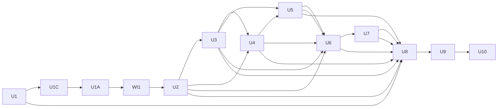

# Mandem Child ExecPlan Registry

This directory decomposes the program-level ExecPlan at `../2026-07-21-001-feat-mandem-plan.md`.

The master plan defines product intent, architecture, U1-U10 sequencing, and cross-program
acceptance. Each child plan begins as a non-executable scaffold. The scaffold lists dependencies
and handoffs before detailed planning begins.

## Promotion contract

A child plan has these promotion states:

`scaffolded -> planned -> clean-room approved -> operator approved -> executable -> complete`

Do not dispatch a scaffold to an implementation agent. Before promotion to executable, the plan
author must expand the child into a nearly self-contained ExecPlan that follows `PLANS.md`,
validate it against the actual outputs of completed dependencies, obtain a clean-room review,
address review findings, and obtain approval for an exact revision.

The program orchestrator reads the master and registry. An implementation worker receives only the
complete approved child ExecPlan, which must include every applicable program constraint and
dependency interface. A dispatch is invalid if it directs the worker to treat the master plan as a
second implementation instruction. Use summaries and bounded packets only for navigation.

## Architecture invariant

Authors must apply Mandem's architecture standard to Mandem itself. For every unit, they must place
behavior under the Nucleus-derived `domain/`, `application/`, `infrastructure/`, and `api/`
boundaries where applicable and keep composition roots thin. The deterministic architecture
checker must report success. This requirement also applies to tooling and bootstrap code.

## Dependency graph

Use the graph to determine dependency order. Planners may begin later-unit planning early, but they
must revalidate those scaffolds after dependencies complete.

## Registry

| Unit | Child scaffold | Depends on | Promotion |
| --- | --- | --- | --- |
| U1 | [Bootstrap repository and architecture contract](./u1-bootstrap-repository-architecture-contract.md) | None | complete; corrective work delegated to U1C |
| U1C | [Correct architecture checker and package contract](./u1-corrective-architecture-package-contract.md) | U1 merged at `88b9533ab840c9d357a1d09d2341709e2cbdd986` | executable; implementation begins after authorization PR #12 merges |
| U1A | [Documentation discoverability and continuous authoring quality gates](./u1a-documentation-authoring-quality-gates.md) | U1C | blocked until U1C completes; clean-room approval must be refreshed for its exact revision |
| WI1 | [Deterministic program issue graph checks and idempotent GitHub reconciliation](./wi1-program-issue-graph-integrity.md) | U1A | planned; requires clean-room review and exact operator approval |
| U2 | [Protocol, lifecycle kernel, and SQLite event model](./u2-protocol-lifecycle-sqlite.md) | U1, U1A, WI1 | scaffolded; dependency revalidation invalidated |
| U3 | [Server, Docker lifecycle, resident host mode, and reconciliation](./u3-server-docker-resident-reconciliation.md) | U2 | scaffolded |
| U4 | [Work items, ExecPlans, queue, gates, primitive CLI, and projections](./u4-work-items-plans-queue-gates-cli.md) | U2, U3 | scaffolded |
| U5 | [Operating docs and bounded Claude/Codex sessions](./u5-operating-docs-provider-sessions.md) | U3, U4 | scaffolded |
| U6 | [Unattended worktree delivery through Review, Learn, and merge](./u6-unattended-work-review-learn-merge.md) | U2, U3, U4, U5 | scaffolded |
| U7 | [Complete AXI CLI, TOON output, OpenTUI, and worker witnessability](./u7-complete-cli-toon-opentui.md) | U2, U3, U4, U5, U6 | scaffolded |
| U8 | [SBP installation, architecture baseline, and migration shims](./u8-sbp-install-architecture-baseline.md) | U1, U2, U3, U4, U5, U6, U7 | scaffolded |
| U9 | [Restart-proof SBP vertical slice and v1 release candidate](./u9-restart-proof-sbp-release-candidate.md) | U1, U2, U3, U4, U5, U6, U7, U8 | scaffolded |
| U10 | [Alloy, Loki, Grafana, and final v1 publication](./u10-observability-final-v1.md) | U9 | scaffolded |
