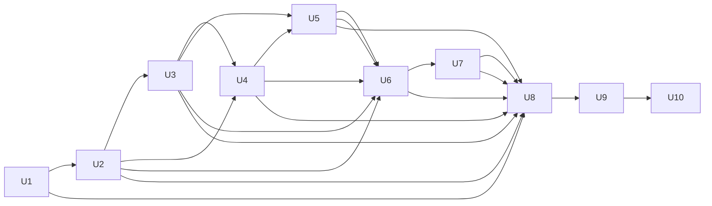

# Mandem Child ExecPlan Registry

This directory decomposes the program-level ExecPlan at `../2026-07-21-001-feat-mandem-plan.md`.

The master plan defines product intent, architecture, U1-U10 sequencing, and cross-program acceptance. Each file here begins as a non-executable scaffold that makes dependencies and handoffs visible before detailed planning begins.

## Promotion contract

A child plan moves through:

`scaffolded -> planned -> clean-room approved -> operator approved -> executable -> complete`

No implementation agent may receive a scaffold. Before promotion to executable, the child must be expanded into a nearly self-contained ExecPlan following `PLANS.md`, validated against the real outputs of completed dependencies, clean-room reviewed, repaired, and approved at an exact revision.

The program orchestrator reads the master and registry. An implementation worker receives only the
complete approved child ExecPlan, which must embed every applicable program constraint and
dependency interface. A dispatch packet that presents the master as a second implementation
authority is invalid. Summaries and bounded packets are navigation aids only.

## Architecture invariant

Mandem is the first consumer of its own architecture standard. Every unit must place behavior under the Nucleus-derived `domain/`, `application/`, `infrastructure/`, and `api/` boundaries where applicable, keep composition roots thin, and pass the deterministic architecture checker. There is no tooling or bootstrap exception.

## Dependency graph

The graph is dependency order, not a prohibition on early planning. Later scaffolds should be refined as interfaces stabilize, but must be revalidated after their dependencies complete.

## Registry

| Unit | Child scaffold | Depends on | Promotion |
| --- | --- | --- | --- |
| U1 | [Bootstrap repository and architecture contract](./u1-bootstrap-repository-architecture-contract.md) | None | executable |
| U2 | [Protocol, lifecycle kernel, and SQLite event model](./u2-protocol-lifecycle-sqlite.md) | U1 | scaffolded |
| U3 | [Server, Docker lifecycle, resident host mode, and reconciliation](./u3-server-docker-resident-reconciliation.md) | U2 | scaffolded |
| U4 | [Work items, ExecPlans, queue, gates, primitive CLI, and projections](./u4-work-items-plans-queue-gates-cli.md) | U2, U3 | scaffolded |
| U5 | [Operating docs and bounded Claude/Codex sessions](./u5-operating-docs-provider-sessions.md) | U3, U4 | scaffolded |
| U6 | [Unattended worktree delivery through Review, Learn, and merge](./u6-unattended-work-review-learn-merge.md) | U2, U3, U4, U5 | scaffolded |
| U7 | [Complete AXI CLI, TOON output, OpenTUI, and worker witnessability](./u7-complete-cli-toon-opentui.md) | U2, U3, U4, U5, U6 | scaffolded |
| U8 | [SBP installation, architecture baseline, and migration shims](./u8-sbp-install-architecture-baseline.md) | U1, U2, U3, U4, U5, U6, U7 | scaffolded |
| U9 | [Restart-proof SBP vertical slice and v1 release candidate](./u9-restart-proof-sbp-release-candidate.md) | U1, U2, U3, U4, U5, U6, U7, U8 | scaffolded |
| U10 | [Alloy, Loki, Grafana, and final v1 publication](./u10-observability-final-v1.md) | U9 | scaffolded |
